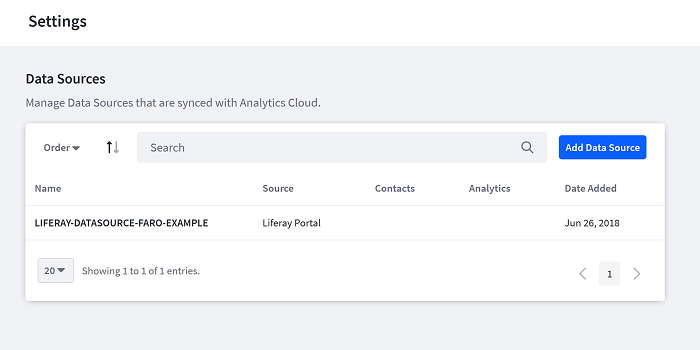

# Connecting Data Sources

```{toctree}
:maxdepth: 3

connecting-data-sources/connecting-liferay-dxp-to-analytics-cloud.md
connecting-data-sources/syncing-contact-data-from-dxp.md
connecting-data-sources/scoping-sites-and-individuals-using-properties.md
connecting-data-sources/adding-a-salesforce-data-source.md
connecting-data-sources/adding-a-csv-data-source.md
```

Liferay Analytics Cloud requires two kinds of data. First, web analytics data on user interactions with Liferay DXP Pages and Assets. Second, profile data on the users themselves. Analytics Cloud syncs these two kinds of data so that you can see how users are interacting with your site and who those users are. First, provide Analytics Cloud with data sources.

Both kinds of data can be obtained from a Liferay DXP instance. If you have other user profile data in addition to what is already stored in Liferay DXP user models, you can import it from a CSV file or add with contact data from a Salesforce system.

Contact data is merged and consolidated into a single customer view. Liferay DXP data sources let you select Organizations and User Groups to sync. Individual contacts are matched by email address. You can define the contact data model using whatever field names and types you want, but Analytics Cloud makes it easy to define trivial model fields by suggesting values.

## Viewing Your Data Sources

Your data sources can be viewed from the navigation panel.

1. Select Settings.

1. Click on Data Sources.

The Data Sources page appears and lists all existing data sources.



Unless a teammate has already added a data source, the list is empty. To add a new data source, see the following tutorials:

- [Connecting Liferay DXP to Analytics Cloud](./connecting-data-sources/connecting-liferay-dxp-to-analytics-cloud.md)
- [Adding a Salesforce Data Source](./connecting-data-sources/adding-a-salesforce-data-source.md)
- [Adding a CSV Data Source](./connecting-data-sources/adding-a-csv-data-source.md)

Once you’ve created your data sources, you may need to modify them. See [Managing Data Sources](./workspace-data/managing-data-sources.html) to learn more.

## Next Steps

- [Connecting Liferay DXP to Analytics Cloud](./connecting-data-sources/connecting-liferay-dxp-to-analytics-cloud.md)
- [Syncing Contact Data from DXP](./connecting-data-sources/syncing-contact-data-from-dxp.md)
- [Scoping Sites and Individuals Using Properties](./connecting-data-sources/scoping-sites-and-individuals-using-properties.md)
- [Adding a Salesforce Data Source](./connecting-data-sources/adding-a-salesforce-data-source.md)
- [Adding a CSV Data Source](./connecting-data-sources/adding-a-csv-data-source.md)