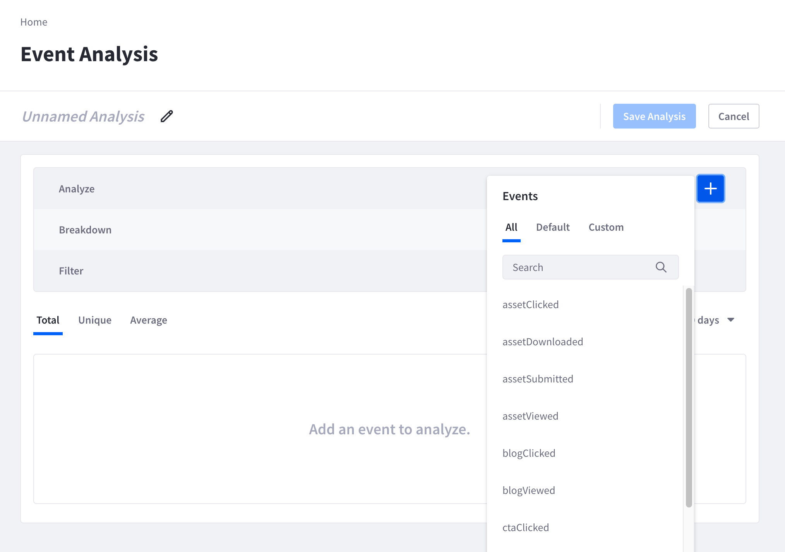
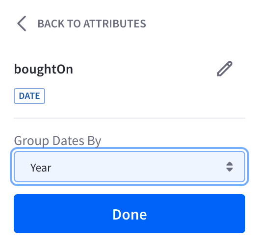
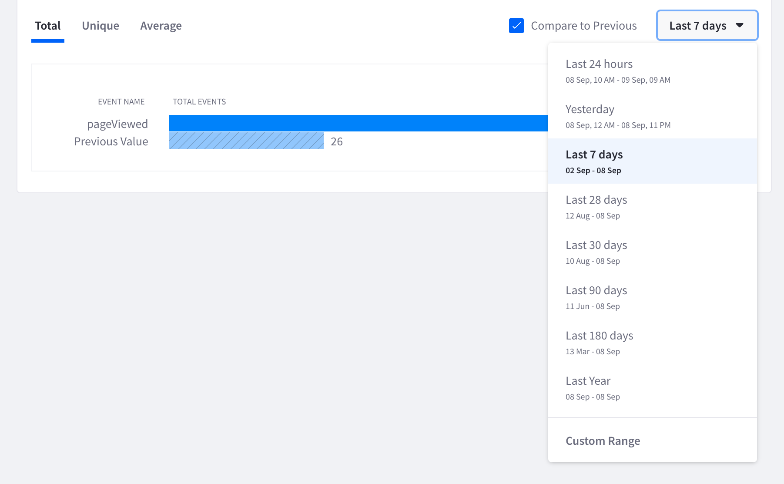

# Events Analysis

As individuals visit and interact with your site, Analytics Cloud tracks these events. Many of these events that take place on your Liferay DXP instance are set up to be tracked out-of-the-box. You can also define and track custom events by adding code snippets to your site. Use the events analysis tool to analyze and filter events based on different attributes. To analyze an event, 

1. Navigate to *Touchpoints* &rarr; *Events*. 

1. In the Analyze row, click the add icon () and select an event to analyze. Or use the search bar to find a specific event.

    

    The Default events are events that are already tracked by Analytics Cloud by default. The Custom events are events that you have defined and set up. See [Definitions for Events](../../workspace-data/defintions/definitions-for-events.md) to learn more.

    Hover over a specific event in the drop-down list to see the event's description. Click the pencil icon () to edit the description.

1. In the Breakdown row, click the add icon () and select breakdown attributes. 

    

    Up to three attributes can be selected in the Breakdown row. Note that each type of event is made up of different attributes. Global attributes are attributes that are collected for all types of events. See [Event Attributes](../../workspace-data/defintions/definitions-for-events.md) to learn more.
    
    Hover over a specific attribute in the drop-down list to see the attribute's description. Click the pencil icon () to edit the description and data typecast.

    Analytics Cloud automatically tries to detect and cast the datatype based on the first data collected for that attribute. Data is cast as either boolean, date, duration, number, or string. The data typecast will determine the parameters available for filtering the analysis. For example, selecting an attribute that has a date typecast will have filtering options such as a before or after time period. Date, duration, and number typecasts also have grouping feature to group the data by a set number. For example, a date typecase will allow you to group the data by day, month, or year. 

    

2. In the Filter row, click the add icon () and select attributes to further filter the event. The drop-down list shows all available attributes that can be used for filtering. The events analysis tool gives the flexibility to filter by attributes that are both related or unrelated to the events and breakdowns selected. 

3. The default time period is set Last 30 days. Click the dropdown arrow to change to a different time period. Place a check on *Compare to Previous* to compare the event data with a previous time period.

    

4. Note that there are three tabs (Total, Unique, and Average) to view the breakdown of the event. The Total tab shows the total number of events triggered by all users. The Unique tab shows the total number of unique users who triggered the event. The Average tab shows the average number of events per user.

5. To analyze a different event or see a different breakdown click the *X* button of the event or the breakdown to start over.