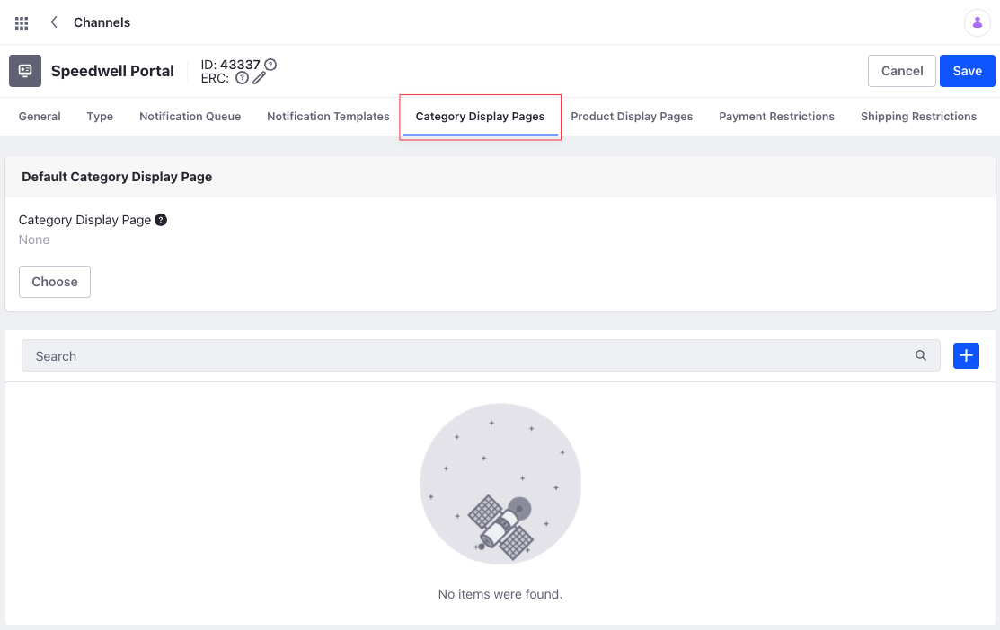

# Creating Category Display Pages

Liferay Commerce lets you link Categories to Widget Pages that ease the process of creating and managing pages at scale. Rather than managing one page for every category, Category Display pages help in defining a single template that will be used across all the different categories. With Category Display pages, users can make use of in-built or custom widgets and fragments to display details pertaining to a specific category. This is useful when you have many categories in your store and want to manage them efficiently.

## Creating a default Category Display Page



To create a default category page for your store, follow these steps:

1. Create a new _Widget Page_ in your store, and add the _Category Content_ widget to it, along with any other desired page elements.

1. Click on the _Global Menu_ (), click on the Commerce tab, and go to _Store Management_ → _Channels_.

1. Select the desired _Channel_ and click on the _Category Display Pages_ tab. Under the Default Category Display Page section, click on _Choose_ and select the page you created.

This page will be used as the default page for all Categories in your store.


```{note}
For Liferay DXP 7.3 and earlier, the Default Category Display Page selection under Channel Settings is not available. To set a Category Display page, users simply need to create a Widget page and add the Category Content widget to it, along with any other desired Page elements. This will implicitly be recognized as the default Category Display page.
```

## Creating a Category Display Page for a specific Category

There might be a case where you want a specific category to display a different page from the others either for promotions or offers. To create such a mapping between a specific Category and a Page, follow these steps:

1. Create a new _Widget Page_ in your store and add the _Category Content_ widget to it along with any other desired Page elements.

1. Open the _Global Menu_ (), click on the Commerce tab, and go to _Store Management_ → _Channels_.

1. Select the desired _Channel_, click on the _Category Display Pages tab_, and click the _Add_ button ().

    

1. Click on _Select_, under _Select Categories_, and choose the category you want to link to your new Site page.

    

1. Click on _Choose_ under _Category Display Page_, select your new Site page, and click on _Save_.

1. Click on _Save_ when finished.

```{note}
The default Category Display page must contain the Category Content widget in order to display each category differently. If there are multiple pages with the Category Content widget, Liferay will default to the first one in the layout list. 
```

This will establish a relationship between the category and the selected Page. Each time a user clicks on the specific category, they will be redirected to the new category display page. To view and manage your category display pages, use the Category Display Pages tab under Channel Settings.
