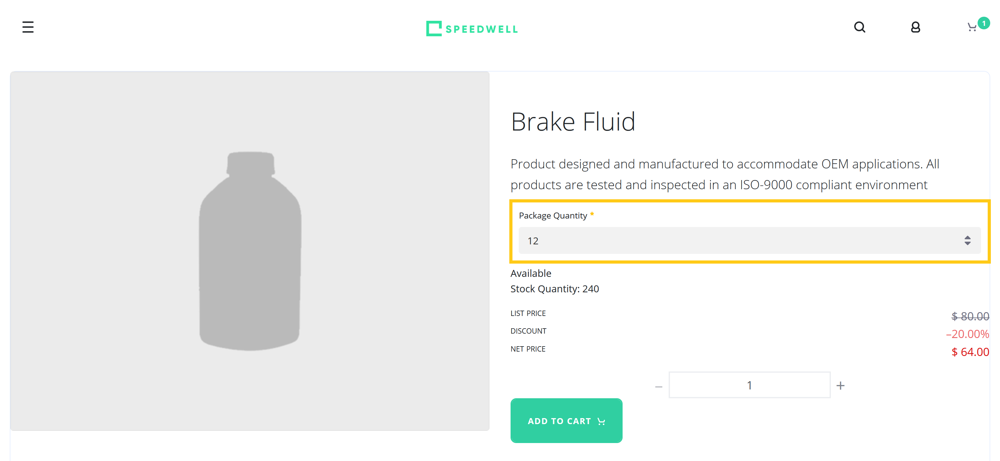
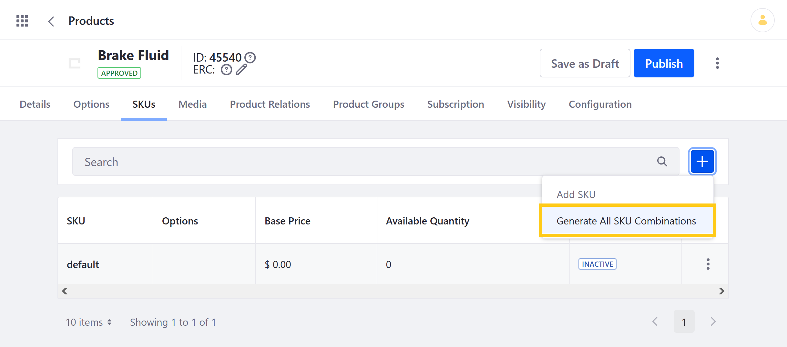
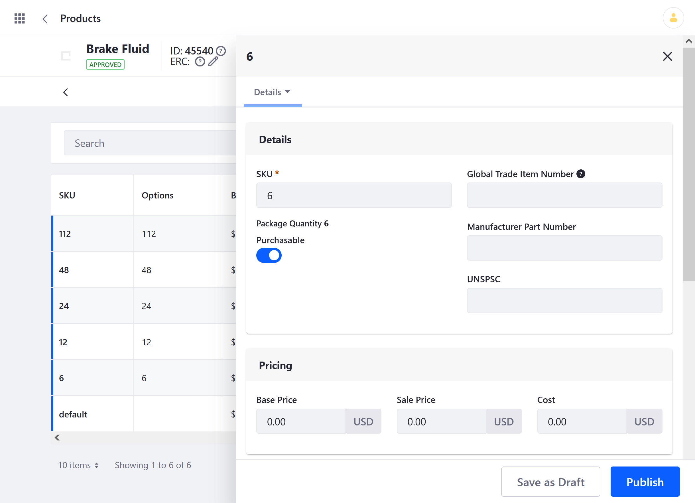
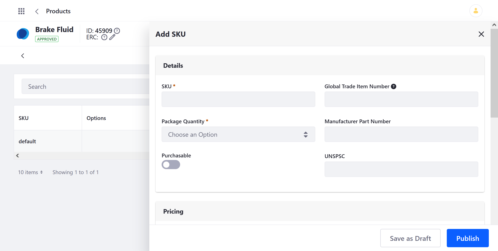
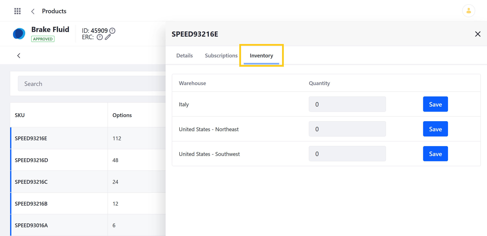

# Creating SKUs for Product Variants

With Liferay Commerce, you can add multiple SKUs to a Product to represent Product variants. To do this, the Product must have at least one [Option](../products/using-product-options.md) with *SKU Contributor* enabled. You can then manually or automatically create multiple active SKUs for a Product using the Option's defined values. Once created, each SKU represents a purchasable version of the Product that's displayed in the Product Details widget.



```{note}
Without Product Options, only one SKU can be active for a Product at a time.
```

```{tip}
It’s highly recommended that Product Option values are finalized before using them to create SKUs. See `Using Product Options <./using-product-options.md`>_ for more information.
```

## Automatically Generating Multiple SKUs

Follow these steps to generate and activate multiple SKUs for a Product:

1. Open the *Global Menu* (), click on the *Commerce* tab, and go to *Products*.

1. Click on a Product that has at least one Option with SKU Contributor enabled, and go to the *SKUs* tab.

1. Click the *Add* button (), and select *Generate All SKU Combinations*.

   

   SKUs are automatically generated for each Option value. These SKUs use the value's name and are created without Base Price or inventory. To configure an SKU, click its *Actions* button (), and select *Edit*. See [SKU Fields Reference](#sku-fields-reference) for more information.

   

1. When finished, click on *Publish*.

```{important}
Each product in the inventory must be associated to at least one SKU.
```

## Manually Adding an SKU to a Product

Follow these steps to manually create a Product SKU for individual Option values:

   ```{important}
   While SKU Contributor is enabled, each manually created SKU must be mapped to an Option value.
   ```

1. Open the *Global Menu* (), click on the *Commerce* tab, and go to *Products*.

1. Click on a Product that has at least one Option with SKU Contributor enabled, and go to the *SKUs* tab.

1. Click the *Add* button (), and select *Add SKU*.

   

1. Configure the SKU fields. See [SKU Fields Reference](#sku-fields-reference) for more information.

   

1. When finished, click on *Publish*.

## Adding SKU Inventory

If Allow Back Orders is enabled for the Product, all published SKUs with a set base price are immediately available to Customers for purchase in the Product Details widget. However, if Allow Back Orders is disabled, you must first add inventory to the SKUs to make them available for purchase. See [Introduction to Managing Inventory](../../managing-inventory/introduction-to-managing-inventory.md) for more information.



```{note}
If all SKU inventory is 0 and Allow Back Orders is disabled, then none of the Product variants are listed in the Product Details widget. However, if only one SKU reaches 0, then all variants are listed. 

If *Allow Back Orders* is enabled, then all Options are listed in the Product Details widget, regardless of inventory. 
```

## SKU Fields Reference

### Details

| Field | Description |
| :--- | :--- |
| SKU (Required) | Enter an SKU for the Product variant |
| [Option Field] (Required) | Used to map the SKU to an Option value when SKU Contributor is enabled |
| Purchaseable | Determines whether the SKU can be purchased |
| Global Trade Item Number | Sets a GTIN for the SKU |
| Manufacturer Part Number | Sets an MPN for the SKU |
| UNSPSC | Sets a United Nations Standard Products and Services Code for the SKU |

### Pricing

| Field | Description |
| :--- | :--- |
| Base Price | Sets a Base Price entry for the SKU |
| Sale Price | Sets a sale price for the SKU's Base Price entry |
| Cost | Sets the SKU cost used for net calculations |

### Shipping Override

These fields override Product-level specifications for individual SKUs and are used for shipping.

| Field | Description |
| :--- | :--- |
| Width | Overrides Product width |
| Height | Overrides Product height |
| Depth | Overrides Product depth |
| Weight | Overrides Product weight |

### Schedule

| Field | Description |
| :--- | :--- |
| Published | Makes the SKU visible and available for purchase |
| Display Date | Determines when the SKU is first displayed in Site for purchase. |
| Expiration Date | Determines when the SKU is no longer available for purchase |
| Never Expire | Determines whether the SKU can be scheduled to automatically expire |

## Additional Information

* [Products Overview](./products-overview.md)
* [Using Product Options](./using-product-options.md)
* [Overriding Product Level Information](./overriding-product-level-information.md)
