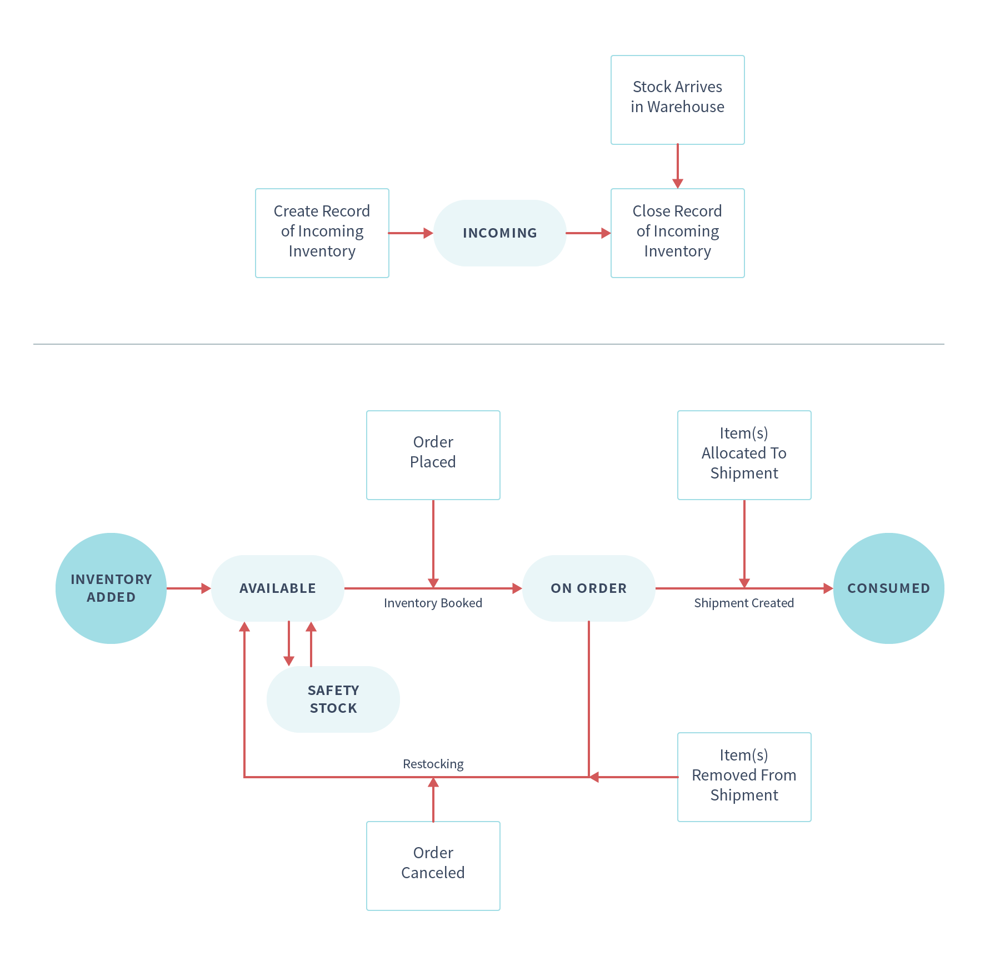

# Introduction to Managing Inventory

Liferay Commerce provides tools for product inventory management that scale from users with a single storefront and warehouse to larger organizations with multiple sales channels and geographically distributed warehouses.

There are several features used in managing inventory: Inventory Management, Warehouses, Availability Estimates, Low Stock Actions, and the ability to set inventory by warehouse.

## Inventory Management

> Availability: Commerce 2.1+

The Inventory Management system allows users to track all their inventory in a single place. The Inventory Management tracks inventory by SKU; all items that share the same SKU now share the same inventory regardless of how they were created in the product catalog.

See [Using Inventory Management](./using-the-inventory-management-system.md) for more information.

```{important}
Each product in the inventory must be associated to at least one SKU.
```

## Warehouses

Warehouses represent the physical locations where product inventory is managed and sourced for order fulfillment. Products inventory quantities are managed on a per warehouse basis.

See [Setting Up Commerce Warehouses](./setting-up-commerce-warehouses.md) and [Warehouse Reference Guide](./warehouse-reference-guide.md) for more information on managing warehouses.

In order for a store to accept orders for a product, the related channel must have a warehouse associated with it. See the [Introduction to Channels](../../starting-a-store/channels/introduction-to-channels.md) article on how channels work.

## Availability Estimates

Store owners may configure Availability Estimates to inform customers when an out of stock product will be available again.

See the [Availability Estimates](./availability-estimates.md) for more information.

## Low Stock Actions

Low Stock Actions can be configured to perform automated actions when available product inventory reaches a specified threshold. See the [Low Stock Action](./low-stock-action.md) to learn how to configure what behavior is executed when inventory reaches a minimum threshold.

Developers interested in creating their own custom low stock action can refer to [Implementing a Custom Low Stock Activity](../../developer-guide/implementing-a-custom-low-stock-activity.md).

## Setting Inventory by Warehouse

In Liferay Commerce, inventory management is done per product SKU. To learn more, read the [Setting Inventory by Warehouse](./setting-inventory-by-warehouse.md) article.



## Additional Information

* [Creating a New Shipment](../../order-management/shipments/creating-a-shipment.md)
* [Inventory Management Reference Guide](./inventory-management-reference-guide.md)
* [Product Inventory Configuration Reference](./product-inventory-configuration-reference.md)
* [Order Life Cycle](../../order-management/orders/order-life-cycle.md)
* [Using the Inventory Management System](./using-the-inventory-management-system.md)
