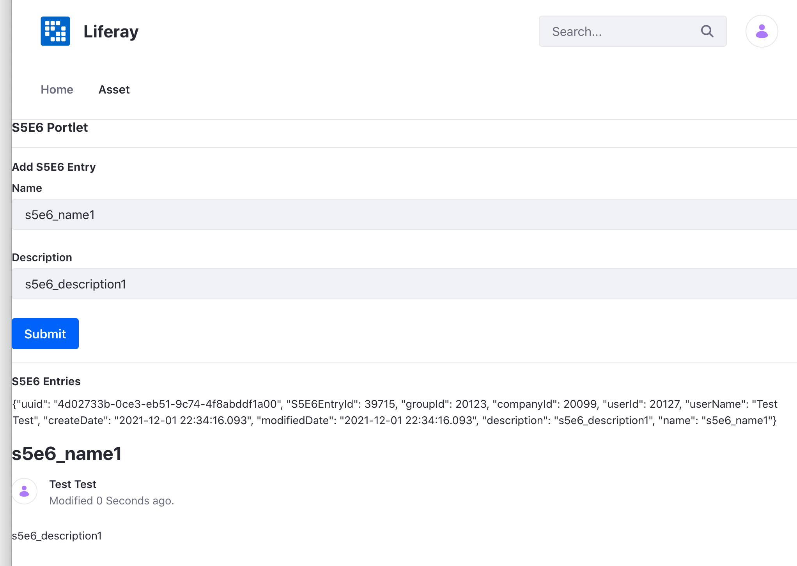

# Enabling Assets

Many of Liferay's applications (e.g. Blogs, Documents and Media, Message Boards, etc.) are asset enabled out-of-the-box. You can publish your assets with the [Asset Publisher widget](../../../site-building/displaying-content/using-the-asset-publisher-widget/displaying-assets-using-the-asset-publisher-widget.md) or even create [Asset Libraries](../../../content-authoring-and-management/asset-libraries/asset-libraries-overview.md). With the help of [Service Builder](../service-builder.md), you can asset enable your custom application. See the sample project below to learn how.

## Get the Sample Code

1. Start Liferay DXP. If you don't already have a docker container, use

   ```bash
   docker run -it -m 8g -p 8080:8080 [$LIFERAY_LEARN_DXP_DOCKER_IMAGE$]
   ```

   If you're running a different Liferay Portal version or Liferay DXP, adjust the above command accordingly.

1. Download and unzip [Enabling Assets](./liferay-s5e6.zip).

   ```bash
   curl https://learn.liferay.com/dxp/latest/en/ubuilding-applications/data-frameworks/asset-framework/liferay-s5e6.zip -O
   ```

   ```bash
   unzip liferay-s5e6.zip
   ```

1. From the module root, build and deploy.

   ```bash
   ./gradlew deploy -Ddeploy.docker.container.id=$(docker ps -lq)
   ```

   ```note::
   This command is the same as copying the deployed jars to /opt/liferay/osgi/modules on the Docker container.
   ```

1. Confirm the deployment in the Liferay Docker container console.

   ```bash
   STARTED com.acme.s5e6.api_1.0.0 [1433]
   STARTED com.acme.s5e6.service_1.0.0 [1434]
   STARTED com.acme.s5e6.web_1.0.0 [1435]
   ```

1. Open your browser to `https://localhost:8080`.

1. Add the S5E6 Portlet to a page. You can find the example portlet under Sample Widgets. 

1. Also add an Asset Publisher widget to the same page. You can find the widget under Content Management.

1. Add an entry with the S5E6 Portlet (e.g. `s5e6_name1` and `s5e6_description1`) and click `Submit`.

1. The S5E6 Portlet is asset enabled and therefore the added entry automatically shows up in the Asset Publisher widget.

   

## Modify the Service Model Definition

This tutorial assumes that you have a working application that you created using Service Builder. To enable assets, make the following changes to your entity:

1. Add the following data fields if you don't already have them defined:

   ```xml
   <!-- Group instance -->

   <column name="groupId" type="long" />

   <!-- Audit fields -->

   <column name="companyId" type="long" />
   <column name="userId" type="long" />
   <column name="userName" type="String" />
   <column name="createDate" type="Date" />
   <column name="modifiedDate" type="Date" />
   ```

   The Asset Framework requires these fields to keep track of your application's data.

1. Add an asset entry entity reference right before the closing `</entity>` tag. When a new entry is added with your application, a corresponding entry is added to Liferay's `AssetEntry` table.

   ```xml
   <reference entity="AssetEntry" package-path="com.liferay.portlet.asset" />
   ```

