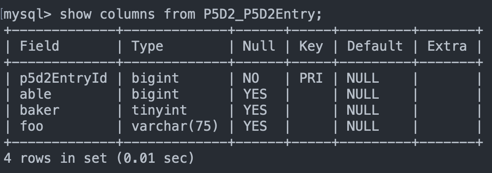
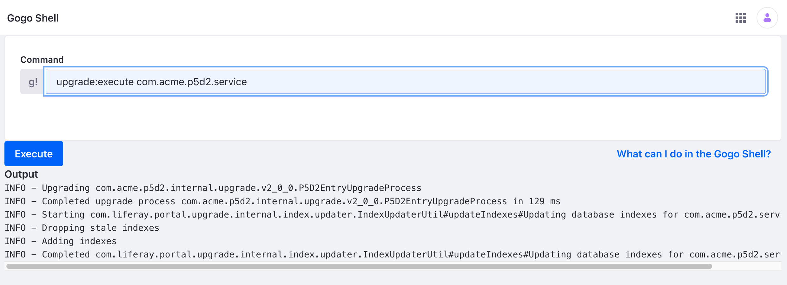
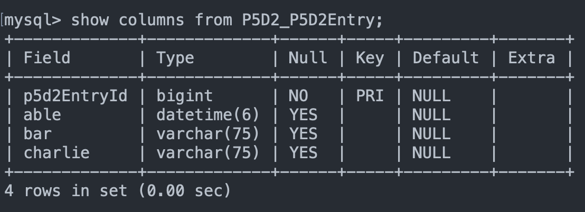

# Upgrading Your Database Tables

```markdown
{bdg-secondary}`Available Liferay DXP 7.4 U10+ or Liferay Portal 7.4 GA14+`
```

An upgrade of your application may require making changes to your database table. Liferay's Upgrade framework makes it easy to make these changes. Deploy the sample project to see this upgrade process.

## Deploy Version 1.0.0

1. Start Liferay DXP. If you don't already have a docker container, use

   ```bash
   docker run -it -m 8g -p 8080:8080 [$LIFERAY_LEARN_DXP_DOCKER_IMAGE$]
   ```

   If you're running a different Liferay Portal version or Liferay DXP, adjust the above command accordingly. 

1. Download and unzip [Upgrading Your Database Tables](./liferay-p5d2.zip).

   ```bash
   curl https://learn.liferay.com/dxp/latest/en/building-applications/data-frameworks/upgrade-processes/liferay-p5d2.zip -O
   ```

   ```bash
   unzip liferay-p5d2.zip
   ```

1. Move into the `1.0.0` directory, build and deploy.

   ```bash
   cd 1.0.0
   ```

   ```bash
   ../gradlew deploy -Ddeploy.docker.container.id=$(docker ps -lq)
   ```

   ```{note}
   This command is the same as copying the deployed jars to /opt/liferay/osgi/modules on the Docker container.
   ```

1. Confirm the deployment in the Liferay Docker container console.

   ```bash
   STARTED com.acme.p5d2.api_1.0.0 [1030]
   STARTED com.acme.p5d2.service_1.0.0 [1031]
   ```

1. If you are using an external database, verify the table columns for the app. For example, for MySQL:

   ```sql
   SHOW COLUMNS FROM P5D2_P5D2Entry;
   ```

   

## Upgrade to 2.0.0

1. Now deploy the 2.0.0. Move into the `2.0.0` directory, build and deploy.

   ```bash
   cd 2.0.0
   ```

   ```bash
   ../gradlew deploy -Ddeploy.docker.container.id=$(docker ps -lq)
   ```

1. Login to Liferay and navigate to the Gogo shell console at *Control Panel* &rarr; *Gogo Shell*.

1. Verify that the 2.0.0 upgrade is available by entering the command `upgrade:list com.acme.p5d2.service`.

1. Run the upgrade by entering the command `upgrade:execute com.acme.p5d2.service`. The Gogo shell console will show the completed upgrade process.

   

1. You can verify that the table columns have been updated in the database. For example, for MySQL:

   ```sql
   SHOW COLUMNS FROM P5D2_P5D2Entry;
   ```

   