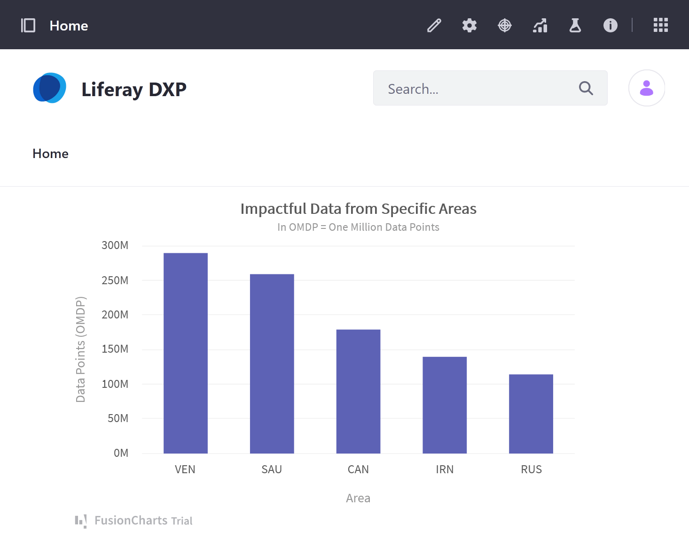
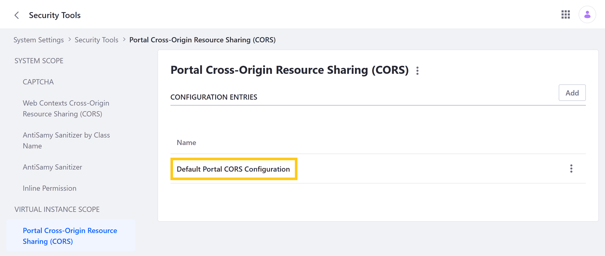
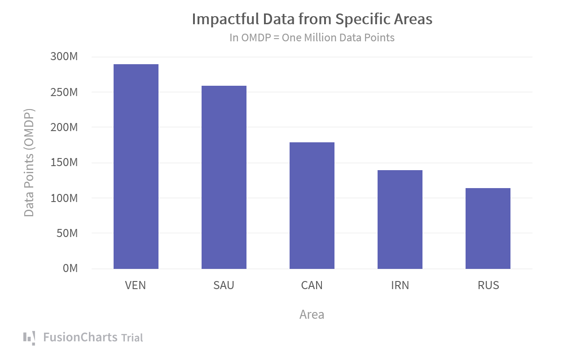
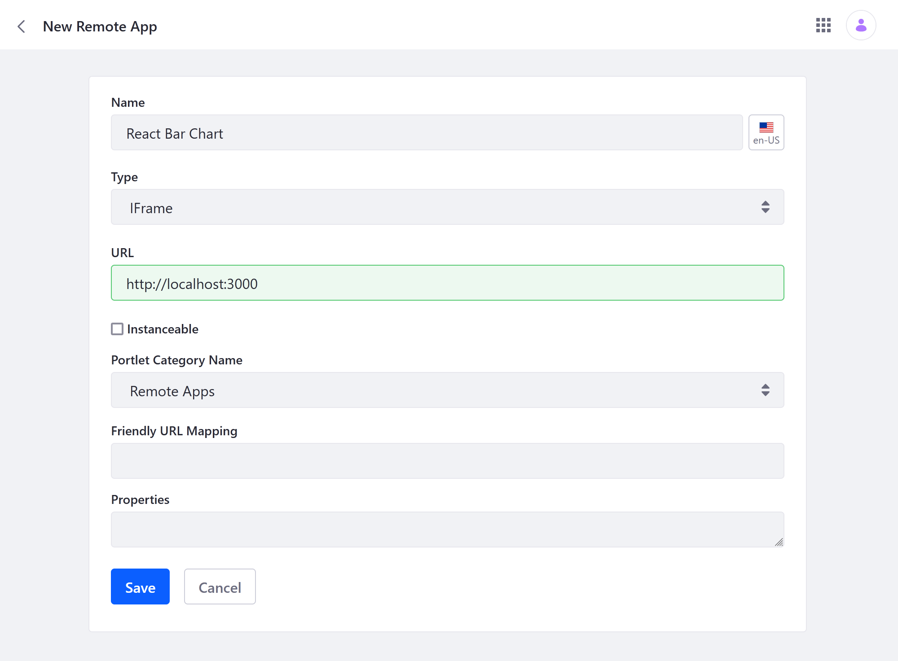
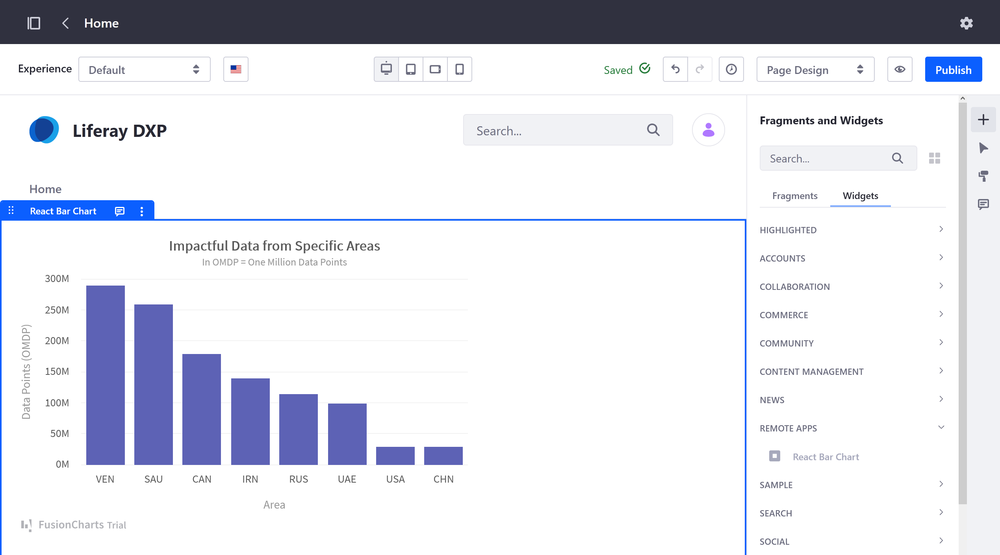

# Using Object Data with React Charts

With Liferay Objects, you can build and extend applications without needing to develop code or deploy modules. The following tutorial demonstrates how to use Liferay [Objects](../../objects.md), [Headless APIs](../understanding-object-integrations/headless-framework-integration.md), and Remote Apps with React [FusionCharts](https://www.fusioncharts.com/dev/getting-started/react/your-first-chart-using-react) to create dynamic visuals for data dashboards.

First, you'll set up a new DXP instance and enable Cross-Origin Resource Sharing ([CORS](https://developer.mozilla.org/en-US/docs/Web/HTTP/CORS)). Then, you'll create an Object for receiving and storing data. After adding Object data using REST APIs, you'll set up the provided React server with the FusionChart. Finally, you'll create a Remote App for the React chart and deploy it as a Page widget.

The chart is configured to automatically call the Object via Headless API every five seconds, which returns the Object's data and updates the chart dynamically.



## Setting Up Liferay DXP

Before proceeding, start up a new Liferay DXP 7.4+ container.

```docker
docker run -it -m 8g -p 8080:8080 [$LIFERAY_LEARN_DXP_DOCKER_IMAGE$]
```

Since the provided React Chart runs on its own server, you must create a CORS policy and enable CORS for Object API patterns. See [Setting Up CORS](../../../installation-and-upgrades/securing-liferay/securing-web-services/setting-up-cors.md) to learn more.

### Adding a Web Contexts CORS Policy

Follow these steps to add a Web Contexts CORS policy:

1. Open the *Global Menu* (), click on the *Control Panel* tab, and go to *System Settings* &rarr; *Security Tools*.

1. Go to the *Web Contexts Cross-Origin Resource Sharing (CORS)* tab and click *Add*.

   

1. Keep the default policy values and click *Save*.

   | Field | Value |
   | --- | --- |
   | Dynamic Web Context OSGi filter | `(&(!(liferay.cors=false))(osgi.jaxrs.name=*))` |
   | URL Pattern | `*` |
   | CORS Response Headers | `Access-Control-Allow-Credentials: true` |
   | CORS Response Headers | `Access-Control-Allow-Headers: *` |
   | CORS Response Headers | `Access-Control-Allow-Methods: *` |
   | CORS Response Headers | `Access-Control-Allow-Origin: *` |

   ```{important}
   The default values are adequate for this tutorial. However, they should not be used for production.
   ```

### Enabling CORS for Object APIs

Follow these steps to update the *Default Portal CORS Configuration* to enable CORS for Object APIs:

1. Open the *Global Menu* (), click on the *Control Panel* tab, and go to *System Settings* &rarr; *Security Tools*.

1. Go to the *Portal Cross-Origin Resource Sharing (CORS)* tab and click *Default Portal CORS Configuration*.

   

1. Add a *URL Pattern* with the `/o/c/*` value and click *Save*. This enables CORS for all Object APIs.

   

## Creating a Dashboard Data Object

Follow these steps to create an Object for your React Data Chart:

1. Open the *Global Menu* (), click on the *Control Panel* tab, and go to *Objects*.

1. Click the *Add* button () and enter these values.

   | Field | Value |
   | --- | --- |
   | Label | Dashboard Data Object |
   | Plural Label | Dashboard Data Objects |
   | Name | DashboardDataObject |

   ```{note}
   These values are necessary, since they are used in the provided React App.
   ```

1. Select the new *Object* draft, click on the *Field* tab, and add these *fields*.

   | Label | Field Name | Type | Required |
   | --- | --- | --- | --- |
   | Label | label | String | &#10004; |
   | Value | value | Integer | &#10004; |

1. Click on the *Details* tab and click *Publish*.

[Publishing an Object](../creating-and-managing-objects/creating-objects.md#publishing-object-drafts) creates and activates a new application for receiving and storing data. You can now access it via the Liferay UI or Headless APIs.

## Adding Object Data

Follow these steps to add data to your newly published Object using Headless APIs:

1. Open the Liferay *API Explorer* (`localhost:8080/o/api`), click on the REST Services drop-down menu, and select `c/dashboarddataobjects`.

1. Enter this script into the request body for the batch `POST` API.

   ```json
   [
     {
       "label": "VEN",
       "value": "290"
     },
     {
       "label": "SAU",
       "value": "260"
     },
     {
       "label": "CAN",
       "value": "180"
     },
     {
       "label": "IRN",
       "value": "140"
     },
     {
       "label": "RUS",
       "value": "115"
     }
   ]
   ```

1. Click *Execute* to add the data entries to the Object.

Once you've finished adding data, you can set up the provided React server. This includes a FushionChart implementation that displays entries for the Dashboard Data Object.

## Setting Up the React Chart

Follow these steps to download, install, and start the React server:

1. Download and unzip the [React project](./liferay-x3j8.zip).

   ```bash
   curl https://learn.liferay.com/dxp/latest/en/building-applications/objects/building-solutions-with-objects/liferay-x3j8.zip -O
   ```

   ```bash
   unzip liferay-x3j8.zip -d liferay-x3j8
   ```

   ```bash
   cd liferay-x3j8
   ```

   ```{note}
   To continue, you must have `node` and `yarn` installed. If you don't, run this command and follow the prompts:
   `./setup_tutorial.sh`
   ```

1. Install the React project.

   ```bash
   yarn install
   ```

1. Start the React server.

   ```bash
   yarn start
   ```

Once started, you can go to `localhost:3000` to view the React chart. It's configured to call the `c/dashboarddataobjects` service using Basic Authentication and gets the Object's data every five seconds.

```{important}
Basic Authentication (i.e., `test@liferay.com:test`) is for local development only. Use Auth Tokens for live scenarios.
```



After you've started the server, you can use the chart in Liferay as a Remote App.

## Using the Chart in Liferay as a Remote App

Follow these steps to create a Remote App for the React chart:

1. Open the *Global Menu* (), click on the *Applications* tab, and go to *Remote Apps*.

1. Click the *Add* button ().

1. Enter these values:

   | Field | Value |
   | --- | --- |
   | Name | React Bar Chart |
   | Type | iFrame |
   | URL 1 | `http://localhost:3000` |

   

1. Click *Save*.

Once Saved, Liferay creates a widget that you can deploy to Site Pages. The widget is listed under the remote apps' Portlet Category Name. The default value is *Remote Apps*.



## Additional Information

* [Objects Overview](../../objects.md)
* [Headless Framework Integration](../understanding-object-integrations/headless-framework-integration.md)
* [Setting Up CORS](../../../installation-and-upgrades/securing-liferay/securing-web-services/setting-up-cors.md)
