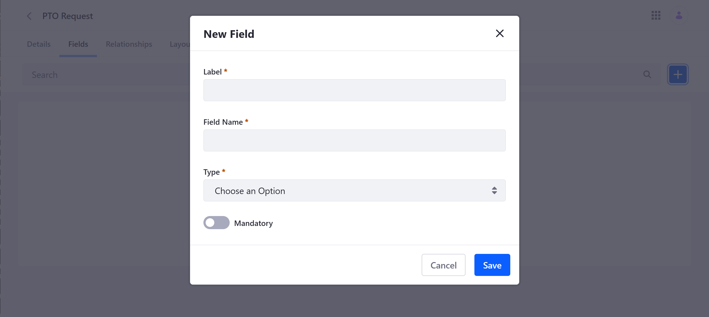
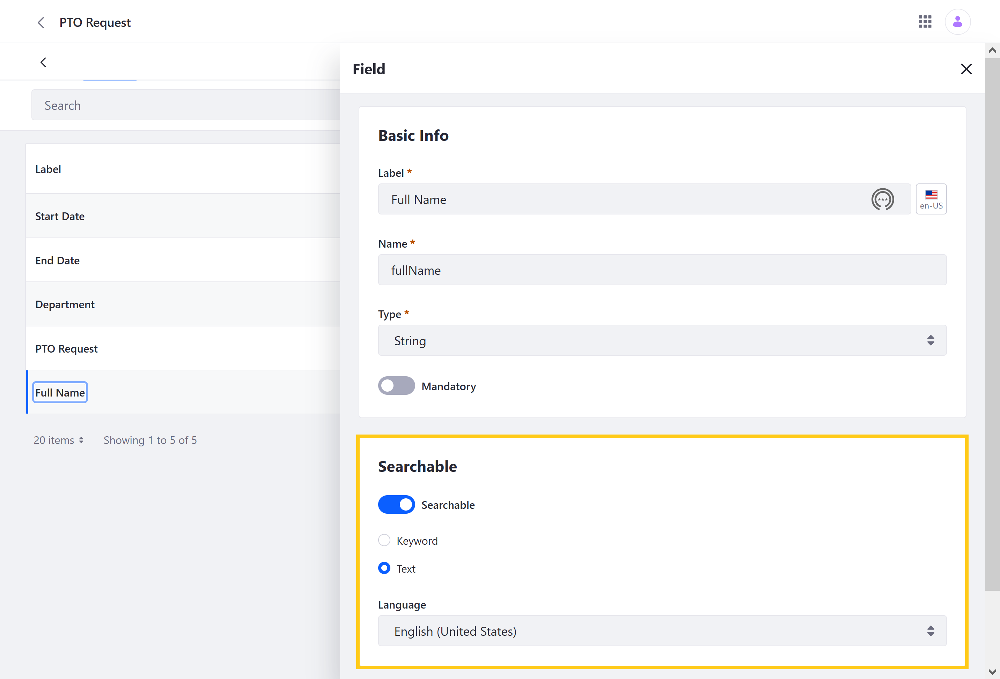

# Adding Fields to Objects

> Available: Liferay DXP/Portal 7.4+

Fields are data definitions that represent database columns. They store different [types of values](#field-types-ui-reference) for Liferay Objects. You can add fields to any published or unpublished Object, including both system and custom Objects.

When an Object is [published](./creating-objects.md#publishing-object-drafts), an initial database table is created with the draft's data definitions. This table includes all Object fields and relationships that exist at the time of publishing. Fields and relationships added to an Object after publishing are added to a side table (i.e., `[Initial_Table_Name]_x`).

```{important}
If a field is saved to an Object draft, you can edit any of its settings and values. However, once fields are published or saved to a published Object, only its Label can be edited. All other values and settings cannot be changed. 

Fields in Object drafts can be removed. After initial publication, however, fields cannot be removed, with the exception of fields added _after_ initial publication, because those fields were added to a side table.
```

Follow these steps to add a new field to an Object:

1. Open the *Objects* portlet.

1. Select the desired Object.

1. Click on the *Fields* tab, and click on the *Add* button ().

   

1. Enter a *Label* and *Field Name*.

   **Label**: This value identifies the field in the Objects UI and can be localized after the field is created.

   **Field Name**: This value determines the field's name in the back-end and uses camel case. Once a field is published, this value cannot be changed.

   ```{important}
   The following field names are reserved by Liferay and cannot be used for custom fields: `companyId`, `createDate`, `groupId`, `id`, `lastPublishDate`, `modifiedDate`, `status`, `statusByUserId`, `statusByUserName`, `statusDate`, `userId`, `userName`. If users attempt to create a field using one of these field names, Liferay displays an error message.
   ```

1. Select a field *Type*. See [Field Type Reference](#field-types-ui-reference) for more information.

1. Determine whether or not the field is *Mandatory*.

   ```{note}
   Mandatory boolean fields require a true value from end users.
   ```

1. Click on *Save*.

After saving fields to an Object draft, you can select them to define whether they are searchable. All fields are searchable by default.



## Field Types UI Reference

> For Liferay DXP 7.4 U10

| Type | Description |
| :--- | :--- |
| Boolean | Stores true or false values |
| Date | Stores date values |
| Text (*previously String*) | Stores simple text value up to 280 characters |
| Long Text (*previously Clob*) | Stores a text box value that supports up to 65,000 characters |
| Picklist | Stores a [Picklist](../picklists/using-picklists.md) string value |
| Integer | Stores an integer up to 9 digits in length |
| Long Integer (*previously Long*) | Stores a large integer up to 19 digits in length |
| Decimal (*previously Double*) | Stores a decimal number value that supports fractional portions |
| Precision Decimal (*Previously BigDecimal*) | Stores a high-precision decimal number without rounding |

## Additional Information

* [Creating Objects](./creating-objects.md)
* [Defining Object Relationships](./defining-object-relationships.md)
* [Designing Object Layouts](./designing-object-layouts.md)
* [Managing Objects](./managing-objects.md)
