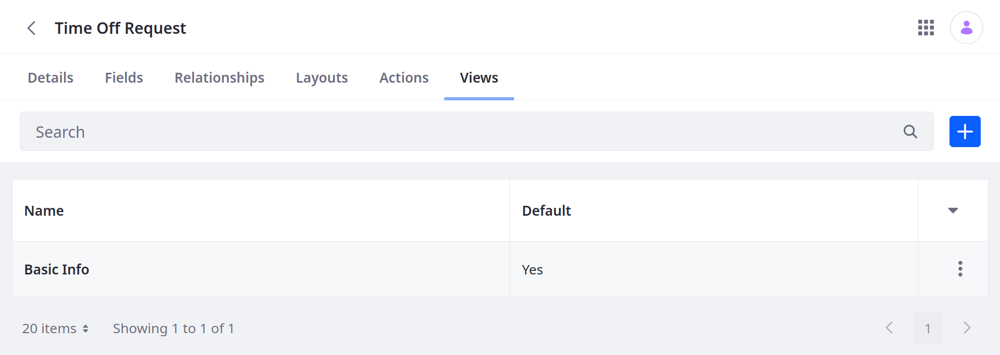
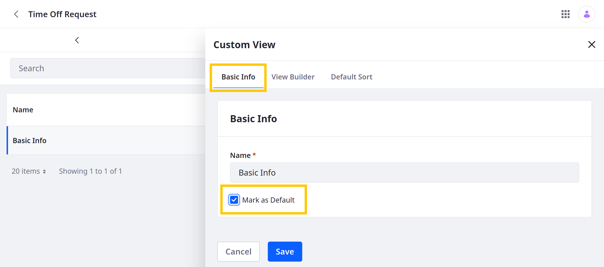
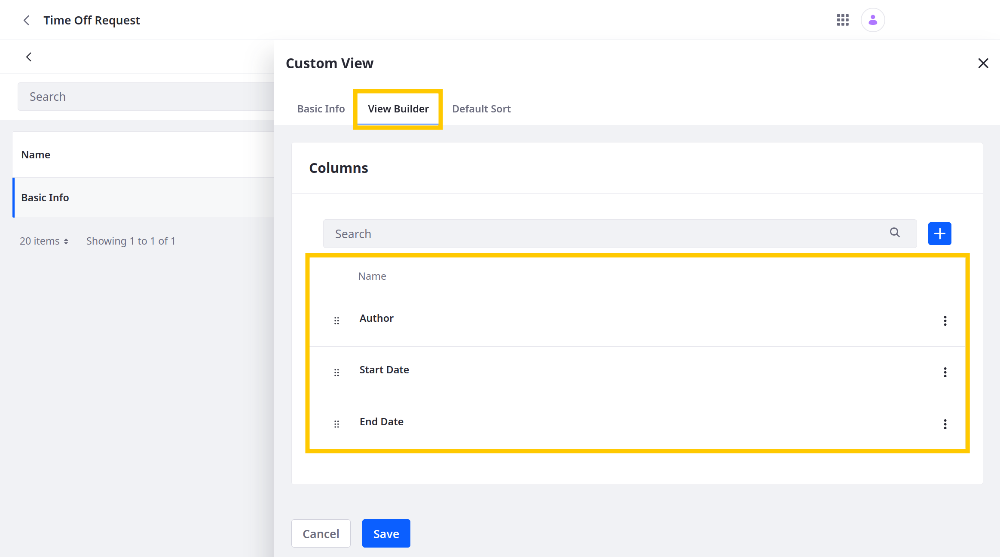
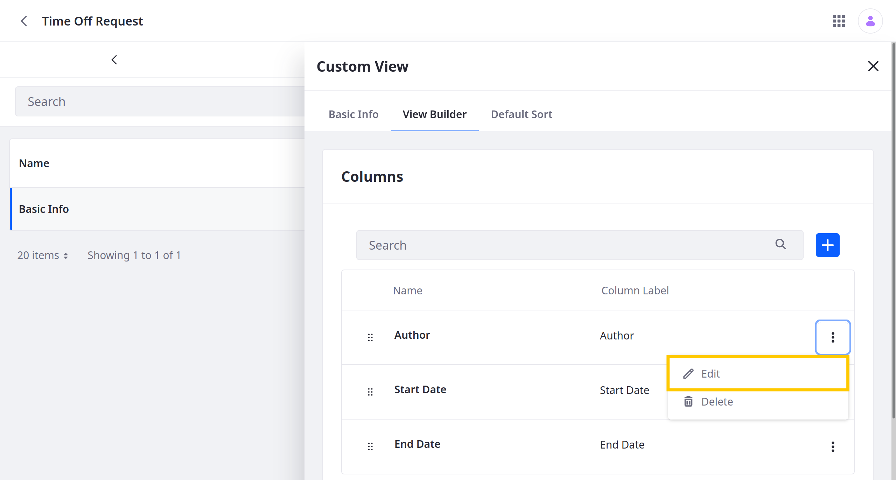

# Designing Object Views

> Available Liferay DXP 7.4 U10 and Liferay Portal 7.4 __

Object views define tables for displaying entries in an Object's application page. By default, Liferay automatically generates a default view for each published Object. This view orders all entry fields alphabetically. However, you can design custom views to determine which Object fields are included in the table and how they're ordered.


```{note}
Custom views can only be added to custom Objects. They cannot be added for System Objects.
```

Follow these steps to design a custom Object view:

1. Open the *Global Menu* (), click the *Control Panel* tab, and go to *Objects*.

1. Begin editing the desired *Object*.

   ```{note}
   You can add views to both draft and published Objects.
   ```

1. Go to the *Views* tab and click the *Add* button ().

1. Enter a *name* and click *Save*. This creates a new blank view. You can now add fields to it.

   

1. Click the *view* to begin editing it.

1. In the *Basic Info* tab, determine whether to use the view as *default*.

   ```{note}
   This ensures the view is used for the Object's application page. If no custom layout is selected as default, the Object uses its automatically generated layout.
   ```

   

1. Go to the *View Builder* tab and click the *Add* button ().

1. Check all fields you want to include in the view table and click *Save*.

   Each selected field is used as a column in the application page table.

   Available options include [manually added fields](./adding-fields-to-objects.md) and automatically added fields (i.e., Author, Creation Date, Modified Date, Workflow Status, and ID).

   ```{note}
   Views do not support columns with multiple entries (e.g., *Many to Many* relationship fields).
   ```

   

1. Drag and drop fields to arrange their order.

1. Click *Save*.

Once saved, the custom view is used for displaying Object entries.



## Sorting Views
<!-- U17? Sorting custom views-->
Coming Soon!

## Filtering Views
<!-- U17? Filtering entries in a custom view-->
Coming Soon!

## Additional Information

* [Creating and Managing Objects](../creating-and-managing-objects.md)
* [Adding Fields to Objects](./adding-fields-to-objects.md)
* [Designing Object Layouts](./designing-object-layouts.md)
