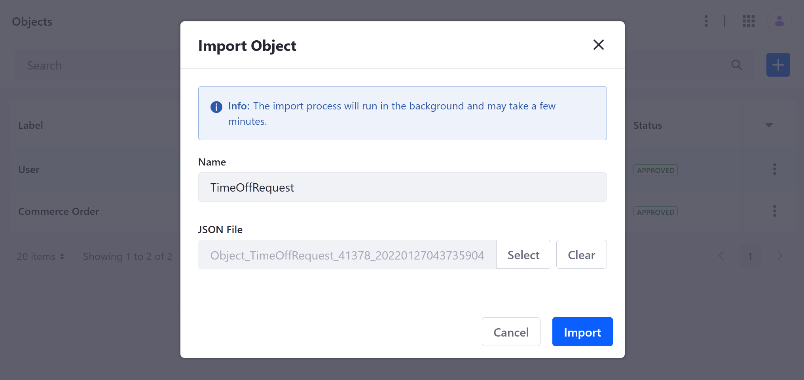
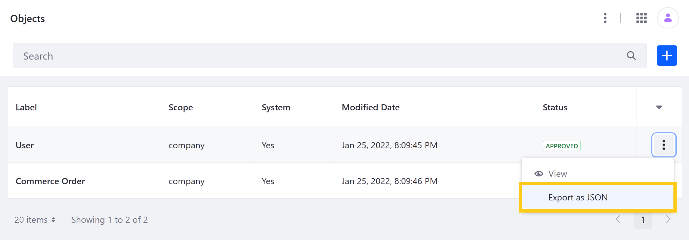
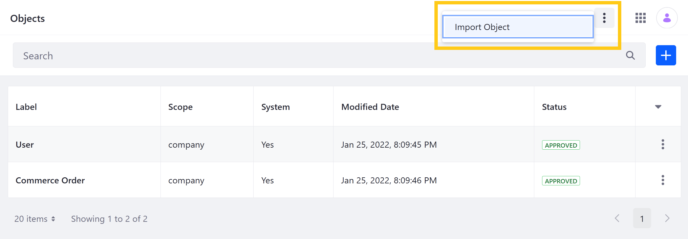

# Exporting and Importing Object Structures

> Available for Liferay DXP 7.4 U5+ and Portal 7.4 GA9+

With Liferay Objects, you can import and export Object structures as `.json` files. This provides greater flexibility during application development, enabling users to easily migrate Object definitions between Liferay environments.

```{important}
At this time, Objects does not support importing or exporting relationships. All other Object structure elements are supported (e.g., scope, fields, layouts).
```

## Exporting Structures

Follow these steps to export an Object structure:

1. Open the *Global Menu* (), go to the *Control Panel* tab, and click on *Objects*.

1. Click on the *Actions* button () for the desired Object and select *Export as JSON*.

   

1. Click *Save* in the dialog window to begin downloading the Object's definition as a JSON file.

This file includes the Object's Fields, Layouts, Actions, and general configuration details (e.g., label, scope, etc.). If the exported Object has Relationships, they are not included in the JSON file.

Once exported, you can import the Object definition into compatible Liferay environments.

## Importing Structures

Follow these steps to import an Object structure:

1. Open the *Global Menu* (), click on the *Control Panel* tab, and go to *Objects*.

1. Click the *Actions* button () in the Application Bar and select *Import Object*.

   

1. Enter a *name* for the new Object and select the *JSON file* you want to import.

   ```{important}
   Object names must be unique and use PascalCase.
   ```

   

1. Click *Import*.

This beings importing the Object structure in the background and can take a few minutes.

## Additional Information

* [Creating Objects](./creating-objects.md)
* [Managing Objects](./managing-objects.md)
