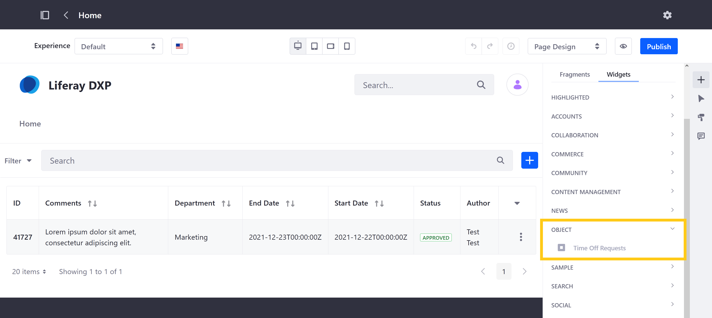

# Deploying Object Widgets to Sites

> Available: Liferay DXP 7.4 U1/Liferay Portal 7.5 GA5

When an Object is published, Liferay automatically generates a dedicated widget for deploying it to Site Pages. This includes both Site-scoped and Company-scoped Objects, so you can grant users access to an Object outside of the Site Menu () and Global Menu ().

```{note}
Widget data is saved and displayed according to the Object's scope.
```

## Showing and Hiding Object Widgets

Follow these steps to determine whether an Object's widget is available in Sites:

1. Open the *Global Menu* (), go to the *Control Panel* tab, and click on *Objects*.

1. Select the desired *Object*.

1. In the Details tab, toggle the *Show/Hide Widget* switch.

   

1. Click *Save*.

If the switch is toggled to *Show Widget* and the Object is published, you can immediately add the widget to Site Pages.

If the switch is toggled to *Hide Widget*, it's hidden in the widget menu and in any Site Pages using it.

## Adding the Widget to Pages

When enabled, Published Object widgets are listed under *Objects* in the widget menu.

You can add Object widget to Site Pages like any other Page widget.



You can also click on the widget's *Options* button () to access additional functions and configuration options.


## Additional Information

* [Creating Objects](./creating-and-managing-objects/creating-objects.md)
* [Displaying Object Entries](./displaying-object-entries.md)
