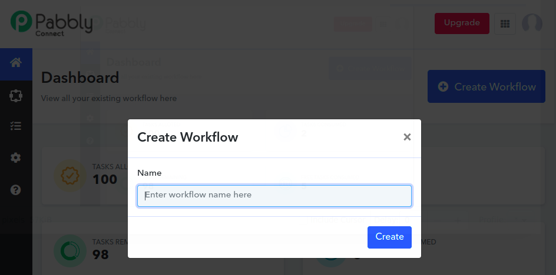
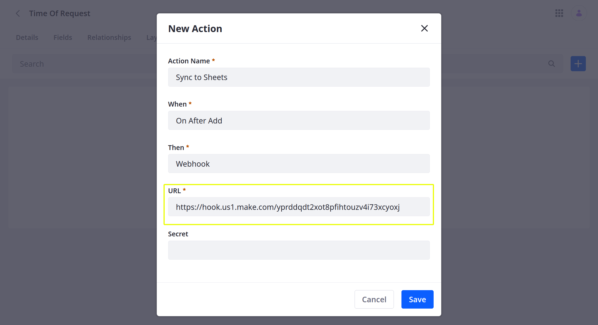
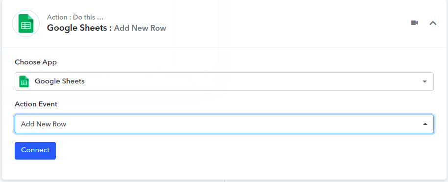
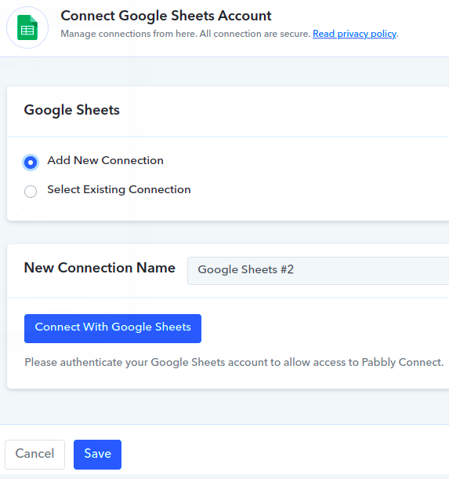
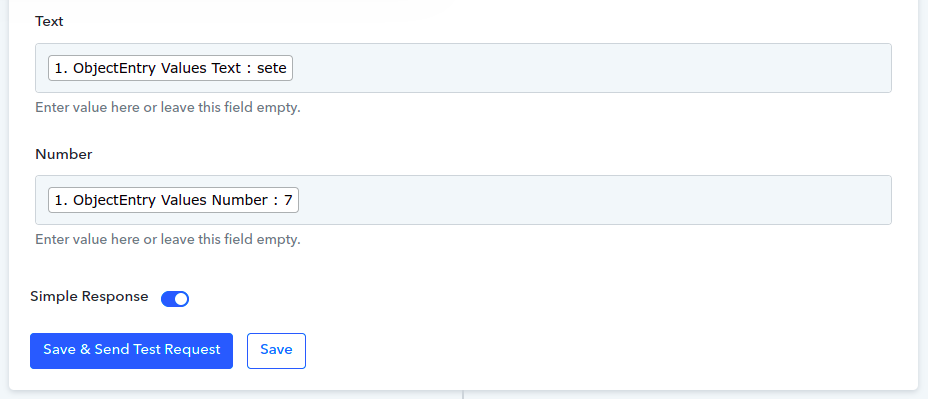

# Using Pabbly to Sync Object Data with Google Sheets

You can use Liferay Objects with data integration tools to create automated tasks for syncing Object data with external services. These tasks are triggered using webhooks and can connect to Google applications, Microsoft Office, and more.

Here you'll learn how to use webhooks to trigger sync tasks between Liferay Objects and Google Sheets using [Pabbly](https://www.pabbly.com/). Syncing your data in this way requires an Pabbly account, Google Spreadsheet, and active DXP 7.4 instance. The DXP instance must also have a published Object with the desired fields for sending or receiving data to the Google Spreadsheet.

## Syncing Object Data to a Google Sheet

Follow these steps to sync Object data to a Google Sheet:

1. Sign in to [Pabbly](https://www.pabbly.com/), navigate to the *All Apps* page, and click *Pabbly Connect*.

   

1. On the *Dashboard* page, click *Create Workflow*.

   

1. Enter a name and click *Create*.

   

1. For the *Trigger*, select the *Webhook* app.

   

1. Copy the generated *webhook URL*.

   

1. In your Liferay instance, use the copied URL to [define an Object action](../creating-and-managing-objects/defining-object-actions.md) that sends a request to the webhook endpoint whenever a new Object entry is added.

   

1. Adding an Object entry to trigger the webhooko and then click *Capture Response* in Pabbly.

   This allows the Webhook app to determine the Object's data structure automatically.

   

1. For the *Action*, select the *Google Sheets* app.

   

1. In the *Action Event* dropdown menu, select *Add New Row* and click *Connect*.

   

1. Connect the desired Google account to the app and click *Save*.

   

1. Select the desired *Spreadsheet* and *Sheet* to sync with the Object.

   

1. Map the Sheet's columns to data fields in the Object's structure.

   

1. Click the *Save & Send Test Request* button and verify the test was successful.

   

   If successful, the *Workflow* is activated and ready to use.

## Additional Information

* [Objects Overview](../../objects.md)
* [Creating and Managing Objects](../creating-and-managing-objects.md)
* [Understanding Object Integrations](../understanding-object-integrations.md)