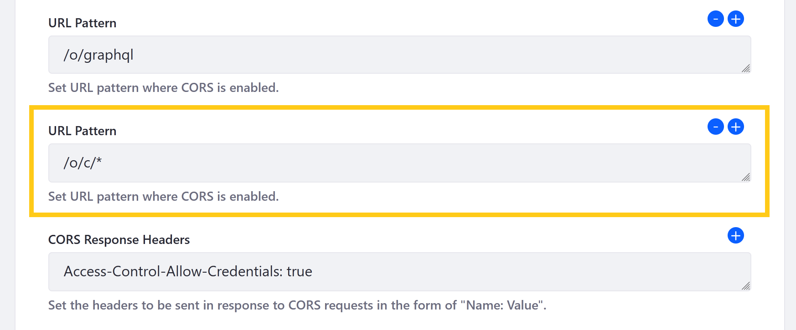
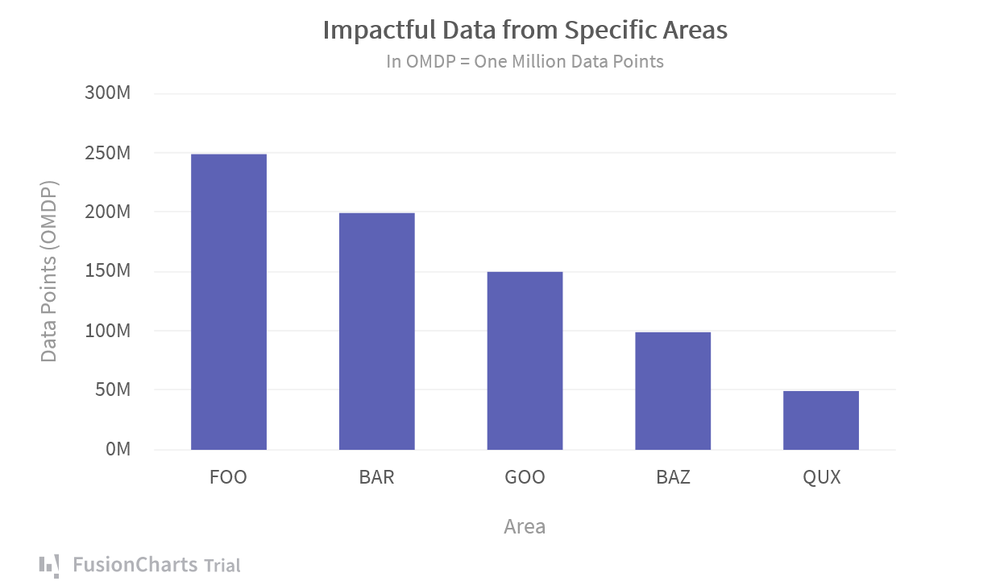
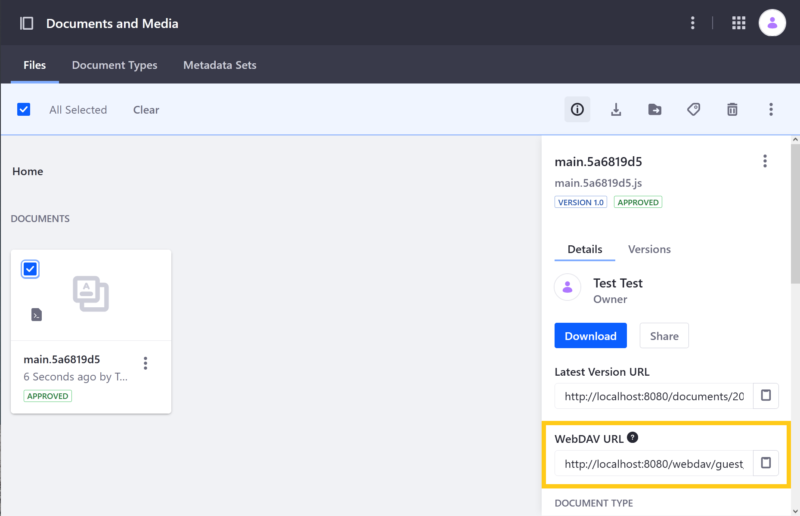

# Using Object Data with React Charts

Liferay [Objects](../../objects.md) can be combined with [Headless APIs](../understanding-object-integrations/headless-framework-integration.md), and Remote Apps with React [FusionCharts](https://www.fusioncharts.com/dev/getting-started/react/your-first-chart-using-react) to create dynamic visuals for data dashboards.

First, you'll set up a new DXP instance with [CORS](https://developer.mozilla.org/en-US/docs/Web/HTTP/CORS) enabled for Object API calls. Then, you'll create an Object for receiving and storing data. After adding data to the Object using REST APIs, you'll download and build the provided React application. Once the code is compiled, you'll host the generated `.js` file in the Liferay Document Library and copy its WebDAV URL. Finally, you'll use this URL to create a Remote App for the React chart and deploy it as a Page widget.

The chart is configured to call the Object via Headless API every five seconds, which returns the Object's data and updates the chart dynamically.


## Setting Up Liferay DXP

Before proceeding, start a new Liferay DXP 7.4+ container.

```docker
docker run -it -m 8g -p 8080:8080 [$LIFERAY_LEARN_DXP_DOCKER_IMAGE$]
```

Once started, follow these steps to add the `/o/c/*` URL pattern to the *Default Portal CORS Configuration*:

1. Open the *Global Menu* (), click the *Control Panel* tab, and go to *System Settings* &rarr; *Security Tools*.

1. Go to the *Portal Cross-Origin Resource Sharing (CORS)* tab and click *Default Portal CORS Configuration*.

   

1. Add a *URL Pattern* with the `/o/c/*` value and click *Save*. This enables CORS for all Object APIs.

   

## Creating an Object for the React Chart

1. Open the *Global Menu* (), click the *Control Panel* tab, and go to *Objects*.

1. Click the *Add* button () and enter these values:

   | Field | Value |
   | :--- | :--- |
   | Label | X3J8-Object |
   | Plural Label | X3J8-Objects |
   | Name | X3J8Object |

   ```{note}
   The provided React app uses these values.
   ```

1. Select the new *Object* draft, click on the *Field* tab, and add these *fields*:

   | Label | Field Name | Type | Required |
   | :--- | :--- | :--- | :--- |
   | Label | label | String | &#10004; |
   | Value | value | Integer | &#10004; |

1. Click the *Details* tab and click *Publish*.

[Publishing an Object](../creating-and-managing-objects/creating-objects.md#publishing-object-drafts) creates and activates a new application for receiving and storing data. You can now access it via the Liferay UI or Headless APIs.

## Adding Data to the Object using Headless APIs

1. Open the Liferay *API Explorer* (i.e., `localhost:8080/o/api`), select the *REST Services* drop-down menu, and choose `c/x3j8objects`.

1. Enter this data into the request body for the batch `POST` API:

   ```json
   [
     {
       "label": "FOO",
       "value": "250"
     },
     {
       "label": "BAR",
       "value": "200"
     },
     {
       "label": "GOO",
       "value": "150"
     },
     {
       "label": "BAZ",
       "value": "100"
     },
     {
       "label": "QUX",
       "value": "50"
     }
   ]
   ```

1. Click *Execute* to add the data entries to the Object.

Once you've finished adding data, you can set up the provided React server. This includes a FusionChart implementation that makes API calls to X3J8-Object and displays its data.

## Setting Up the React Chart

Follow these steps to download and build the React application:

1. Download and unzip the [React project](./liferay-x3j8.zip).

   ```bash
   curl https://learn.liferay.com/dxp/latest/en/building-applications/objects/objects-tutorials/liferay-x3j8.zip -O
   ```

   ```bash
   unzip liferay-x3j8.zip -d liferay-x3j8
   ```

   ```bash
   cd liferay-x3j8
   ```

1. Verify you have `node` and `yarn` installed. If you don't, run the following command and follow the prompts:

   ```bash
   ./setup_tutorial.sh
   ```

1. cd x3j8-remote-app

1. (Optional) Start the React server.

   ```bash
   yarn start
   ```

   Once started, go to `localhost:3000` to view the React chart. It calls the `c/x3j8objects` service using Basic Authentication and retrieves the Object's data every five seconds.

   

1. Build the React project.

   ```bash
   yarn build
   ```

   This command creates an optimized production build, which includes the files necessary for running the application as a Remote App.

1. Verify the build is successful and take note of the application's `.js` file.

   ```bash
   Creating an optimized production build...
   Compiled successfully.

   File sizes after gzip:

     523.77 kB  build/static/js/main.5a6819d5.js
     20 B       build/static/css/main.31d6cfe0.css
   ```

   ```{note}
   The `.css` file is unnecessary for this tutorial.
   ```

Once the code is compiled, you can host the application's `.js` file in the Liferay Document Library and copy its WebDAV URL.

## Hosting the Application's `.js` File

1. Open the *Site Menu* (), expand *Content & Data*, and click *Documents and Media*.

1. Drag and drop the `.js` file into the upload area.

   When uploaded to the Document Library, the file is assigned a unique WebDAV URL, which you'll use to create the Remote App.

1. Click the *Info* icon () and select the *uploaded file*.

1. Copy the file's *WebDAV URL* and save it for use in the next step.

   For example, `http://localhost:8080/webdav/guest/document_library/main.5a6819d5.js`.

   

## Creating a Remote App for the React Chart

1. Open the *Global Menu* (), click the *Applications* tab, and select *Remote Apps*.

1. Click the *Add* button ().

1. Enter these values:

   | Field | Value |
   | :--- | :--- |
   | Name | X3J8-Remote-App |
   | Type | Custom Element |
   | HTML Element Name | `x3j8-remote-app` |
   | URL | WebDAV URL for the `.js` file |
   | Portlet Category Name | Remote Apps |

1. Click *Save*.

Once Saved, Liferay creates a widget for the Remote App that you can deploy to Site Pages. This widget is listed under the application's Portlet Category Name (i.e., *Remote Apps* for this tutorial).


## Additional Information

* [Objects Overview](../../objects.md)
* [Headless Framework Integration](../understanding-object-integrations/headless-framework-integration.md)
* [Setting Up CORS](../../../installation-and-upgrades/securing-liferay/securing-web-services/setting-up-cors.md)
