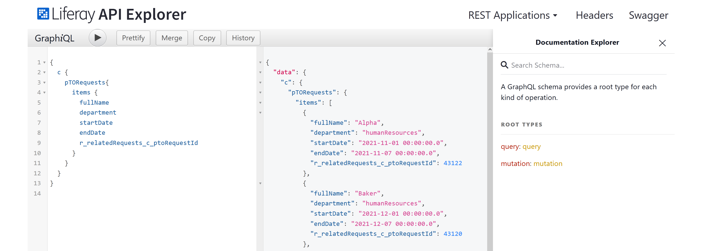

# Headless Framework Integration

> Available: Liferay DXP/Portal 7.4+

When you publish Objects, you also publish headless REST APIs with them. Liferay automatically generates both REST and [GraphQL](https://graphql.org) APIs for each Object you create. The APIs generated for an Object depend on its scope (i.e., company or Site).

All Objects use the `c/[pluralobjectlabel]` naming pattern (e.g., `c/timeoffrequests`). Each Object entry schema includes all of the Object's fields and relationships.

You can view and test an Object's APIs via the Liferay API Explorer at `[server]:[port]/o/api` (e.g., `localhost:8080/o/api`). REST APIs are listed under *REST Applications*. Click on *GraphQL* to access Liferay's [Graph*i*QL](https://github.com/graphql/graphiql) browser.

## Object REST APIs

With the REST APIs, you can perform both single and batch CRUD operations for Object entries.


All endpoints and Java methods use the Object's name. In the following examples, replace `ObjectName`/`objectName` with the name of your Object.

See [Consuming REST Services](../../../headless-delivery/consuming-apis/consuming-rest-services.md) for more information.

```{important}
In Liferay DXP 7.4 GA1, Picklist field values must use the following format in Object API calls: `"samplePicklist": "string"`. As of Liferay DXP 7.4 U1, the format changes, and values must use this format: `"samplePicklist": {"key": "string"}`.
```

### Company Scoped Objects

The following REST APIs are available for all company scoped Objects.

| HTTP Method | HTTP Endpoint | Java Method | Description |
| --- | --- | --- | --- |
| GET | `/` | `getObjectNamePage` | Returns a complete list of Object entries in a Liferay instance; results can be paginated, filtered, searched, and sorted |
| POST | `/` | `postObjectNamePage` | Creates a new Object entry using the details provided in the API call |
| DELETE | `/by-external-reference-code/{externalReferenceCode}` | `deleteByExternalReferenceCode` | Deletes the specified Object entry using its external reference code |
| GET | `/by-external-reference-code/{externalReferenceCode}` | `getByExternalReferenceCode`| Returns details for the specified Object entry using its external reference code |
| PUT | `/by-external-reference-code/{externalReferenceCode}` | `putByExternalReferenceCode` | Replaces the specified Object entry's details with those provided in the API call using its external reference code |
| DELETE | `/batch` | `deleteObjectNameBatch` | Deletes multiple Object entries |
| POST | `/batch` | `postObjectNameBatch` | Creates multiple Object entries using the details provided in the API call |
| PUT | `/batch` | `putObjectNameBatch` | Replaces multiple Object entries using the details provided in the API call |
| DELETE | `/{objectNameId}` | `deleteObjectName` | Deletes the specified Object entry and returns a 204 if the operation succeeds |
| GET | `/{objectNameId}` | `getObjectName` | Returns details for the specified Object entry |
| PATCH | `/{objectNameId}` | `patchObjectName` | Updates the fields specified in the API call for the specified Object entry; other fields remain unchanged |
| PUT | `/{objectNameId}` | `putObjectName` | Replaces the specified Object entry's details with those provided in the API call |

### Site Scoped Objects

The following REST APIs are available for all Site scoped Objects.

| HTTP Method | HTTP Endpoint | Java Method | Description |
| --- | --- | --- | --- |
| DELETE | `/scopes/{scopeKey}/by-external-reference-code/{externalReferenceCode}` | `deleteScopeScopeKeyByExternalReferenceCode` | Deletes the specified Object entry using its scope key and external reference code |
| GET | `/scopes/{scopeKey}/by-external-reference-code/{externalReferenceCode}` | `getScopeScopeKeyByExternalReferenceCode` | Returns details for the specified Object entry using its scope key and external reference code |
| PUT | `/scopes/{scopeKey}/by-external-reference-code/{externalReferenceCode}` | `putScopeScopeKeyByExternalReferenceCode` | Replaces the specified Object entry's details with those provided in the API call using its scope key and external reference code |
| GET | `/scopes/{scopesKey}` | `getScopeScopeKeyPage` | Returns a complete list of Object entries in a Site; results can be paginated, filtered, searched, and sorted |
| POST | `/scopes/{scopesKey}` | `postScopeScopeKey` | Creates a new Object entry in the specified Site using the details provided in the API call |
| DELETE | `/{objectNameId}` | `deleteObjectName` | Deletes the specified Object entry |
| GET | `/{objectNameId}` | `getObjectName` | Returns details for the specified Object entry |
| PATCH | `/{objectNameId}` | `patchObjectName` | Updates the fields specified in the API call for the specified Object entry; other fields remain unchanged |
| PUT | `/{objectNameId}` | `putObjectName` | Replaces the specified Object entry's details with those provided in the API call |

```{note}
For the API's `scopesKey` parameter, use the proper identifier for the desired data scope (e.g., Site ID, user role).
```

## Object GraphQL APIs

With the GraphQL APIs, you can both query and mutate Object data. Use Liferay's Graph*i*QL IDE  to search Object schemas, draft queries, run requests, and more.



See [Consuming GraphQL APIs](../../../headless-delivery/consuming-apis/consuming-graphql-apis.md) for more information.

## Additional Information

* [Consuming REST Services](../../../headless-delivery/consuming-apis/consuming-rest-services.md)
* [Consuming GraphQL APIs](../../../headless-delivery/consuming-apis/consuming-graphql-apis.md)
