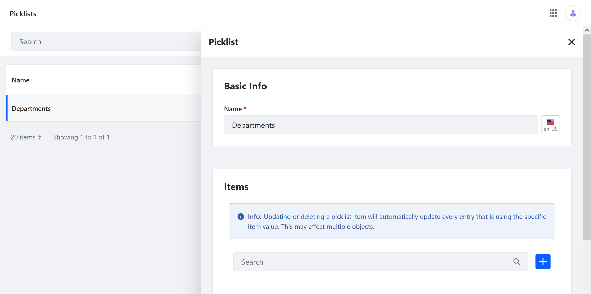
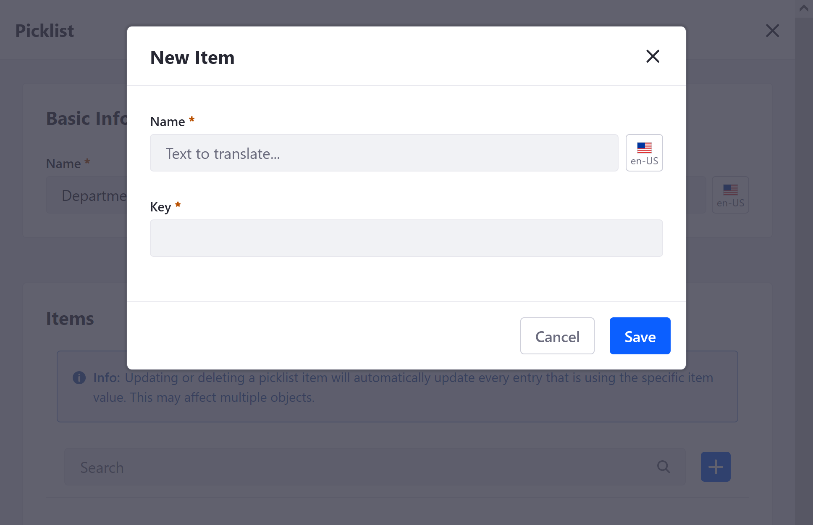
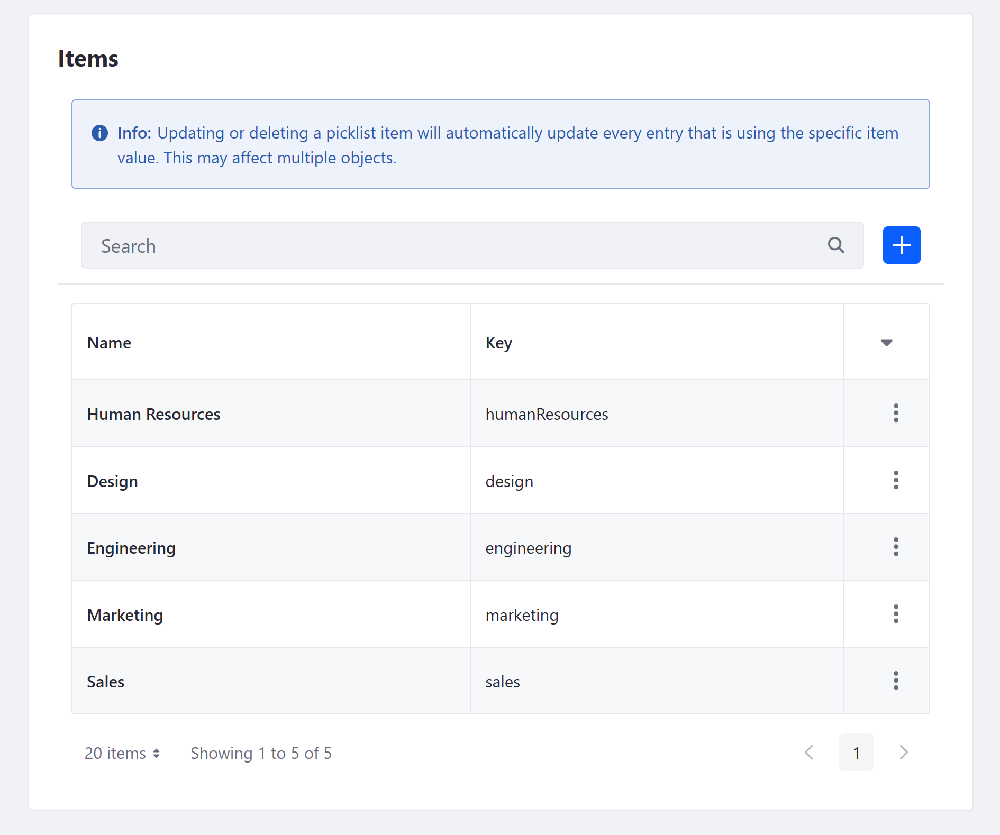
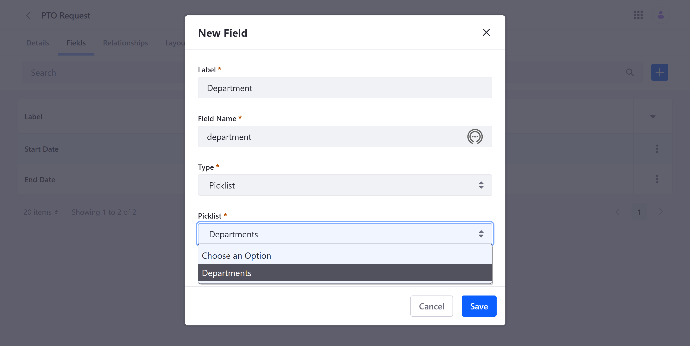
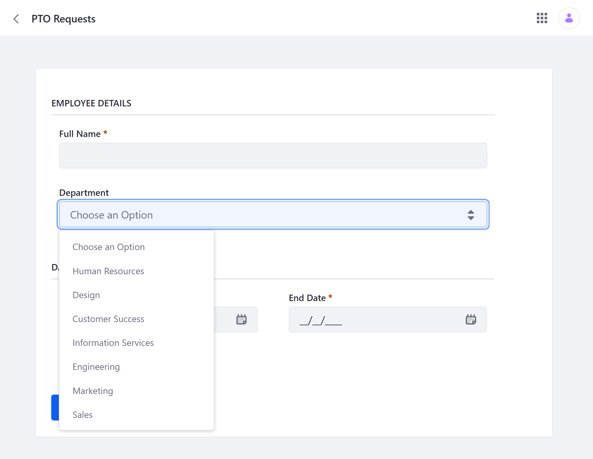

# Using Picklists

Picklists is an application for creating standard lists of values that are understood across the Liferay Portal. The process of creating a Picklist includes creating the initial list and adding items to it. Once these values are defined, they can be used in supported applications.

## Creating a Picklist

Follow these steps to create a Picklist:

1. Open the *Global Menu* (), go to the *Control Panel* tab, and click on *Picklists*.

1. Click on the *Add* button ().

   

1. Enter a *Name* for the Picklist, and click on *Save*. This value identifies the list in the Liferay UI and can be localized after creation.

1. Click on the new Picklist to edit it.

1. Under Items, click the *Add* button ().

   

1. In the modal window, enter a *Name* and *Key* for the item.

   **Name**: Determines the item's display name and can be localized after creation.

   **Key**: Determines the standard value understood by applications in the back-end and uses camel case.

   ```{note}
   Once created, an Item's key cannot be changed, but you can edit its name or delete it at any time.
   ```

   

1. Click *Save*. This immediately updates the Picklist with the new item.

1. Repeat the above steps to add additional items to the list.

   

## Adding Picklist Fields to Objects

Once a list is created, you can select it when creating Object fields. Simply select the *Picklist* field type and then select the desired pick list. See [Adding Fields to Objects](./creating-and-managing-objects/adding-fields-to-objects.md) for more information.



When users access this field in an Object's layout, it appears as a drop-down menu that lists the Picklist's items.



```{important}
A list cannot be deleted if it is used by an Object field, though list items can be edited and removed at any time.

Updating or deleting a Picklist item automatically updates all Object entries using the item value.
```

## Picklist Fields in API Calls

### In Liferay DXP 7.4 GA1

When making POST, PATCH, and PUT API calls that include Picklist fields, each Picklist field must use this format:

```json
"samplePicklist": "string"
```

### In Liferay DXP 7.4 U1

When making POST, PATCH, and PUT API calls that include Picklist fields, each Picklist field must use this format:

```json
"samplePicklist": {"key": "string"}
```

## Additional Information

* [Adding Fields to Objects](./creating-and-managing-objects/adding-fields-to-objects.md)
* [Designing Object Layouts](./creating-and-managing-objects/designing-object-layouts.md)
