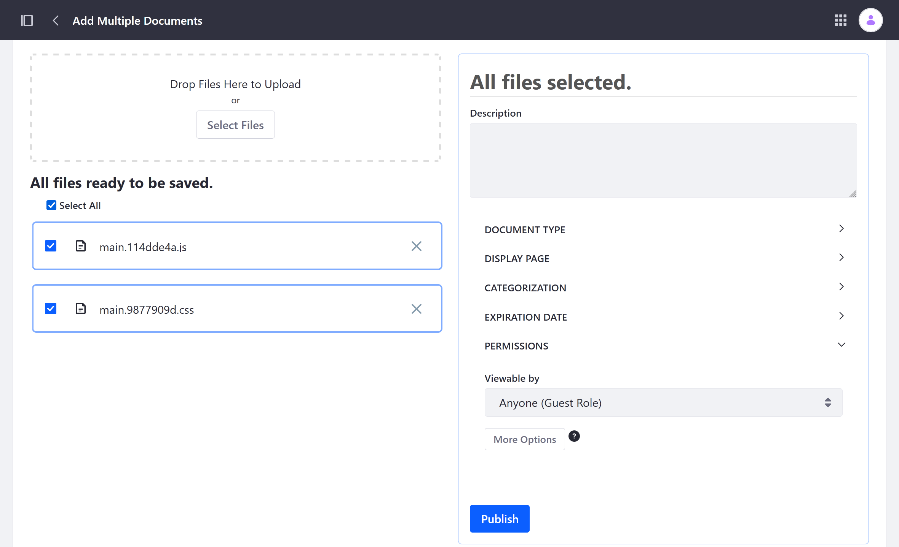
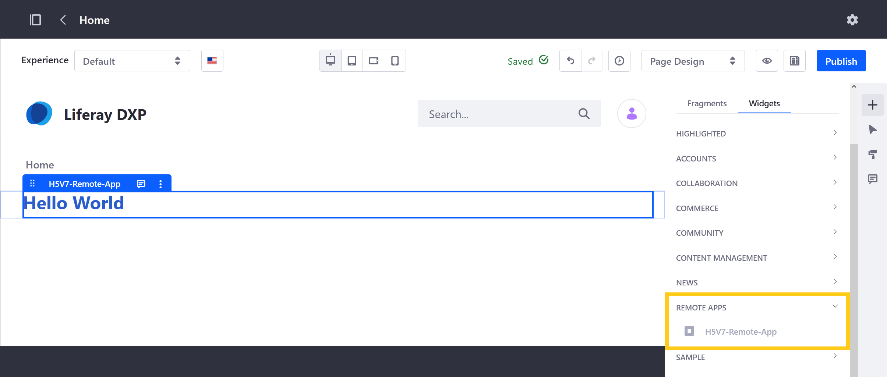

# Creating a Liferay Remote App

> Available for Liferay DXP 7.4+

Remote Apps is an application for integrating single-page applications into your Liferay solutions. It uses Liferay's front-end infrastructure to register external applications with the Liferay platform and render them as widgets. To simplify remote app creation, Liferay provides the [`create_remote_app.sh`](https://raw.githubusercontent.com/liferay/liferay-portal/master/tools/create_remote_app.sh) script. This script can be used to automatically generate React and Vue applications compatible with Liferay Remote Apps.

In this tutorial, you'll use the `create_remote_app.sh` script to create a simple "Hello World" React application. You'll call the script using a [cURL command](https://github.com/liferay/liferay-portal/blob/master/tools/create_remote_app.sh.README.markdown) that determines the application's HTML element name and JS framework (e.g., `react`, `vue2`, `vue3`). After the application is generated, you'll compile its code, host its `.js` and `.css` files, and then register it with Liferay Remote Apps using the Custom Element type. Once registered, you can deploy it to Site Pages as a widget.

```{important}
Running `create_remote_app.sh` requires the latest versions of [Node.JS](https://nodejs.org/), [NPM](https://www.npmjs.com/), and [YARN](https://classic.yarnpkg.com/). Before proceeding, ensure these tools are installed.
```

## Run the `create_remote_app.sh` Script

When calling `create_remote_app.sh`, you must provide a valid HTML element name and specify the desired JS framework.

Run this command to generate the React application's code:

```bash
curl -Ls https://github.com/liferay/liferay-portal/raw/master/tools/create_remote_app.sh | bash -s liferay-hello-world react
```

This calls the script with two arguments: a custom HTML element name (`liferay-hello-world`) and the desired JS framework (`react`).

When finished running, the script automatically creates a new React application in a folder named `liferay-hello-world`, which includes these elements:

```bash
liferay-hello-world
├── node_modules
├── README.md
├── package.json
├── public
│   └── index.html
├── src
│   ├── common
│   │   ├── services
│   │   │   └── liferay
│   │   │       ├── api.js
│   │   │       └── liferay.js
│   │   └── styles
│   │       ├── hello-world.scss
│   │       ├── index.scss
│   │       └── variables.scss
│   ├── index.js
│   └── routes
│       ├── hello-bar
│       │   ├── components
│       │   └── pages
│       │       └── HelloBar.js
│       ├── hello-foo
│       │   ├── components
│       │   └── pages
│       │       └── HelloFoo.js
│       └── hello-world
│           ├── components
│           └── pages
│               └── HelloWorld.js
└── yarn.lock
```

### Understanding the `index.js` File

   ```{literalinclude} ./creating-a-liferay-remote-app/resources/liferay-h5v7.zip/liferay-hello-world/src/index.js
       :language: js
   ```

The generated `index.js` file includes two customizations necessary for using the application as a Liferay Remote App.

* WebComponent: In line 21, the application is declared a `WebComponent` so that it can connect to Remote Apps.
* ELEMENT_ID: In line 30, `ELEMENT_ID` is set to `liferay-hello-world`, instead of the conventional `<div id="root" />`. This is because a Remote App's HTML Element Name must match the application's `ELEMENT_ID`, and `<div id="root" />` does not work for this purpose.

### Understanding the React Routes

The generated code includes three routes: `hello-world` (default), `hello-foo`, and `hello-bar`. Routes are alternative sets of code that you can use when running an application. <!--TASK: uncomment references once article is added; "See  for more information."-->

## Building the React Application

After running `create_remote_app.sh`, navigate to the new `liferay-hello-world` folder and build the application:

```bash
cd liferay-hello-world
```

```bash
yarn build
```

This command creates an optimized production build, which includes the `.js` and `.css` files necessary for running the application.

Before proceeding, confirm the code has compiled successfully and take note of the application's `.js` and `.css` files.

```bash
Creating an optimized production build...
Compiled successfully.

File sizes after gzip:

  43.51 kB  build/static/js/main.114dde4a.js
  121 B     build/static/css/main.9877909d.css
```

These files must be [hosted](#hosting-the-application-files) in a location accessible to Liferay Remote Apps. They can be hosted in a remote server or a data storage system. For our purposes, we'll upload them to Liferay's Document Library and host them using their WebDAV URLs.

```{tip}
Unique file names are generated for every build. When testing your custom applications, remember to update your `.js` and `.css` files after builds.
```

## Hosting the Application Files

Follow these steps to host the React application's `.js` and `.css` files:

1. Start up a new Liferay DXP 7.4+ container and log in.

   ```docker
   docker run -it -m 8g -p 8080:8080 [$LIFERAY_LEARN_DXP_DOCKER_IMAGE$]
   ```

1. Open the *Site Menu* (), expand *Content & Data*, and go to *Documents and Media*.

1. Click the *Add* button () and select *Multiple Files Upload*.

1. Drag and drop the `.js` and `.css` files into the upload area.

   Alternatively, use *Select Files* to upload them.

   

1. Click *Publish*.

This adds the files to the Document Library and assigns them unique URLs, which you'll use to create the Remote App.

To view each file's URL, click the *Info* icon () and select a file. Copy each file's *WebDAV URL* and save them for use in the next step.


For example,

* `http://localhost:8080/webdav/guest/document_library/main.114dde4a.js`
* `http://localhost:8080/webdav/guest/document_library/main.9877909d.css`

## Registering the Application with Remote Apps

Follow these steps to create a Remote App for the React application:

1. Open the *Global Menu* (), click on the *Applications* tab, and go to *Remote Apps*.

1. Click the *Add* button ().

1. Enter these values:

   | Field | Value |
   | --- | --- |
   | Name | Liferay Hello World |
   | Type | Custom Element |
   | HTML Element Name | `liferay-hello-world` |
   | URL | WebDAV URL for the `.js` file |
   | CSS URL | WebDAV URL for the `.css` file |
   | Portlet Category Name | Remote Apps |

   

1. Click *Save*.

Once saved, Liferay creates a widget that you can deploy to Site Pages. The widget is listed under the selected Portlet Category Name, and you can use it like any other Page widget.


## Additional Information

* [Building Applications](../../building-applications.md)
* [Remote Apps Overview](../remote-apps.md)
* [Objects Overview](../objects.md)
