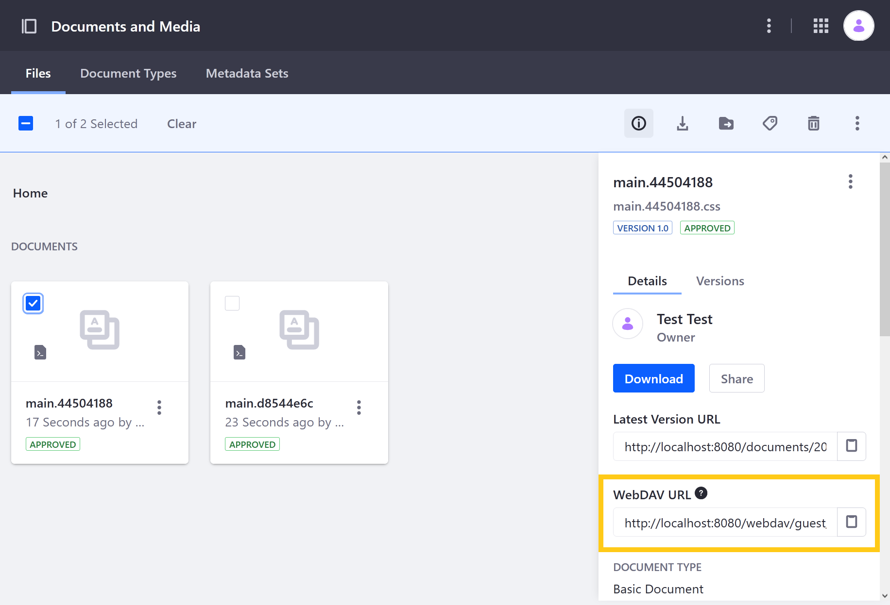
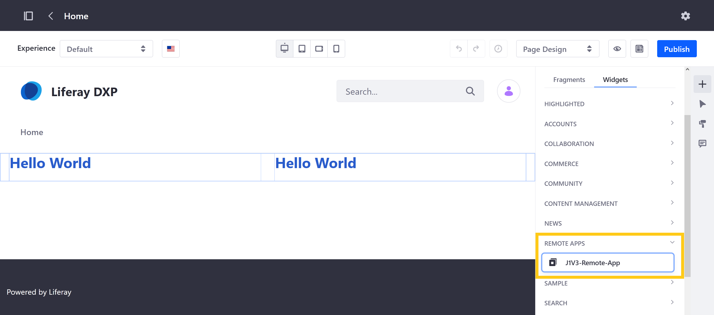
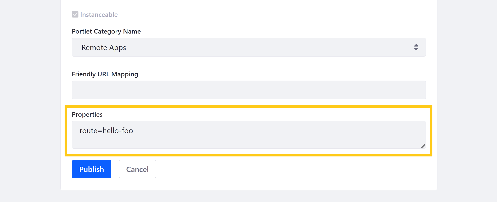
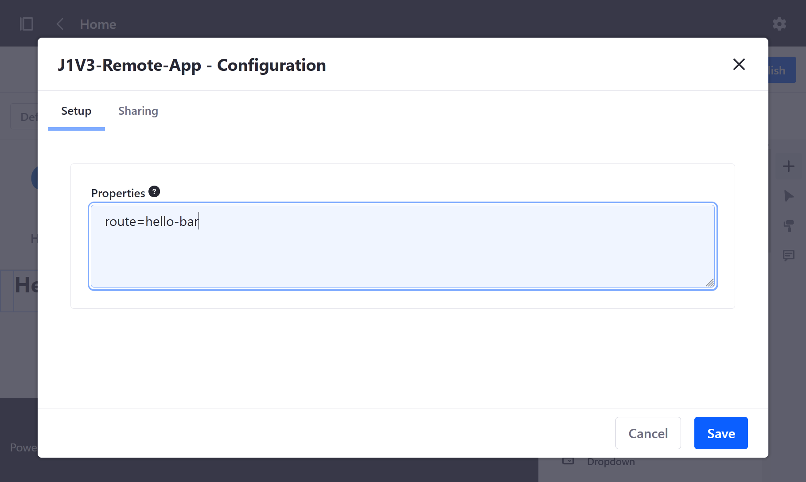

# Using Routes with a Basic Remote App

Remote Apps use Liferay's front-end infrastructure to register external applications with the Liferay platform and render them as widgets. For applications that include multiple routes (e.g., [React Router](https://reactrouter.com/), you can define Remote App properties to determine which routes are used for a widget at runtime. These properties can be set for an application via Remote Apps or the widget's configuration options once deployed.

In this tutorial, you'll create a basic React application using Liferay's `create_remote_app.sh` script, which generates a sample app with three routes: `hello-world`, `hello-foo`, `hello-bar`. After compiling the application and hosting its `.js` and `.css` files, you'll register the application with Remote Apps and deploy it as a Page widget. Finally, you'll configure it to use each of the alternative routes.


```{note}
Liferay Remote Apps is agnostic regarding how applications are built, packaged, and hosted. This tutorial only offers a convenient way to create a sample remote application with basic routing.
```

Running `create_remote_app.sh` requires the latest versions of [Node.JS](https://nodejs.org/), [NPM](https://www.npmjs.com/), and [YARN](https://classic.yarnpkg.com/). Before proceeding, ensure these tools are installed.

## Creating, Building, and Hosting the React Application

1. Start a new Liferay DXP 7.4+ container. You can continue to the next steps while the container starts.

   ```docker
   docker run -it -m 8g -p 8080:8080 [$LIFERAY_LEARN_DXP_DOCKER_IMAGE$]
   ```

1. Run this command in a separate terminal to generate the React application.

   ```bash
   curl -Ls https://github.com/liferay/liferay-portal/raw/master/tools/create_remote_app.sh | bash -s j1v3-remote-app react
   ```

1. Verify the application was created successfully.

   The script should create a new React application called `j1v3-remote-app` that includes the following elements:

   ```bash
   j1v3-remote-app
   ├── node_modules
   ├── README.md
   ├── package.json
   ├── public
   │   └── index.html
   ├── src
   │   ├── common
   │   │   ├── services
   │   │   │   └── liferay
   │   │   │       ├── api.js
   │   │   │       └── liferay.js
   │   │   └── styles
   │   │       ├── hello-world.scss
   │   │       ├── index.scss
   │   │       └── variables.scss
   │   ├── index.js
   │   └── routes
   │       ├── hello-bar
   │       │   └── pages
   │       │       └── HelloBar.js
   │       ├── hello-foo
   │       │   └── pages
   │       │       └── HelloFoo.js
   │       └── hello-world
   │           └── pages
   │               └── HelloWorld.js
   └── yarn.lock
   ```

1. Navigate to the new `j1v3-remote-app` folder and build the application.

   ```bash
   cd j1v3-remote-app
   ```

   ```bash
   yarn build
   ```

1. Verify the build succeeded and take note of the application's `.js` and `.css` files.

   ```bash
   Creating an optimized production build...
   Compiled successfully.

   File sizes after gzip:

   43.51 kB  build/static/js/main.114dde4a.js
   121 B     build/static/css/main.9877909d.css
   ```

1. In Liferay DXP, open the *Site Menu* (), expand *Content & Data*, and go to *Documents and Media*.

   ```{tip}
   For demonstration purposes this tutorial hosts the application’s static resources in Liferay’s Document Library.
   In a production environment, instead host the application’s resources on a server optimized for hosting static resources.
   ```

1. Click the *Add* button () and select *Multiple Files Upload*.

1. Drag and drop the `.js` and `.css` files into the upload area.

   

1. Click *Publish*.

This adds the files to the Liferay Document Library and assigns them unique WebDAV URLs, which you'll use to create the Remote App.

To view each file's URL, click the *Info* icon () and select one of the files at a time. Copy each file's *WebDAV URL* and save them for use in the next step.



For example,

* `http://localhost:8080/webdav/guest/document_library/main.114dde4a.js`
* `http://localhost:8080/webdav/guest/document_library/main.9877909d.css`

## Registering and Deploying the Remote App

1. Open the *Global Menu* (), click on the *Applications* tab, and go to *Remote Apps*.

1. Click the *Add* button ().

1. Enter these values:

   | Field | Value |
   | :--- | :--- |
   | Name | J1V3-Remote-App |
   | Type | Custom Element |
   | HTML Element Name | `j1v3-remote-app` |
   | URL | WebDAV URL for the `.js` file |
   | CSS URL | WebDAV URL for the `.css` file |
   | Instanceable | &#10004; |
   | Portlet Category Name | Remote Apps |

1. Click *Save*.

Once saved, Liferay creates a widget named J1V3-Remote-App, which you can deploy to Site Pages like any other Page widget. It appears under the selected Portlet Category Name.

Since J1V3-Remote-App is instanceable, you can add many of them to a page, each with its own independent configuration. For this tutorial, add the widget to a page twice.



## Using the `route` Property

The auto-generated app includes three routes: `hello-world`, `hello-foo`, `hello-bar`. By default the application uses the `hello-world` route. However, you can use Remote App properties to configure it to use an alternate route. You can set these properties via [Remote Apps](#defining-a-route-property-via-remote-apps) or a [widget's configuration options](#defining-a-route-property-via-widget-configuration).

### Defining a Route Property via Remote Apps

1. Open the *Global Menu* (), click on the *Applications* tab, and go to *Remote Apps*.

1. Select *J1V3-Remote-App*.

   

1. Enter `route=hello-foo` into the Properties field.

   

1. Click *Publish*.

1. Verify both deployed widgets use the `HelloFoo` route.

   

### Defining a Route Property via Widget Configuration

1. Edit the Page containing the J1V3-Remote-App widgets.

1. Click the *Options* button () for one of the widgets and select *Configuration*.

   

1. Enter `route=hello-bar` into the Properties field.

   

1. Click *Save*.

1. Verify the configured widget uses the `hello-bar` route, while the other widget still uses the `hello-foo` route.

   

## Analyzing the Route Code

```{literalinclude} ./using-routes-with-a-basic-remote-app/resources/liferay-j1v3.zip/j1v3-remote-app/src/index.js
    :language: js
    :lines: 1-34
```

This `index.js` file creates the `WebComponent` class, which extends the `HTMLElement` interface. This class implements the interface's [`connectedCallback()`](https://developer.mozilla.org/en-US/docs/Web/Web_Components/Using_custom_elements#using_the_lifecycle_callbacks) function, which calls [`ReactDOM.render`](https://reactjs.org/docs/react-dom.html#render) with `App` as a parameter. When `App` is called, it checks for any defined `"route"` attribute and compares that value with the available routes. If it matches either `hello-foo` or `hello-bar`, then it returns and renders the corresponding route. Otherwise, it returns and renders `hello-world`.

Each of the routes is imported into the `index.js` file from the `routes` folder:

```bash
routes
├── hello-bar
│   └── pages
│       └── HelloBar.js
├── hello-foo
│   └── pages
│       └── HelloFoo.js
└── hello-world
    └── pages
        └── HelloWorld.js
```

### HelloWorld.js

```{literalinclude} ./using-routes-with-a-basic-remote-app/resources/liferay-j1v3.zip/j1v3-remote-app/src/routes/hello-world/pages/HelloWorld.js
    :language: js
    :lines: 1-9
```

### HelloFoo.js

```{literalinclude} ./using-routes-with-a-basic-remote-app/resources/liferay-j1v3.zip/j1v3-remote-app/src/routes/hello-foo/pages/HelloFoo.js
    :language: js
    :lines: 1-9
```

### HelloBar.js

```{literalinclude} ./using-routes-with-a-basic-remote-app/resources/liferay-j1v3.zip/j1v3-remote-app/src/routes/hello-bar/pages/HelloBar.js
    :language: js
    :lines: 1-9
```

## Additional Information

* [Remote Apps Overview](../../remote-apps.md)
* [Understanding Remote App Types](../understanding-remote-app-types.md)
* [Creating a Basic Remote App](./creating-a-basic-remote-app.md)
* [Remote Apps UI Reference](../remote-apps-ui-reference.md)
