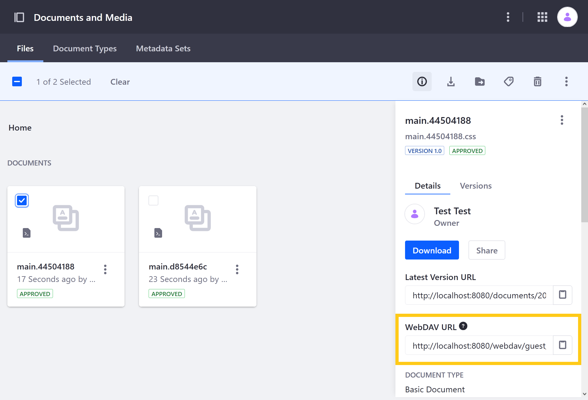
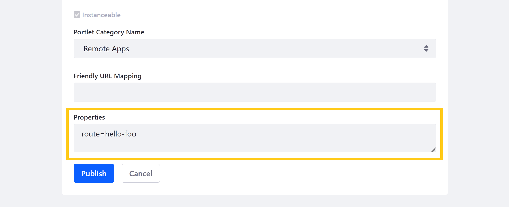
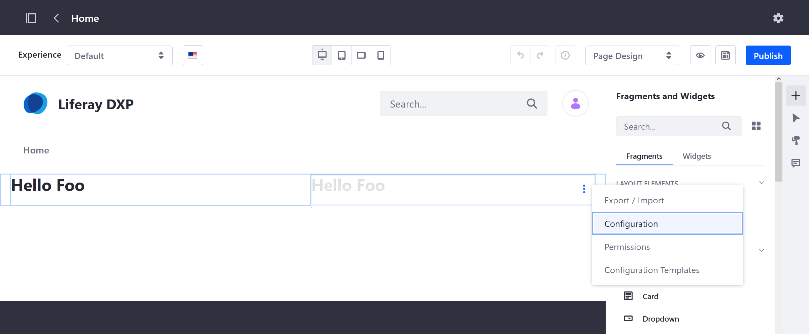

# Using Routes with Remote Apps

Remote Apps uses Liferay's front-end infrastructure to register external applications with the Liferay platform and render them as widgets. For applications that include multiple routes, you can define Remote App properties to determine which route is used for a widget during runtime. These properties can be set for an application via Remote Apps or the widget's configuration options once deployed.

In this tutorial, you'll create a React application using the `create_remote_app.sh` script, compile its code, and then host its `.js` and `.css` files in the Liferay Document Library. Liferay's [`create_remote_app.sh`](https://raw.githubusercontent.com/liferay/liferay-portal/master/tools/create_remote_app.sh) script generates a web component with three routes: `hello-world`, `hello-foo`, `hello-bar`. Once hosted, you'll register the application with Remote Apps and deploy its widget to a Site Page. Finally, you'll define properties to use each route.

```{important}
Running `create_remote_app.sh` requires the latest versions of [Node.JS](https://nodejs.org/), [NPM](https://www.npmjs.com/), and [YARN](https://classic.yarnpkg.com/). Before proceeding, ensure these tools are installed.
```

## Creating, Building, and Hosting the React Application

Follow these steps to create, build, and host the React application:

1. Start up a new Liferay DXP 7.4+ container and move on to the next steps while it's starting up.

   ```docker
   docker run -it -m 8g -p 8080:8080 [$LIFERAY_LEARN_DXP_DOCKER_IMAGE$]
   ```

1. Run this command in a separate terminal to generate the React application's code:

   ```bash
   curl -Ls https://github.com/liferay/liferay-portal/raw/master/tools/create_remote_app.sh | bash -s j1v3-remote-app react
   ```

1. Verify the application was created successfully.

   When finished running, the script automatically creates a new React application in a folder named `j1v3-remote-app`, which includes these elements:

   ```bash
   j1v3-remote-app
   ├── node_modules
   ├── README.md
   ├── package.json
   ├── public
   │   └── index.html
   ├── src
   │   ├── common
   │   │   ├── services
   │   │   │   └── liferay
   │   │   │       ├── api.js
   │   │   │       └── liferay.js
   │   │   └── styles
   │   │       ├── hello-world.scss
   │   │       ├── index.scss
   │   │       └── variables.scss
   │   ├── index.js
   │   └── routes
   │       ├── hello-bar
   │       │   └── pages
   │       │       └── HelloBar.js
   │       ├── hello-foo
   │       │   └── pages
   │       │       └── HelloFoo.js
   │       └── hello-world
   │           └── pages
   │               └── HelloWorld.js
   └── yarn.lock
   ```

1. Navigate to the new `j1v3-remote-app` folder and build the application:

   ```bash
   cd j1v3-remote-app
   ```

   ```bash
   yarn build
   ```

1. Verify the build was successful and take note of the application's `.js` and `.css` files.

   ```bash
   Creating an optimized production build...
   Compiled successfully.

   File sizes after gzip:

   43.51 kB  build/static/js/main.114dde4a.js
   121 B     build/static/css/main.9877909d.css
   ```

1. In Liferay DXP, open the *Site Menu* (), expand *Content & Data*, and go to *Documents and Media*.

1. Click the *Add* button () and select *Multiple Files Upload*.

1. Drag and drop the `.js` and `.css` files into the upload area.

   

1. Click *Publish*.

This adds the files to the Document Library and assigns them unique WebDAV URLs, which you'll use to create the Remote App.

To view each file's URL, click the *Info* icon () and select a file. Copy each file's *WebDAV URL* and save them for use in the next step.



For example,

* `http://localhost:8080/webdav/guest/document_library/main.114dde4a.js`
* `http://localhost:8080/webdav/guest/document_library/main.9877909d.css`

## Registering and Deploying the Remote App

Follow these steps to create a Remote App for the React application:

1. Open the *Global Menu* (), click on the *Applications* tab, and go to *Remote Apps*.

1. Click the *Add* button ().

1. Enter these values:

   | Field | Value |
   | --- | --- |
   | Name | J1V3-Remote-App |
   | Type | Custom Element |
   | HTML Element Name | `j1v3-remote-app` |
   | URL | WebDAV URL for the `.js` file |
   | CSS URL | WebDAV URL for the `.css` file |
   | Instanceable | &#10004; |
   | Portlet Category Name | Remote Apps |

1. Click *Save*.

Once saved, Liferay creates a widget named J1V3-Remote-App, which you can deploy to Site Pages like other Page widgets. This widget is listed under the selected Portlet Category Name.

For this tutorial, add the widget to a page twice. Since J1V3-Remote-App is instanceable, you can add multiple instances of the widget to a page, each with its own independent configuration.


## Using the `route` Property

You can set the `route` properties for an application via Remote Apps or a widget's configuration options.

### Defining a Route Property via Remote Apps

Follow these steps to define a route property via *Remote Apps*:

1. Open the *Global Menu* (), click on the *Applications* tab, and go to *Remote Apps*.

1. Select *J1V3-Remote-App*.

   

1. Enter `route=hello-foo` into the Properties field.

   

1. Click *Publish*.

1. Verify the deployed widgets both use the `HelloFoo` route.

   

### Defining a Route Property via Widget Configuration

Follow these steps to define a route property via *widget configuration*:

1. Begin editing the Page where the J1V3-Remote-App widgets are deployed.

1. Click the *Options* button () for one of the widgets and select *Configuration*.

   

1. Enter `route=hello-bar` into the Properties field.

   

1. Click *Save*.

1. Verify the configured widget uses the `HelloBar` route, while the other widget still uses the `HelloFoo` route.

   

## Analyzing the Route Code

### Understanding the `index.js` File

```{literalinclude} ./using-routes-with-remote-apps/resources/liferay-j1v3.zip/j1v3-remote-app/src/index.js
    :language: js
```

The index file creates the `WebComponent` class that extends `HTMLElement`.

It calls the `render` function for `ReactDOM`, which checks the value for the `App` function.

This function checks for a `route` parameter.

If there is a value, and that value matches either `hello-foo` or `hello-bar`, then it returns and renders the imported `HelloFoo.js` or `HelloBar.js` routes.

If no valid route value is provided, then it defaults to `HelloWorld.js`.

### Understanding the Routes

The default create_remote_app.sh script includes these routes:

```bash
routes
├── hello-bar
│   └── pages
│       └── HelloBar.js
├── hello-foo
│   └── pages
│       └── HelloFoo.js
└── hello-world
    └── pages
        └── HelloWorld.js
```

#### HelloWorld

```{literalinclude} ./using-routes-with-remote-apps/resources/liferay-j1v3.zip/j1v3-remote-app/src/routes/hello-world/pages/HelloWorld.js
    :language: js
```

#### HelloFoo

```{literalinclude} ./using-routes-with-remote-apps/resources/liferay-j1v3.zip/j1v3-remote-app/src/routes/hello-foo/pages/HelloFoo.js
    :language: js
```

#### HelloBar

```{literalinclude} ./using-routes-with-remote-apps/resources/liferay-j1v3.zip/j1v3-remote-app/src/routes/hello-bar/pages/HelloBar.js
    :language: js
```

## Additional Information

* [Creating a Liferay Remote App](./creating-a-liferay-remote-app.md)
