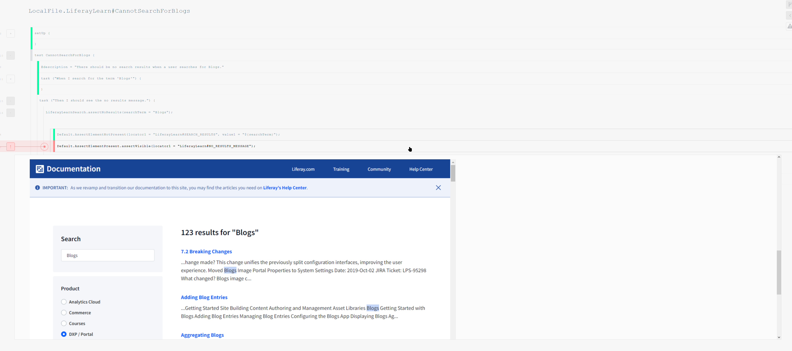

# Understanding Test Results and Debugging Tests

Poshi tests are run on the terminal or command line. When a test run is completed there are multiple ways to view the test results and diagnose test issues.

## Viewing Test Results on the Console Log

When a test run is successful the console log will display a message similar to the following:

```
###
### LocalFile.LiferayLearn#CannotSearchForPumpkins
###

Using "L:\poshi-standalone\build\webdriver/chromedriver.exe" as "webdriver.chrome.driver" path

com.liferay.poshi.runner.PoshiRunner > test[LocalFile.LiferayLearn#CannotSearchForPumpkins] STANDARD_ERROR
   Starting ChromeDriver 2.37.544315 (730aa6a5fdba159ac9f4c1e8cbc59bf1b5ce12b7) on port 46142
   Only local connections are allowed.
   Mar 21, 2022 9:42:39 AM org.openqa.selenium.remote.ProtocolHandshake createSession
   INFO: Detected dialect: OSS

com.liferay.poshi.runner.PoshiRunner > test[LocalFile.LiferayLearn#CannotSearchForPumpkins] STANDARD_OUT
   There should be no search results when a user searches for Pumpkins.
   Total duration of 'LiferaySelenium.pause' usages: 0 ms

BUILD SUCCESSFUL in 2m 5s
4 actionable tasks: 2 executed, 2 up-to-date
```

A failed test run displays more information which will include the reason the test failed. Note that the following log displays that the failure point being `Element is not visible at "//h4[@id="noResultsMessage"]"`.

```
###
### LocalFile.LiferayLearn#CannotSearchForPumpkins
###

Using "L:\poshi-standalone\build\webdriver/chromedriver.exe" as "webdriver.chrome.driver" path

com.liferay.poshi.runner.PoshiRunner > test[LocalFile.LiferayLearn#CannotSearchForBlogs] STANDARD_ERROR
Starting ChromeDriver 2.37.544315 (730aa6a5fdba159ac9f4c1e8cbc59bf1b5ce12b7) on port 29070
Only local connections are allowed.
Mar 21, 2022 9:27:57 AM org.openqa.selenium.remote.ProtocolHandshake createSession
INFO: Detected dialect: OSS

com.liferay.poshi.runner.PoshiRunner > test[LocalFile.LiferayLearn#CannotSearchForBlogs] STANDARD_OUT
There should be no search results when a user searches for Blogs.

BUILD FAILED: Element is not visible at "//h4[@id="noResultsMessage"]"
L:\poshi-standalone\poshi-tests\macros\LiferayLearnSearch.macro[assertNoResults]:7
L:\poshi-standalone\poshi-tests\testcases\LiferayLearn.testcase[CannotSearchForBlogs]:16


com.liferay.poshi.runner.PoshiRunner > test[LocalFile.LiferayLearn#CannotSearchForBlogs] STANDARD_ERROR
java.lang.Exception: Element is not visible at "//h4[@id="noResultsMessage"]"
    at com.liferay.poshi.runner.selenium.BaseWebDriverImpl$Condition.assertTrue(BaseWebDriverImpl.java:4489)
    at com.liferay.poshi.runner.selenium.BaseWebDriverImpl$Condition.waitFor(BaseWebDriverImpl.java:4524)
    at com.liferay.poshi.runner.selenium.BaseWebDriverImpl.waitForVisible(BaseWebDriverImpl.java:3451)
    at sun.reflect.NativeMethodAccessorImpl.invoke0(Native Method)
    at sun.reflect.NativeMethodAccessorImpl.invoke(NativeMethodAccessorImpl.java:62)
    at sun.reflect.DelegatingMethodAccessorImpl.invoke(DelegatingMethodAccessorImpl.java:43)
    at java.lang.reflect.Method.invoke(Method.java:498)
    at com.liferay.poshi.runner.PoshiRunnerExecutor$1.call(PoshiRunnerExecutor.java:1174)
    at java.util.concurrent.FutureTask.run(FutureTask.java:266)
    at java.util.concurrent.ThreadPoolExecutor.runWorker(ThreadPoolExecutor.java:1149)
    at java.util.concurrent.ThreadPoolExecutor$Worker.run(ThreadPoolExecutor.java:624)
    at java.lang.Thread.run(Thread.java:748)

com.liferay.poshi.runner.PoshiRunner > test[LocalFile.LiferayLearn#CannotSearchForBlogs] STANDARD_OUT
Total duration of 'LiferaySelenium.pause' usages: 0 ms
Test retry attempts exceeded in Poshi Runner JVM

com.liferay.poshi.runner.PoshiRunner > test[LocalFile.LiferayLearn#CannotSearchForBlogs] FAILED
java.lang.Exception at BaseWebDriverImpl.java:4489

1 test completed, 1 failed

> Task :runPoshi FAILED

FAILURE: Build failed with an exception.

* What went wrong:
Execution failed for task ':runPoshi'.
> There were failing tests. See the report at: file:///L:/poshi-standalone/tests/index.html
```

## Viewing the Test Reports

Another way to view the test results is through the Test Report. After a test run, a `test-results` folder gets created in your root directory. Within this folder are the test logs and summary pages of the completed test run. If you ran the test example in this tutorial your test-results folder should look similar to this:

```
poshi-standalone
├── ...
├── test-results   
|   ├── binary
|   ├──  index.html LocalFile.LiferayLearn_CannotSearchForPumpkins
|   |  ├── screenshots
|   |  ├── index.html
|   |  └── summary.html
|   ├── poshi-warnings.xml
|   └── TEST-com.liferay.poshi.runner.PoshiRunner.xml
├── ...
├── ...
```

Navigate to the `index.html` and open the file on a browser.

A successful test result will display the test steps with a green bar indicating that the step passed.

  

A failed test result will display the failing test step with a red bar indicating that the step failed. You can expand the exclamation mark icon to view more information on the failure point, including screenshots of the system state before and after the failure.

  

To test this, make a copy of your `CannotSearchForPumpkins` test and replace the term `Pumpkins` with `Blogs`. If you are also changing the test name, remember to edit your `poshi-ext.properties` file. See [Running a Test](./running-a-test.md) for more information.

## Diagnosing the Cause of a Test Failure

From the information provided in the log, there are a few ways to diagnose the issue:

1. Determine if there is a bug in the system in test by manually testing the test steps, including the variables provided in the Poshi test.

1. If there is no bug and the system behaves as expected, determine if the locator is checking the correct path by searching for the path on the page DOM (Web Developer Console).

1. If there is neither a bug nor an incorrect path, consider whether the function you are using in the macro is appropriate for the interaction. For example, you might be using the `Click` function on a checkbox where the function `Check` might be more appropriate. See [Functions](../poshi-basics/poshi-layers/functions.md) for more information.
