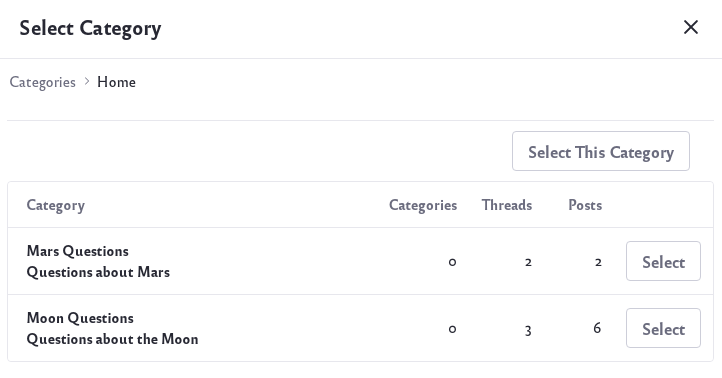
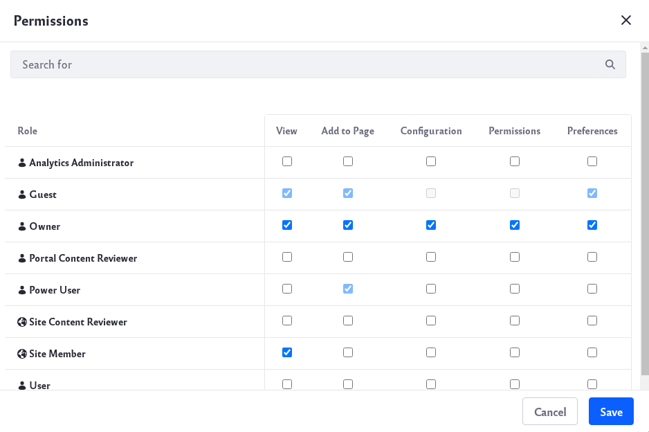

# Configuring the Questions App

> Available: Liferay DXP/Portal 7.3+

There are two primary methods for configuring the Questions app: directly through the app configuration and through the System Settings configuration.

To configure through the application,

1. Click on the Options icon () of the app and click *Configuration*.

    

To configure through System Settings,

1. Navigate to *Control Panel* &rarr; *System Settings* &rarr; *Third Party*.
1. Click on *Questions* under Widget Scope.

    

## Topic Display Style

Topics can be displayed as cards or as a list.

1. Click on the Options icon () of the app and click *Configuration*.

    

1. Under General Settings, there is a Show Cards for Topic Navigation option.

  If this is checked, the app will display separate cards for each question topic. If it is not checked, the app will display a list of all the questions.

  

## Limiting Topic Display

Questions default display behavior is to show all Topics. You can opt to only display certain topics by configuring a Root Topic. To only display specific sub-topics or questions do the following,

1. Click on the Options icon () of the app and click *Configuration*.

    

1. Click the *Select* button under Root Topic ID.

    

1. Select a topic and click *Save*. The app will now only show sub-topics and questions for the selected topic.

## Managing App Permissions

To modify permissions for the app,

1. Click on the Options icon () of the app and click *Permissions*.

    

1. A new window will open.

    

1. Assign permissions for different Roles. Click *Save*.

## Redirecting Guest Users to Login

To enable this functionality you must configure it through System Settings,

1. Navigate to *Control Panel* &rarr; *System Settings* &rarr; *Third Party*.
1. Click on *Questions* under Widget Scope.

    

1. Check *Enable Redirect to Login*
1. Guests user are now redirected to a login page when they try to click *Ask Question*.

```{note}
A Service Access Policy needs to be created to allow Guest users to view the app.
```

### Creating a Service Access Policy to Allow Guest Viewers

To create a new policy,

1. Navigate to *Control Panel* &rarr; *Service Access Policy*. Click on the *Add* icon ().

1. Give the policy a Name and Title. Click the *Switch to Advanced Mode* button at the bottom. Add the following two signatures under Allowed Service Signatures,

    ```java
    com.liferay.message.boards.service.MBCategoryService#getCategoriesCount
    com.liferay.message.boards.service.MBCategoryService#getCategory
    ```

    

1. Click *Save* to save the new policy.

## System Configuration Reference

| Setting | Description |
| :--- | :--- |
| Show Cards for Topic Navigation | If this is checked, the app will display separate cards for each question topic. If it is not checked, the app will display a list of all the questions. |
| Use Topic Names in URL | If this is checked, each topic name will be used in a more friendly URL instead of a topic ID number. |
| Root Topic ID | This setting is ignored. |
