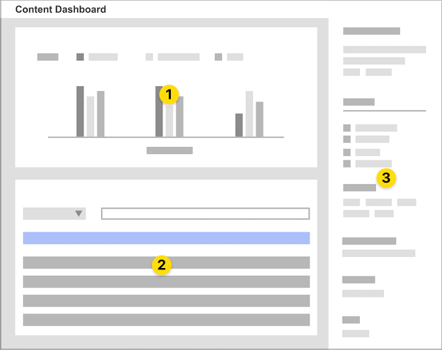
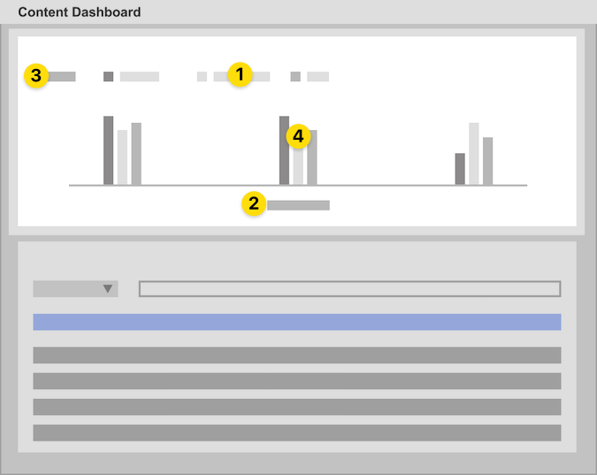
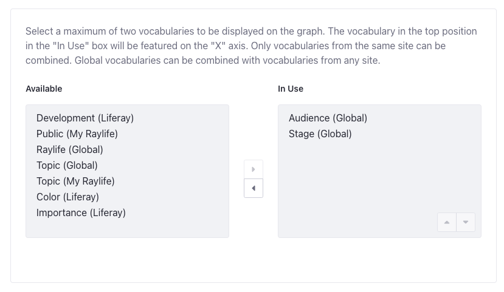
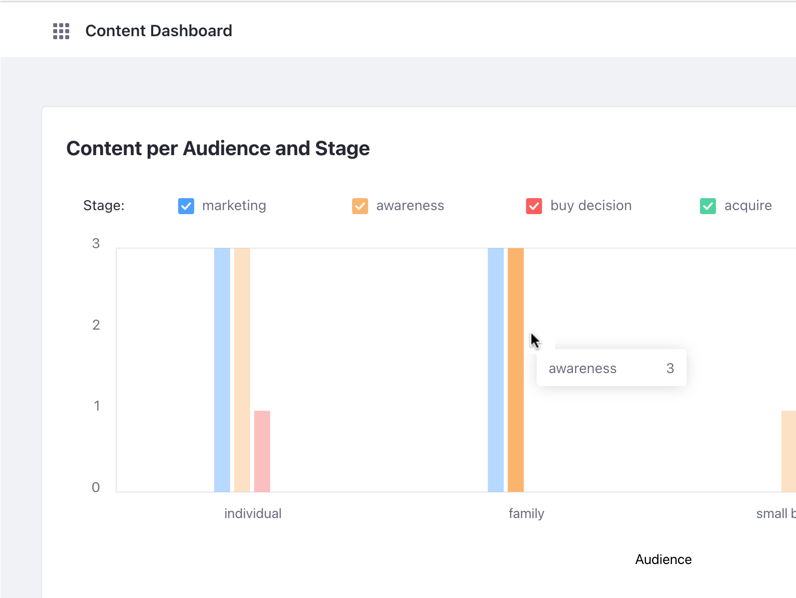
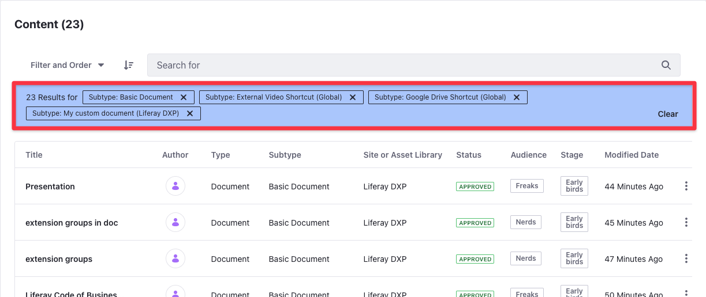

# Content Dashboard Interface

> Available: Liferay 7.3+

The Content Dashboard interface has the following areas:

- [Content Audit Tool](#content-audit-tool) (1)
- [Contents list](#contents-list) (2)
- [Content Info sidebar](#content-info-sidebar) (3)



When you [open the Content Dashboard](#accessing-the-content-dashboard), you see the [Content Audit Tool](#content-audit-tool) (1) at the top of the page and the [Contents list](#contents-list) (2) at the bottom. From the Contents list, you can access the [Content Info sidebar](#content-info-sidebar) (3) and the [Content Performance panel](../content-performance-tool/about-the-content-performance-tool.md). The Content Info sidebar and the Content Performance panel can collapse. They show additional details for each item in the Contents List.

To access the Content Info sidebar, click the *Actions Menu* () for the content and select the *Info* option. Alternatively, hover over the article and click *Info* (). For information on the *View Metrics* () option, read [About the Content Performance Panel](../content-performance-tool/about-the-content-performance-tool.md).

## Accessing the Content Dashboard

1. Click on the Global Menu and, under the *Content* area, click *Content Dashboard*.
1. If the Global Menu is disabled, open the Product Menu and, under the *Site* Menu, go to *Content* &rarr; *Content Dashboard*.

    

## Content Audit Tool

This tool is the graphical area at the top of the Content Dashboard page. The chart represents the total number of assets for the combination of categories in the global Vocabularies you select. This chart takes into account:

- [Web Content Articles](../web-content/web-content-articles/adding-a-basic-web-content-article.md) and [Documents and Media](../documents-and-media/documents-and-media-overview.md) across all Sites and Asset Libraries.

    ```{note}
    Documents and Media are available in the Content Dashboard starting with Liferay DXP 7.4+.
    ```

- Content you can access.
- The existing [filters](#filtering-and-sorting-content-in-the-contents-list) in the [Contents list](#contents-list).
- A maximum of two global Vocabularies (for the *x* and *y* axes.)


```{tip}
If the Content Audit Tool doesn't show the expected chart, [verify your Categories](../tags-and-categories/defining-categories-and-vocabularies-for-content.md) for the global Vocabularies and ensure that [your content is categorized](../tags-and-categories/organizing-content-with-categories-and-tags.md).
```

The following video shows and overview of the Content Audit tool:

<video width="100%" height="100%" controls>
    <source src="./content-dashboard-interface/images/14.mp4" type="video/mp4">
</video>

In the Content Audit Tool interface you can find:

- Chart legend (1)
- *X*-axis Categories for the first global Vocabulary (2)
- *Y*-axis Categories for the second global Vocabulary (3)
- Bar chart (4)



### Customizing the Vocabularies and Categories in the Content Audit Tool

By default, the bar chart shows the total number of assets for each Category in the selected global Vocabularies, but you can filter this information in different ways:

- Use the [filters](#filtering-and-sorting-content-in-the-contents-list) in the [Contents list](#contents-list).
- Filter categories in the chart by checking or unchecking the Category name in the chart legend.
- Click one of the bars to zoom-in on a specific Category's results.
- Change the Vocabularies.

To change the Vocabularies:

1. Click the *Configure Chart* icon () in the Content Audit area.
1. In the dual listbox, click the Vocabulary in the *Available* or *In Use* lists and click the selection buttons ( ) to add or remove the Vocabularies you want to show.
1. Click the *Up* () and *Down* () buttons to order of the Vocabularies in the chart axis.
1. Click *Save*.
1. Click the *Flip Axes* () icon in the Content Audit area if you must switch the axis assigned to the selected vocabularies.

    

```{note}
You can select a maximum of two Vocabularies defined at the Global Site level.
```

A gray bar denotes content without any categories in one of the selected Vocabularies. Chart labels for this content are distinctive. For instance, when you choose the Audience Vocabulary, the content that is not categorized under Audience shows the *No Audience Specified* label.

## Contents List

By default, this area shows all the content you have access to, across all sites and Asset Libraries. From here, you can sort and filter this content using built-in or custom filters. The Content Audit Tool chart changes dynamically based on the filters that you set.

In the Contents list you can find the following elements:

- Filter and Sort selector (1)
- Filter editor (2)
- Search field (3)
- List of contents (4)


In the list of contents, you can find the following columns:

| Column | Description |
| --- | --- |
| Title | Article title(*). |
| Author | Author's name. |
| Type | Specifies a [Web Content Article](../web-content/web-content-articles/adding-a-basic-web-content-article.md) or [Documents](../documents-and-media/documents-and-media-overview.md) asset type (available in Liferay DXP 7.4+.) |
| Subtype | Article's [Subcategory](../tags-and-categories/defining-categories-and-vocabularies-for-content.md#creating-subcategories). |
| Site or Asset Library | Location of the article in the Liferay DXP instance. |
| Status | Article workflow status. Articles with more than one version in different statuses show all than statuses. |
| *First Vocabulary* | This is the first Vocabulary in the Content Audit Tool. |
| *Second Vocabulary* | The optional second Vocabulary in the Content Audit Tool. |
| Modified Date | Date or time of the last article update. |

(*) The *Page* () icon denotes articles based on a [Display Page Template](../../site-building/displaying-content/using-display-page-templates/about-display-page-templates-and-display-pages.md).

```{note}
The *First Vocabulary* and *Second Vocabulary* columns depend on the Vocabularies you select.
```

For each entry in the Contents list, you can access the following options using the *Actions* menu () or hovering over the article and clicking the corresponding option:

- *View* (): Opens the content based on a Display Page Template in view mode.
- *Edit* (): Opens the content in edit mode.
- *Info* (): Opens the [Content info](#content-info-sidebar) sidebar.
- *View Metrics* (): Opens the [Content Performance panel](../content-performance-tool/about-the-content-performance-tool.md).

    

```{note}
Use the *View*, *Info*, and *View Metrics* options for content based on a Display Page Template. Use the *Edit* option when you have Edit permission for the content.
```

### Filtering and Sorting Content in the Contents List

1. Click the *Filter and Order* drop-down menu.
1. Select one of the predefined filters or a custom filter (denoted by three dots) to create your own filter criteria.
1. Select the content you want to filter.

The Filter Editor area shows your filters and the total results. To remove one or more filters, click the *Close* () button next to the filter's name, or click *Clear* to remove all filters and reset the Contents list. In addition to the predefined and custom filters, you can search and filter the assets in the Content View using keywords in the Search field. To understand how the combination of different filters works, read [Understanding How Filtering Works in the Contents List](#understanding-how-filtering-works-in-the-contents-list).


You can also filter the content by clicking one of the bars in the [Content Audit Tool](#content-audit-tool) area and zoom-in on a specific Category's results.



To sort the content,

1. Click the *Filter and Order* drop-down menu.
1. Under the *Order By* section, select the order for the items.

```{note}
When you close the Content Dashboard page, the default filter and sorting option are set again.
```

### Filter Options Reference

> Some filter options are only available starting with Liferay 7.4+

From the *Filter and Order* drop-down menu, you can choose,

| Filter | Description |
| :--- | :--- |
| Categories | Filters using one or more [Categories](../tags-and-categories/organizing-content-with-categories-and-tags.md) from your Vocabularies. |
| Site or Asset Library | Selects the assets' Site or Asset Library.  |
| Type | Using this filter you can choose the Web Content Articles or Documents to include. From here, you can choose from,</br><ul><li>**Web Content Articles**: Includes all the [Basic Web Content Articles](../web-content/web-content-articles/adding-a-basic-web-content-article.md) and the custom [Structures](../web-content/web-content-structures/understanding-web-content-structures.md) from all the Sites.</li><li>**Documents**: Includes the out of the box Document types and all the [custom Document types](../documents-and-media/uploading-and-managing/managing-metadata/defining-document-types.md).</li></ul> |
| Extension | Provides a way to filter by the Document or Media type. You can choose from the following types:</br><ul><li>`audio`</li><li>`code`</li><li>`compressed`</li><li>`image`</li><li>`presentation`</li><li>`spreadsheet`</li><li>`text`</li><li>`vectorial`</li><li>`video`</li><li>`other`</li></ul> |
| Tags | Selects from the list of [keywords](../tags-and-categories/tagging-content-and-managing-tags.md) you use to organize your assets. |
| Filter by Author | Filters by the Web Content or Document's author. |
| Filter by Status | Filters by the Web Content or Document's [workflow status](../../process-automation/workflow/introduction-to-workflow.md). |

When using the Type or Extension filter, you can define your search criteria from a new Filter dialog. Consider this information:

- Selecting a top-level node selects all the elements inside.
- The top-level nodes show the total number of elements inside.
- Search is case insensitive.
- You can add, remove, or edit the available extensions from the Global menu () &rarr; *Control Panel* &rarr; *System Settings* &rarr; *Content and Data* &rarr; *Documents and Media* &rarr; *Service*.
- The filter in the Content lists reflects the filter criteria you choose in the Filter dialog.

    

### Understanding How Filtering Works in the Contents List

- When you use the Categories or Tags filters with more than one criteria, the results correspond to content that meets all the criteria (see example A.)
- When you choose multiple options for the same filter criteria, the Contents list shows assets matching at least one option (see example B.)
- The criteria from different filters is combined using the `and` operator (see example C.)

| Example| Filter By | Filter Example | Contents List Results |
| --- | --- | --- | --- |
| A | Categories | Categories: *Entrepreneur* and *Family* | Only assets that belong to both the *Entrepreneur* `and` Family Categories. |
| B | Authors | Authors: *Peter* and *Linda* | Assets authored by *Peter* `or` _Linda_ `or` both. |
| C | Categories, Authors | Category is _Entrepreneur_ and Author is _Linda_ | Only assets under the *Entrepreneur* Category `and` authored by Linda. |

## Content Info Sidebar

This sidebar provides access to different metadata for the asset selected in the Contents list, including the asset owner, available languages for the content, tags and categories for the asset, or review date.


To open the Information sidebar,

1. Click the Actions Menu () next to the asset and select *Info*.
1. Alternatively, hover over the asset and click the *Info* () icon.

    

## Related Information

- [About the Content Dashboard](./about-the-content-dashboard.md)
- [About the Content Performance Tool](../page-performance-and-accessibility/about-the-content-performance-tool.md)
- [Defining Categories and Vocabularies for Content](../tags-and-categories/defining-categories-and-vocabularies-for-content.md)
