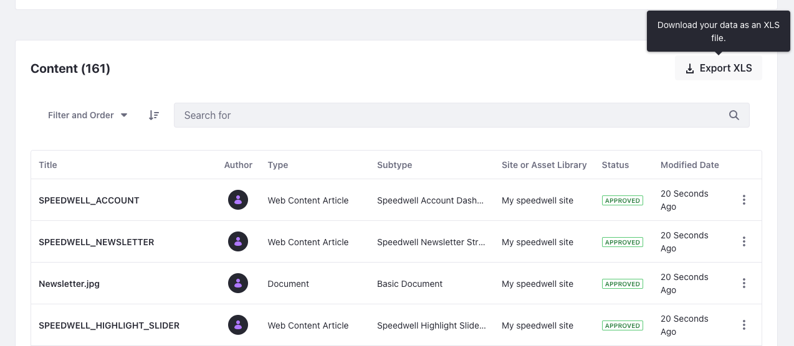

# Exporting Assets List To a Spreadsheet

The Content Dashboard can export a spreadsheet (`.xls` file) of content related metadata for further analysis.

To export the asset list to a spreadsheet follow these steps: 

1. Click on the Global Menu and, under the *Content* area, click *Content Dashboard*.
   
   If the Global Menu is disabled, open the Site Menu and go to *Content* &rarr; *Content Dashboard*.

1. Click on *Export XLS* to download the asset list.



While generating the file, the *Export XLS* button will show a loading state along with a button to cancel the export process. If you click on the *Cancel Export* the exporting process stops and shows a message: *XLS generation was cancelled*. 

When the export process is done, the *Export XLS* button shows the message *XLS Generated*.


```{note}
Navigating away from the page while the `.xls` file is being generated will stop the export process. The system prompts the user before leaving the page.


```

## XLS File Content 

All metadata is exported from contents and documents, so the `.xls` file will contain the following columns:

* Title
* Author
* Type
* Subtype
* Site or Asset Library
* Status
* Categories
* Tags
* Modified Date
* Description
* Extension
* File Name
* Size
* Display Date
* Creation Date
* Languages Translated Into

```{note}
The available metadata present in the `.xls` file differs between content types. For example, an image will not display anything in the "Languages Translated Into" cell, as an image cannot be translated.
```