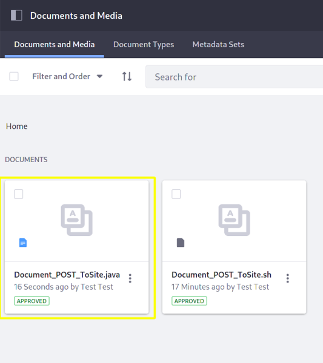
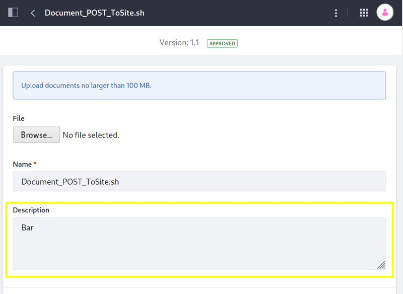

# Document API Basics

Liferay's headless delivery application provides REST services for [Documents and Media](../documents-and-media-overview.md) that add documents and folders, list their information, modify them, delete them and more. Here you'll call those services using cURL commands and Java classes.

Start with uploading documents using an example cURL command and Java class.

## Post a Document

1.  Start the Liferay Docker image:

    ```bash
    docker run -it -m 8g -p 8080:8080 [$LIFERAY_LEARN_PORTAL_DOCKER_IMAGE$]
    ```

1. After Liferay initializes, visit it with your browser at `http://localhost:8080`.

1. Sign in using the default credentials:

    **User Name:** `test@liferay.com`

    **Password:** `test`

1. [Find your site's ID](../../../headless-delivery/consuming-apis/consuming-rest-services.md#identify-the-site-containing-the-data). You'll use this ID in several service calls.

1. Download and unzip the [example project](https://learn.liferay.com/dxp/latest/en/content-authoring-and-management/documents-and-media/developer-guide/liferay-g9i6.zip):

    ```bash
    curl https://learn.liferay.com/dxp/latest/en/content-authoring-and-management/documents-and-media/developer-guide/liferay-g9i6.zip -O
    ```

    ```bash
    unzip liferay-g9i6.zip
    ```

Use a cURL script to upload a file to [Documents and Media](../documents-and-media-overview.md). 

1. On the command line, navigate to the `curl` folder.

    ```bash
	cd liferay-g9i6.zip/curl
	```

1. Upload a file by executing the `Document_POST_ToSite.sh` script with your site ID as a parameter. For example,

    ```bash
    ./Document_POST_ToSite.sh 1234
	```

    ```{note}
    If your user and password aren't `test@liferay.com` and `test`, respectively, replace those values in the `Document_POST_ToSite.sh` script before running it.
    ```

The script uploads itself to your site's Documents and Media.


The command response describes the new Documents and Media file in JSON, like this:

```bash 
{
	...
	"description" : "",
	...
	"id" : 38301,
	...
	"title" : "Document_POST_ToSite.sh"
}
```

The response includes the file's description, newly assigned ID, title, and more. Note the `id` value for later commands.

Next you'll use a Java class to upload a file.

1. Go to the `java` folder and compile the Java source files.

    ```bash
    cd ../java
	```

	```bash
    javac -classpath .:* *.java
    ```

1. Upload a file to Documents and Media by running the `Document_POST_ToSite` class below, replacing the `siteId` system property value with your site's ID.

    ```bash
    java -classpath .:* -DsiteId=1234 Document_POST_ToSite
    ```

    ```{note}
    If your user and password aren't `test@liferay.com` and `test`, respectively, replace those values in the `Document_POST_ToSite.java` file and recompile the class before running it.
    ```

The class uploads its source file `Document_POST_ToSite.java` to Documents and Media.



Read on to see how the cURL command and Java class work. 

## Examine the cURL Command

The `Document_POST_ToSite.sh` script uploads a file by calling a `headless-delivery` application REST service with cURL.

```{literalinclude} ./document-api-basics/resources/liferay-g9i6.zip/curl/Document_POST_ToSite.sh
   :language: bash
```

Here are the command's arguments:

| Arguments | Description |
| :-------- | :---------- |
| `-F "file=@Document_POST_ToSite.sh"` | The file to post. |
| `-H "Content-Type: multipart/form-data"` | The media type ([MIME type](https://en.wikipedia.org/wiki/Media_type)) being posted. |
| `-X POST` | The HTTP method to invoke at the specified endpoint. |
| `"http://localhost:8080/o/headless-delivery/v1.0/sites/${1}/documents"` | The REST service endpoint. Your site ID parameter replaces `${1}`. |
| `-u "test@liferay.com:test"` | Basic authentication credentials. |

```{note}
Basic authentication is used here for demonstration purposes. For production, you should authorize users via [OAuth 2.0](../../../headless-delivery/using-oauth2/using-oauth2.md).
```

Other cURL commands for the `Document` and `DocumentFolder` REST services use similar arguments.

Next, you'll see how similar the Java call is.

## Examine the Java Class

The `Document_POST_ToSite.java` class uploads a file by calling a `headless-delivery` application REST service.

```{literalinclude} ./document-api-basics/resources/liferay-g9i6.zip/java/Document_POST_ToSite.java
   :dedent: 1
   :language: java
   :lines: 10-29
```

This class invokes the REST service using only three lines of code: 

| Line (abbreviated) | Description |
| :----------------- | :---------- |
| `DocumentResource.Builder builder = ...` | Gets a `Builder` for generating a `DocumentResource` service instance. |
| `DocumentResource documentResource = builder.authentication(...).build();` | Specifies basic authentication and generates a `DocumentResource` service instance. |
| `Document document = documentResource.postSiteDocument(...);` | Calls the `DocumentResource.postSiteDocument` method, passing in a site ID, a `Document` object to represent the uploaded file, and a hash map that specifies the file to upload. The file is arbitrary--this example uses the local file `Document_POST_ToSite.java` for convenience. |

Note that the project includes the `com.liferay.headless.delivery.client.jar` file as a dependency. You can find client JAR dependency information for all REST applications in the API explorer in your installation at `/o/api`.

```{note}
The `main` method's comment demonstrates running the class.
```

The other example Java classes are similar to this one, but call different `DocumentResource` methods.

```{important}
See [DocumentResource](https://github.com/liferay/liferay-portal/blob/[$LIFERAY_LEARN_PORTAL_GIT_TAG$]/modules/apps/headless/headless-delivery/headless-delivery-client/src/main/java/com/liferay/headless/delivery/client/resource/v1_0/DocumentResource.java) for service details.
```

Below are examples of calling other `Document` REST services using cURL and Java.

## Get Site Documents

You can list a site's documents by executing the following cURL or Java command. As above, replace `1234` with your site's ID.

### Documents_GET_FromSite.sh

Command:

```bash
./Documents_GET_FromSite.sh 1234
```

Code:

```{literalinclude} ./document-api-basics/resources/liferay-g9i6.zip/curl/Documents_GET_FromSite.sh
   :language: bash
```

### Documents_GET_FromSite.java

Command:

```bash 
java -classpath .:* -DsiteId=1234 Documents_GET_FromSite
```

Code:

```{literalinclude} ./document-api-basics/resources/liferay-g9i6.zip/java/Documents_GET_FromSite.java
   :dedent: 1
   :language: java
   :lines: 11-23
```

The site's `Document` objects are listed in JSON.

## Get a Document

You can get a `Document`'s fields by executing the following cURL or Java command. Replace `1234` with the `Document`'s ID.

```{tip}
Use `Documents_GET_FromSite.[java|sh]` to get site `Document` IDs.
```

### Document_GET_ById.sh

Command:

```bash
./Document_GET_ById.sh 1234
```

Code:

```{literalinclude} ./document-api-basics/resources/liferay-g9i6.zip/curl/Document_GET_ById.sh
   :language: bash
```

### Document_GET_ById.java

Command: 

```bash
java -classpath .:* -DdocumentId=1234 Document_GET_ById
```

Code:

```{literalinclude} ./document-api-basics/resources/liferay-g9i6.zip/java/Document_GET_ById.java
   :dedent: 1
   :language: java
   :lines: 9-20
```

The `Document` fields are listed in JSON.

## Get Document Content

`Document` content is encoded in Base64 and embedded in the `Document`'s `nestedFields`. You can get the content by executing the following cURL or Java command. Replace `1234` with the `Document`'s ID.

### Document_GET_ById_ContentValue.sh

Command:

```bash
./Document_GET_ById_ContentValue.sh 1234
```

Code:

```{literalinclude} ./document-api-basics/resources/liferay-g9i6.zip/curl/Document_GET_ById_ContentValue.sh
   :language: bash
```

The first argument line specifies the service endpoint and authentication credentials, respectively. The URL's `/o/headless-delivery/v1.0/documents/${1}` part is the REST service endpoint to get the `Document` by its ID. This URL is the same as the `Document_GET_ById.sh` script's URL. The `?nestedFields=contentValue` part requests the `contentValue` embedded in the `Document`'s `nestedFields`. Lastly the `&fields=contentValue` part filters on the `contentValue` field, so that the content field alone is returned. Invoking only the service, however, returns Base64-endocded content wrapped in JSON, like this: 

```bash
{
  "contentValue" : "Y3VybCBcCgktRiAiZmlsZT1ARG9jdW1lbnRfUE9TVF9Ub1NpdGUuc2giIFwKCS1IICJDb250ZW50LVR5cGU6IG11bHRpcGFydC9mb3JtLWRhdGEiIFwKCS1YIFBPU1QgXAoJImh0dHA6Ly9sb2NhbGhvc3Q6ODA4MC9vL2hlYWRsZXNzLWRlbGl2ZXJ5L3YxLjAvc2l0ZXMvJHsxfS9kb2N1bWVudHMiIFwKCS11ICJ0ZXN0QGxpZmVyYXkuY29tOnRlc3Qi"
}
```

The routines following the service invocation process the encoded content. The `sed` and `awk` routines isolate the `Document` content value and the `tr` routine decodes it. Here's the decoded content returned for the `Document_POST_ToSite.sh` `Document` that you uploaded:

```{literalinclude} ./document-api-basics/resources/liferay-g9i6.zip/curl/Document_GET_ById_ContentValue.sh
   :language: bash
```

### Document_GET_ById_ContentValue.java

The Java code to get `Document` content and decode it is simpler than the previous cURL command.

Command:

```bash
java -classpath .:* -DdocumentId=1234 Document_GET_ById_ContentValue
```

Code:

```{literalinclude} ./document-api-basics/resources/liferay-g9i6.zip/java/Document_GET_ById_ContentValue.java
   :dedent: 1
   :language: java
   :lines: 11-27
```

Most of the code resembles the code in `Document_POST_ToSite.java`. There are a couple key differences.

The following line adds the `contentValue` nested field as a request parameter.

```java
builder.parameter("nestedFields", "contentValue");
```

After getting the `Document` by its ID, a `Base64.Decoder` decodes the `Document`'s content.

```java
Base64.Decoder decoder = Base64.getDecoder();
```

## Patch a Document

`Document`'s PATCH services update a `Document` and its fields. You can update a `Document` by executing the following cURL or Java command. Replace `1234` with the `Document`'s ID.

### Document_PATCH_ById.sh

Command:

```bash
./Document_PATCH_ById.sh 1234
```

Code:

```{literalinclude} ./document-api-basics/resources/liferay-g9i6.zip/curl/Document_PATCH_ById.sh
   :language: bash
```

The first form data part (following `-F`) specifies a new value for the `Document`'s `description` field. The second form data part specifies the updated file to upload.

### Document_PATCH_ById.java

Command: 

```bash 
java -classpath .:* -DdocumentId=1234 Document_PATCH_ById
``` 

Code:

```{literalinclude} ./document-api-basics/resources/liferay-g9i6.zip/java/Document_PATCH_ById.java
   :dedent: 1
   :language: java
   :lines: 13-34
```

The Java code above calls `DocumentResource`'s `patchDocument` method, passing in the `Document`'s ID, a `Document` object that includes a field to update, and the updated file to upload.

The above commands update the `Document`'s description to "Bar".



## Put a Document

`Document`'s PUT services replace the `Document` and its fields entirely. You can replace a `Document` by executing the following cURL or Java command. Replace `1234` with the `Document`'s ID.

### Document_PUT_ById.sh

Command:

```bash
./Document_PUT_ById.sh 1234
```

Code:

```{literalinclude} ./document-api-basics/resources/liferay-g9i6.zip/curl/Document_PUT_ById.sh
   :language: bash
```

The first form data part sets new `description` and `title` field values. The second form data part specifies a replacement file to upload.

### Document_PUT_ById.java

Command:

```bash
java -classpath .:* -DdocumentId=1234 Document_PUT_ById
```

Code:

```{literalinclude} ./document-api-basics/resources/liferay-g9i6.zip/java/Document_PUT_ById.java
   :dedent: 1
   :language: java
   :lines: 13-35
```

The Java code above calls `DocumentResource`'s `putDocument` method, passing in the `Document`'s ID, a `Document` object that includes values for the `Document`'s `description` and `title` fields, and a replacement file to upload.

The above cURL command and Java class replace `Document` instances with completely new ones that have the new titles "Document_PUT_ById.sh" and "Document_PUT_ById.java", respectively, and have the description "Goo."

```{warning}
Unless you want to use the current `Document`'s title, make sure to specify the `title` value you want for the replacement `Document`.
```


## Delete a Document

You can delete a `Document` by executing the following cURL or Java command. Replace `1234` with the `Document`'s ID.

### Document_DELETE_ById.sh

Command:

```bash
./Document_DELETE_ById.sh 1234
```

Code:

```{literalinclude} ./document-api-basics/resources/liferay-g9i6.zip/curl/Document_DELETE_ById.sh
   :language: bash
```

### Document_DELETE_ById.java 

Command

```bash 
java -classpath .:* -DdocumentId=1234 Document_DELETE_ById
```

Code:

```{literalinclude} ./document-api-basics/resources/liferay-g9i6.zip/java/Document_DELETE_ById.java
   :dedent: 1
   :language: java
   :lines: 8-17
```

The `Document`s are removed from Documents and Media.

## More Document and Document Folder Services

The following cURL commands and Java classes demonstrate more `Document` services and `DocumentFolder` services.

| Files | Description |
| :---- | :---------- |
| `Document_POST_ToDocumentFolder.[java|sh]` | Posts a document to a folder. |
| `DocumentFolder_GET_ById.[java|sh]` | Lists a folder's fields. |
| `DocumentFolder_PATCH_ById.[java|sh]` | Updates a folder and its fields. |
| `DocumentFolder_POST_ToSite.[java|sh]` | Posts a document folder to a site. |
| `DocumentFolder_PUT_ById.[java|sh]` | Replaces a folder and its fields entirely. |
| `DocumentFolders_GET_FromSite.[java|sh]` | Lists a site's folders. |

The [API Explorer](../../../headless-delivery/consuming-apis/consuming-rest-services.md) lists all of the `Document` and `DocumentFolder` services and schemas, and has an interface to try out each service.

See the [DocumentResource](https://github.com/liferay/liferay-portal/blob/[$LIFERAY_LEARN_PORTAL_GIT_TAG$]/modules/apps/headless/headless-delivery/headless-delivery-client/src/main/java/com/liferay/headless/delivery/client/resource/v1_0/DocumentResource.java) and [DocumentFolderResource](https://github.com/liferay/liferay-portal/blob/[$LIFERAY_LEARN_PORTAL_GIT_TAG$]/modules/apps/headless/headless-delivery/headless-delivery-client/src/main/java/com/liferay/headless/delivery/client/resource/v1_0/DocumentFolderResource.java) Java interfaces too.

## Additional Information

* [Documents and Media Overview](../documents-and-media-overview.md)
* [Consuming REST Services](../../../headless-delivery/consuming-apis/consuming-rest-services.md)
* [API Headers Reference](../../../headless-delivery/consuming-apis/api-headers-reference.md)
* [Consuming GraphQL APIs](../../../headless-delivery/consuming-apis/consuming-graphql-apis.md)
