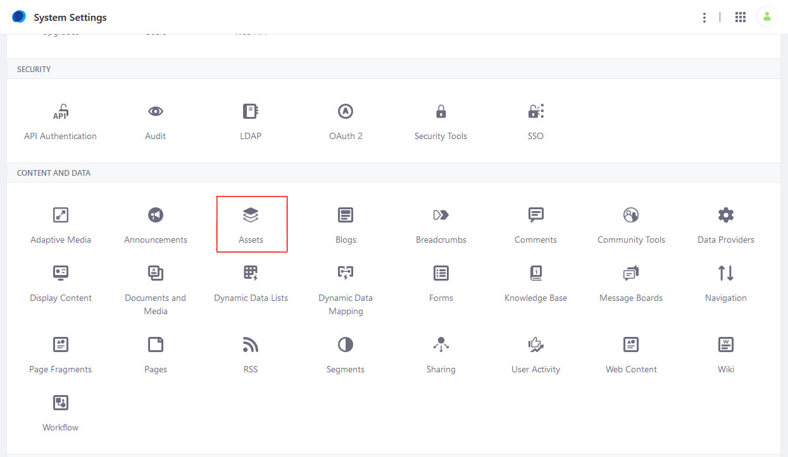
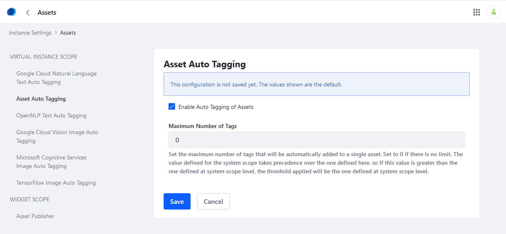

# Configuring Asset Auto Tagging

[Tagging assets](../tagging-content-and-managing-tags.md) is a great way to organize content. Typically, the content creator applies tags while creating the content. You can also tag content automatically. For example, you can scan an image on upload and apply tags that describe the image's content. This lets you leverage tags without requiring content creators to apply them manually.

```note::
   Auto-tagging currently works only for images, text-based documents, text-based web content, and blog entries.
```

Configuring auto-tagging for specific asset types is documented separately:

- [Auto Tagging Images](./auto-tagging-images.md)
- [Auto Tagging Assets](./auto-tagging-assets.md)

Auto-tagging is enabled by default. You can configure it at three levels:

- **Global (System):** For auto-tagging to function on any level, it must be enabled globally. You can also set the default auto-tagging configuration for every Virtual Instance.

- **Virtual Instance:** When enabled globally, auto-tagging is also enabled by default for each Virtual Instance. However, you can override the global auto-tagging configuration on a per-Instance basis.

- **Site:** When enabled for a Virtual Instance, auto-tagging is also enabled by default for all that Instance's Sites. You can disable it for specific Sites.

## Global Scope Configuration

Follow these steps to configure auto tagging globally:

1. Click the *Global Menu* () and click *Control Panel*.
1. Under Configuration, click System Settings.
1. In the Content and Data section, click _Assets_.

   

1. Under System Scope, click *Asset Auto Tagging*.
1. Check the box to enable Asset Auto Tagging globally.

   

1. Enter a value for **Maximum Number of Tags**. The default value of `0` means that there is no limit.
1. Click *Save*_ when finished*.

To set the default auto-tagging configuration for all instances, select *Asset Auto Tagging* under the Virtual Instance Scope section. The available settings are the same as those in the System Scope.

## Virtual Instance Scope Configuration

When enabled globally, auto-tagging is also enabled by default for each Virtual Instance. You can, however, disable or configure it for each instance.

Follow these steps to configure Auto Tagging at the Virtual Instance scope:

1. Click the *Global Menu* () and click *Control Panel*.
1. Under Configuration, click Instance Settings.
1. In the Content and Data section, click *Assets*.
1. Under Virtual Instance Scope, click *Asset Auto Tagging*.

   

1. The settings here are identical to those in the [Global scope configuration](#global-scope-configuration), but apply only to the current Virtual Instance.
1. Click *Save*.

## Site Scope Configuration

1. Access the Asset Auto Tagging option:

   - In Liferay DXP 7.4+:

      1. From the Site Menu, go to *Configuration* &rarr; *Site Settings*.
      1. In the Content and Data section, click *Assets* and then click *Asset Auto Tagging*.

         

   - In previous Liferay DXP versions:

      1. From the Site Menu, go to *Configuration* &rarr; *Settings*.
      1. Under the General area, expand the Asset Auto Tagging option.

1. Use the toggle to enable or disable Auto Tagging for the Site.

1. Click *Save*.

## Related Information

- [Tagging Content and Managing Tags](../tagging-content-and-managing-tags.md)
- [Auto Tagging Images](./auto-tagging-images.md)
- [Site Settings UI Reference](../../../site-building/site-settings/site-settings-ui-reference.md)
