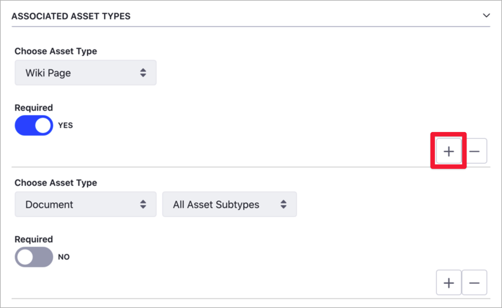
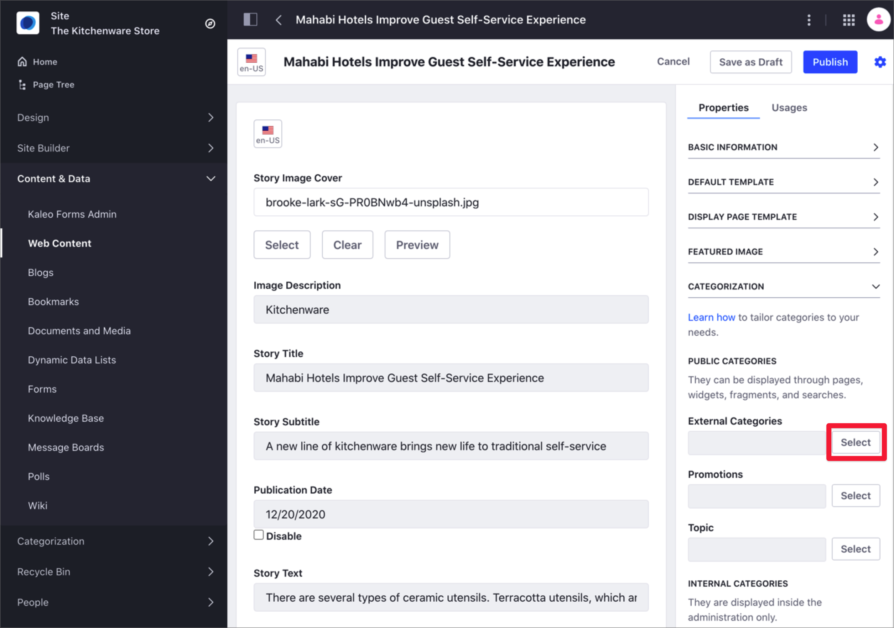
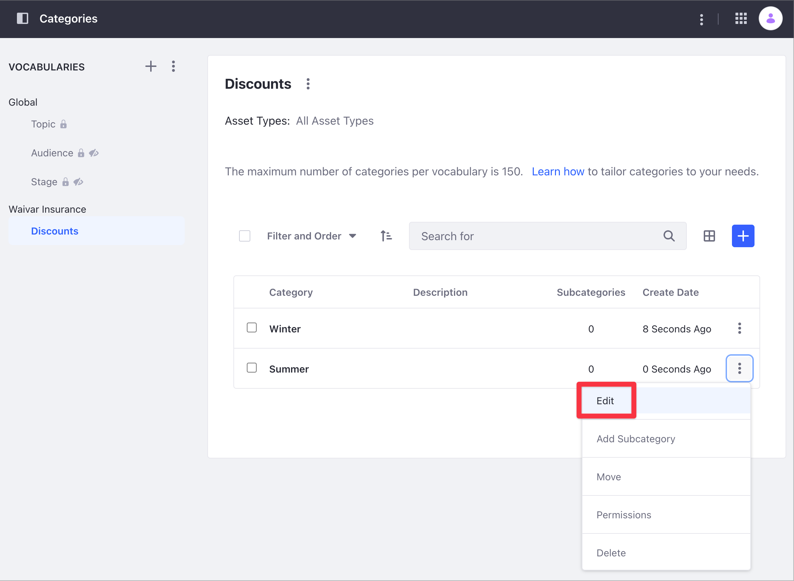

# Defining Categories and Vocabularies for Content

Using Categories, you can group similar assets and organize your content. Along with [Tags](./tagging-content-and-managing-tags.md), Categories help people find relevant information through search or navigation. For more information about Categories in Liferay DXP and the different usage scenarios, see [Organizing Content with Categories and Tags](organizing-content-with-categories-and-tags.md).

You group categories using [vocabularies](#defining-vocabularies), and you create a hierarchy of categories using [subcategories](#creating-subcategories). You can use the vocabularies and categories at the Global Site in any other Site, but you can only create or edit Global Vocabularies at the Global Site.

```{note}
Only Site administrators can manage Categories and Vocabularies in the Categories panel.
```

## Defining Vocabularies

1. Go to the Site where you want to create the Vocabulary.
1. Open the Product Menu and, under the Site Menu, go to *Categorization* &rarr; *Categories*.
1. Click *New Vocabulary* ().
1. Enter a *Name* for the Vocabulary and, optionally, a *Description*.
1. Complete the rest of the Category options:

   **Allow Multiple Categories:** Enable this option to use more than one Category from the Vocabulary to categorize the asset. When disabled, you can use only one Category from the Vocabulary.

   **Visibility:** See [Vocabularies Visibility](./organizing-content-with-categories-and-tags.md#vocabulary-visibility) for more information.

   ```{important}
   You cannot change the Visibility after saving the Vocabulary.
   ```

   **Associated Asset Type:** Select the allowed asset types for applying a Category from this Vocabulary. Set *Required* to *Yes* if you want this type of asset always to have a category.

   ```{tip}
   Click the *Add* button under the *Associated Asset Type* section to include more than one asset type.
   ```

   

1. Click *Save*.
1. To edit an existing vocabulary, click the *Actions* () menu next to the Vocabulary name and select *Edit*.

    

## Defining Categories

You create and manage Categories in the Site Menu &rarr; *Categorization* &rarr; *Categories* panel. You can also create new categories from the Categorization section in the Content Editor, using the Select button for each Vocabulary.

```{important}
You can create a maximum of 150 Categories in one Vocabulary.
```



### Creating Categories

1. Open the Product Menu and, under the Site Menu, go to *Categorization* &rarr; *Categories*.
1. Under the *Vocabularies* list, click the Vocabulary to add the new Category.
1. Click *Add Category* ().
1. Enter a *Name* for the Category and, optionally, a *Description*.
1. Under the Display Page section, choose a specific Display Page for the Category or use the default one.

   ```{note}
   Display Pages for Categories are available starting with Liferay DXP 7.4. For more information, read [Displaying Categories Using Display Pages](../../site-building/displaying-content/using-display-page-templates/displaying-categories-using-display-pages.md).
   ```

1. Click *Save* or *Save and Add a New One* to add more categories.
1. To edit an existing category, click the *Actions* () menu next to the category's name.

### Creating Subcategories

You can create a nested hierarchy of Categories and Subcategories:

1. Open the Product Menu and, under the Site Menu, go to *Categorization* &rarr; *Categories*.
1. Under the *Vocabularies* list, click the Vocabulary you want to modify.
1. Click the category name where you want to create the new subcategory.
1. In the *Add New Subcategory* screen, enter the subcategory's *Name* and, optionally, a *Description*.
1. Click *Save* or *Save and Add a New One* to add more subcategories.

### Moving Categories

You can move a category to a different Vocabulary, or as a subcategory in the same Vocabulary.

1. Open the Product Menu and, under the Site Menu, go to *Categorization* &rarr; *Categories*.
1. Click the *Actions* () menu next to the category you want to move and select *Move*.

    

1. Select the *Vocabulary* and *Category* where you want to move the Category.

    ```{note}
    You can only move a Category into a Vocabulary of the same [Visibility type](./organizing-content-with-categories-and-tags.md#vocabulary-visibility).
    ```

### Editing Additional Category Properties

After creating a Category, you can define these additional options:

- Details
- Images
- Friendly URL
- Properties

To access these options, click the *Actions* () menu next to the Category you want to modify and select *Edit*.



## Related Information

- [Organizing Content with Categories and Tags](./organizing-content-with-categories-and-tags.md)
- [Tagging Content and Managing Tags](./tagging-content-and-managing-tags.md)
- [Content Dashboard](../content-dashboard/about-the-content-dashboard.md)
- [Displaying Categories Using Display Pages](../../site-building/displaying-content/using-display-page-templates/displaying-categories-using-display-pages.md)
