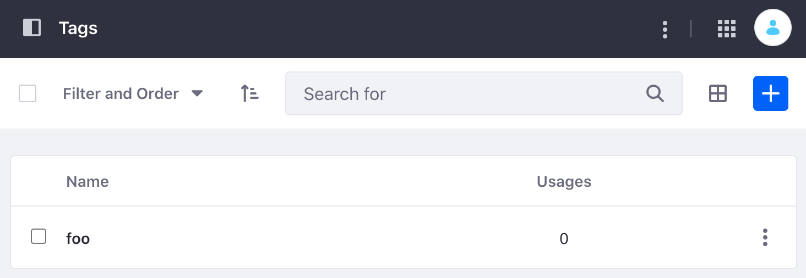

# Tags API Basics

Liferay's REST API's provide services for the tags functionality of Liferay. You can create and edit tags with the API. Start by seeing an example of adding a new tag. Note that in Liferay codebase tags are called keywords. 

## Adding a Tag

1. Start Liferay DXP. If you don't already have a docker container, use

   ```bash
   docker run -it -m 8g -p 8080:8080 [$LIFERAY_LEARN_DXP_DOCKER_IMAGE$]
   ```

1. Download and unzip [Tags API Basics](./liferay-r7u9.zip).

   ```bash
   curl https://learn.liferay.com/dxp/latest/en/content-authoring-and-management/tags-and-categories/developer-guide/liferay-r7u9.zip -O
   ```

   ```bash
   unzip liferay-r7u9.zip
   ```

2. [Find your site's ID](../../../headless-delivery/consuming-apis/consuming-rest-services.md#identify-the-site-containing-the-data). You'll use this in different service calls below.

3. Use the cURL script to add a new tag to your Site. On the command line, navigate to the `curl` folder. Execute the `Keyword_POST_ToSite.sh` script with your site ID as a parameter.

    ```bash
    ./Keyword_POST_ToSite.sh 1234
    ```

    The JSON response shows a new tag has been added:

    ```bash
   "creator" : {
    "additionalName" : "",
    "contentType" : "UserAccount",
    "familyName" : "Test",
    "givenName" : "Test",
    "id" : 20129,
    "name" : "Test Test",
    "profileURL" : "/web/test"
   },
   "dateCreated" : "2021-09-09T21:15:46Z",
   "dateModified" : "2021-09-09T21:15:46Z",
   "id" : 40130,
   "keywordUsageCount" : 0,
   "name" : "foo",
   "siteId" : 20125
    ```

4. Go to the Categories application by navigating to *Administration Menu* &rarr; *Categorization* &rarr; *Tags*. See that a new tag has been added.

    

5. The REST service can also be called with a Java class. Navigate out of the `curl` folder and into the `java` folder. Compile the source files with the following command:

    ```bash
    javac -classpath .:* *.java
    ```

6. Run the `Keyword_POST_ToSite` class with the following command. Replace the `siteId` value with your site's ID:

    ```bash
    java -classpath .:* -DsiteId=1234 Keyword_POST_ToSite
    ```

## Examine the cURL Command