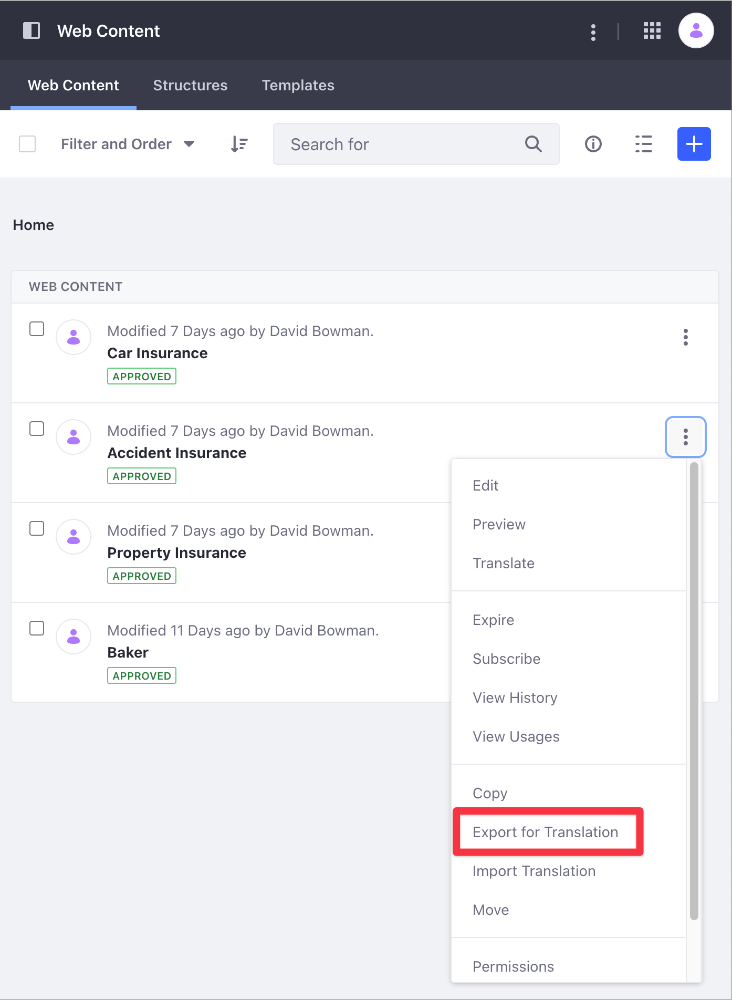
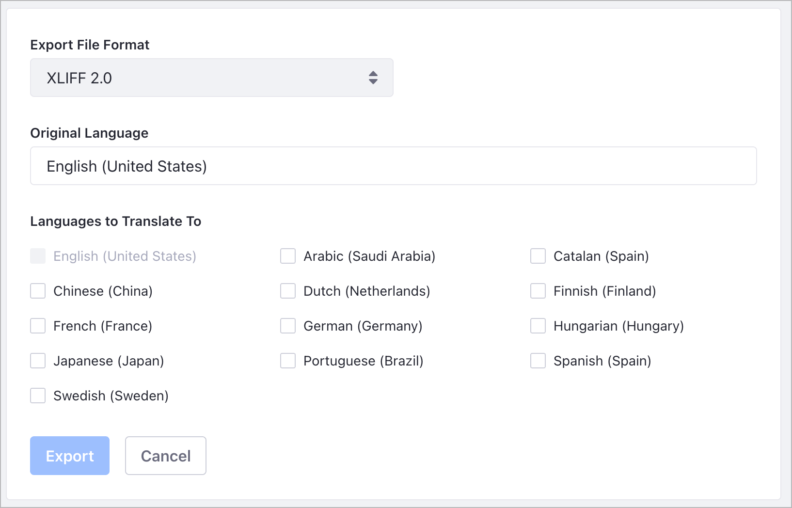
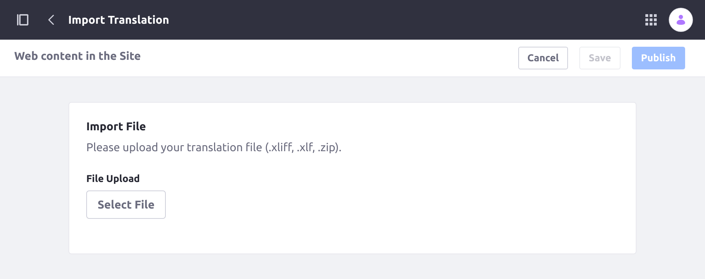

# Exporting and Importing Translations

> Available: Liferay DXP/Portal 7.3+

With Liferay, you can export Web Content for translation as `.xliff` or `.xlf` files. These files can then be sent to translators to produce your translations for your content. Once translated, you can import the translations together as a `.zip` file or individually as `.xliff` or `.xlf` files.

```{important}
Liferay supports both XLIFF 1.2 and 2.0 files. However, it may not support all features and capabilities those formats provide.
```

To export content for translation or import translations, you must have *View* and *Update* permissions for the selected content. See [Managing Permissions for Translation](./manually-translating-web-content.md#managing-permissions-for-translation).

## Exporting Content for Translation

Follow these steps to export Web Content for translation:

1. Open the *Site Menu* () and go to *Content & Data* &rarr; *Web Content*.

1. Click the *Actions* menu (  ) for the Web Content you want to translate and select *Export for Translation*. This opens a modal window that you can use to configure your export.

   

1. Select an Export format: *XLIFF 1.2* or *XLIFF 2.0*.

1. Specify the Web Content's original language. This is used as a reference for the translation.

1. Use the checkboxes to select the languages you want to translate the content into.

   

1. When finished, click *Export* to begin exporting for translation.

Liferay generates a Zip archive for download that contains as many XLIFF files as languages you've selected for translation. These files can be used with compatible translation software to translate your Web Content.

## Importing Content Translations

Once your translations are ready, follow these steps to import them:

1. Open the Product menu and go to *Content & Data* &rarr; *Web Content*.

1. Click the *Actions* menu (  ) for the translated Web Content and select *Import Translation*.

   

1. Select the `.xliff` or `.xlf` file you want to import, or import multiple translation files as a `.zip` file.

   

   ```{important}
   While Liferay supports importing XLIFF files created using the *Export for Translation* action, it cannot guarantee the successful import of files generated by other means.
   ```

1. Click *Publish*.

When the import completes, the Web Content is updated with all changes included in the translation files. If workflow is enabled, this change must be approved as with other content updates.

## Additional Information

* [Manually Translating Web Content](./manually-translating-web-content.md)
* [Adding a Basic Web Content Article](../web-content-articles/adding-a-basic-web-content-article.md)
