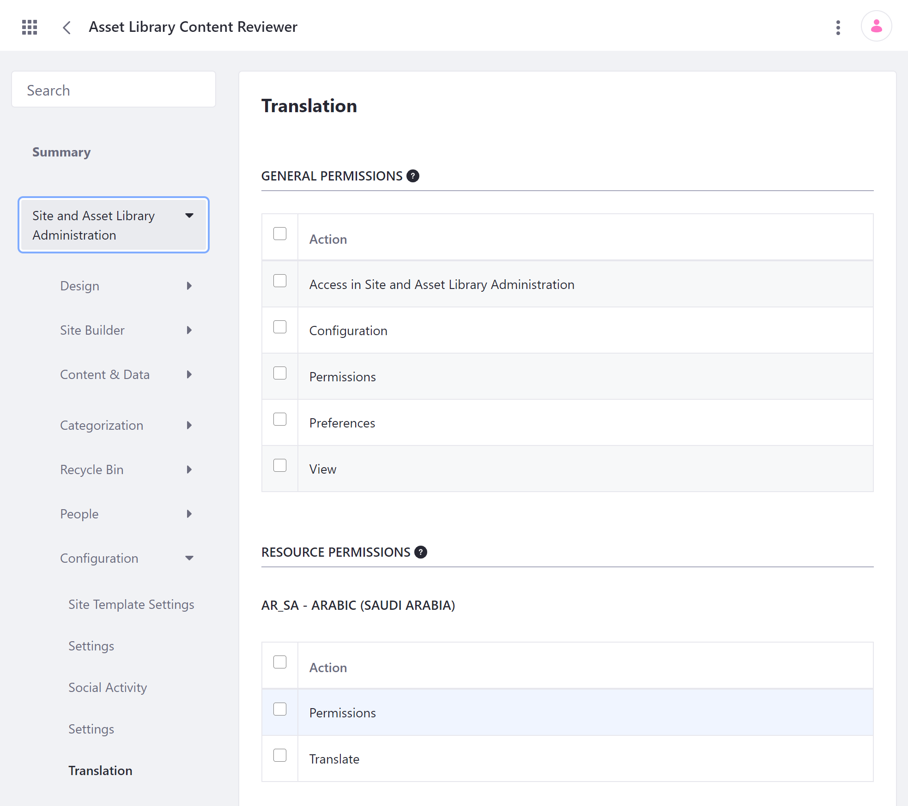

# Manually Translating Web Content

Liferay integrates translation functionality with your web content, so you can create engaging, localized experiences for your global users. Users with the required permissions can manually translate Site content to any available language. You can also integrate the translation process with custom workflows to streamline the review and publication process for new translations.

* [Managing Permissions for Translation](#managing-permissions-for-translation)
* [Translating Web Content](#translating-web-content)
* [Integrating Translations with Custom Workflows](#integrating-translations-with-custom-workflows)

## Managing Permissions for Translation

To manually translate web content, Users must have either Update permissions for the specific content, or Translate permissions for one or more languages.

### Assigning Update Permissions

Update permissions are content specific and must be assigned individually. Users with *Update* permissions for web content can manually translate it into any available language. They can also export web content for translation and import finished translations of the content.

Follow these steps to assign Update permissions for Web Content:

1. Open the *Product* menu, and go to *Content & Data* &rarr; *Web Content*.

1. Click on the *Actions* menu (  ) for the content you want to configure and select *Permissions*.

1. Use the checkboxes to assign Update permissions to the desired User roles.

   Alternatively, you can assign permissions during content creation. Go to *Permissions* in the content Properties sidebar and assign the desired permissions to specific Roles.

### Assigning Translate Permissions

Translate permissions are language specific and grant access to the *Translate* action for web content. Users with Translate permissions can manually translate any Site content into the languages for which they have permission. Once granted, Translate permissions cannot be restricted to particular content.

Follow these steps to assign Translate permissions for specific languages:

1. Open the Control Panel and go to *Users* &rarr; *Roles*.

1. Click on the *Actions* menu (  ) for the Role you want to assign Translate permissions and select *Edit*.

   Alternatively, you can create a new Role with the Add button (  ).

1. Click the *Define Permissions* tab and go to *Site and Asset Library Administration* &rarr; *Configuration* &rarr; *Translation* in the Permissions sidebar menu.

1. Use the checkboxes to assign the desired language permissions to the selected Role.

   

1. Click *Save* at the bottom of the page.

Users with the configured Role can now manually translate any web content into the specified languages.

## Translating Web Content

> Available: Liferay DXP/Portal 7.3+

1. Open the *Product* menu, and go to *Content & Data* &rarr; *Web Content*.

1. Click the *Actions* menu (  ) for the content you want to translate and select *Translate*.

   This redirects you to the content translation interface, where you can view the content's original text alongside your translation. The left column displays the language you're translating from, and the right column provides editable fields you can use for your translation.

   

1. Use the language flags in the top left corner to determine the language you're translating from as well as the language into which you want to translate.

   Users with content Update permissions can translate the original text into any language.

   Users with translate permissions can only translate the origin text into languages for which they have permission.

1. Enter your translation into the *Title*, *Description*, and *Content* fields.

1. Click *Publish* to create a new version of the web content or initiate a workflow, if it's enabled.

   Alternatively, click *Save as Draft* to save and publish your translation at a later time.

## Integrating Translations with Custom Workflows

You can integrate the translation process with custom workflows so your published translations go through a defined review and approval process.

Follow these steps to enable a custom workflow for translation:

1. Open the *Product* menu and go to *Configuration* &rarr; *Workflow*.

1. Click the workflow drop down menu for *Translation* and select the desired workflow.

1. Click *Save*.

Once workflow is enabled, each published translation appears as an individual task that must be approved before the web content is officially updated. Translation reviewers see a read-only, side-by-side preview of the content's original and translated texts.

If edits are required, return to the web content translation page for article in review. When you have finished updating the your translation, resubmit it for further review.

If your translation is approved, your changes are applied to the web content as with regular updates to web content. When applied, the changes cannot be reverted automatically. See [Introduction to Workflow](../../../process-automation/workflow/introduction-to-workflow.md) for more information about building and using workflows.

## Additional Information

* [Adding a Basic Web Content Article](../web-content-articles/adding-a-basic-web-content-article.md)
* [Exporting and Importing Translations](./exporting-and-importing-translations.md)
* [Introduction to Workflow](../../../process-automation/workflow/introduction-to-workflow.md)
