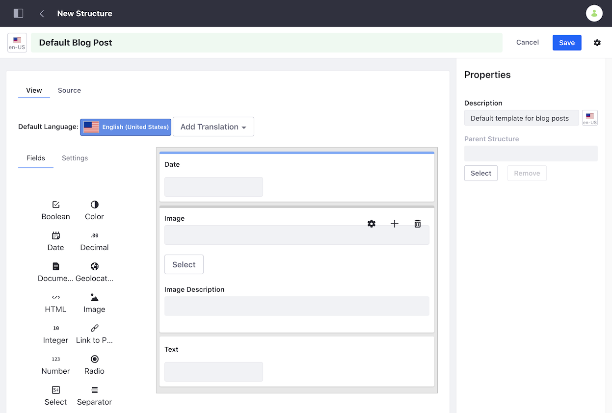

# Creating Structures

Follow these steps to create a Structure:

1. Open the Product Menu and go to the Site Menu heading &rarr; *Content & Data* &rarr; *Web Content*.
1. Select the *Structures* tab.
1. Click the *Add button* () to create a new Structure.
1. Enter the title of your new Structure.
1. Drag and drop the [available fields](#structure-fields) onto the Structure and [configure their settings](./configuring-structure-fields.md#configurable-settings) to create the Structure.

    ```{tip}
    When you create or [edit a Structure](./configuring-structure-fields.md), the *View* tab is selected by default. You can switch to the *Source* tab to view the Structure's raw XML and modify it directly.
    ```

1. Optionally, add a *Description* for your Structure.
1. Click *Save*.



```{warning}
Due to import/export operations, it's possible to have both a global and a Site-scoped Structure with the same `structureKey`. If this happens, the Site-scoped Structure takes precedence, and you can't access the global Structure from that Site.
```

## Structure Fields

You can place these fields on a Structure: 

**Boolean:** A checkbox that stores either `true` (checked) or `false` (unchecked). For example, you can use this field to set a display rule for the Structure's content.

**Color:** A color picker

**Date:** A pre-formatted text field that displays a date picker. The date format depends on the current locale.

**Decimal:** An input that accepts decimal numbers

**Documents and Media:** A file selector to include a file from the Documents and Media library or your computer

**Geolocation:** A map that displays a configured location. Geolocation provides both the current location and directions to another place.

**HTML:** A WYSIWYG editor to offer more formatting options for writing content

**Image:** An image selector to include an image from the Documents and Media library or your computer

```{note}
If you upload an image from your computer, the image is only available for that particular article.
```

**Integer:** An input that accepts whole numbers

**Link to Page:** A selector to include a link to another page in the same Site

**Number:** An input that accepts any type of number

**Radio:** A list of options to choose from using radio buttons. This field allows one selection only.

**Select:** A selection of options to choose from using a combo box. This field allows multiple selections.

**Separator:** A horizontal line to separate fields

**Text:** A text input for short entries, such as titles or headings

**Text Box:** A text input for long entries, such as the body of your content

**Web Content:** A selector to include an existing Web Content Article

See [Editing and Configuring Structure Fields](./configuring-structure-fields.md) for more information on configuring and editing Structure fields.

## Translating a Structure

You can add a translation for the Structure, either while creating it or later.


1. From the Add or Edit Structure screen, open the Language Selector by clicking the locale (e.g.,`en-us`), and then select *Manage Translations*.
1. Click the *Add button* () in the Manage Translations modal and choose the language.
1. Click _Done_.
1. Click the default locale again and select the new locale to begin translating.
1. Translate as much of the Structure's text as you'd like, then click _Save_.

To delete a translation, go back to the Manage Translations modal and click the Trash Icon .

To edit a translation, select the translation using the Language Selector, make any changes, and click _Save_.

## Related Information

* [Understanding Web Content Structures](./understanding-web-content-structures.md)
* [Managing Structures](./managing-structures.md)
* [Configuring Structure Fields](./configuring-structure-fields.md)
