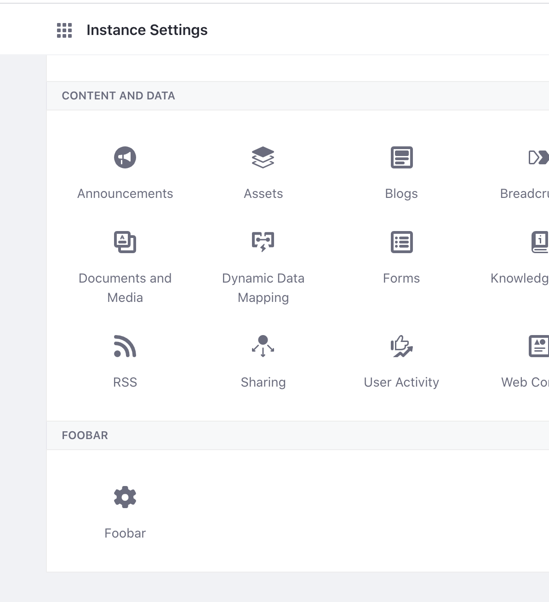

# Categorizing a Configuration

When you register a configuration interface, the UI for your application is generated in *System Settings* &rarr; *Platform* &rarr; *Third Party*. If you prefer a different section and category for where your application's settings UI shows up, this can easily be changed.

## Specifying an Existing Category

Here are the available system settings sections. Categories are nested beneath these sections:

* Commerce
* Platform
* Security
* Content and Data
* Other

Specify the category for your UI by placing an `@ExtendedObjectClassDefinition` annotation in your configuration interface. For example, if you wanted to place the UI under blogs, add the following line above your `@Meta.OCD` annotation:

```java
@ExtendedObjectClassDefinition(category = "blogs")
```

Import the `@ExtendedObjectClassDefinition` class:

```java
import com.liferay.portal.configuration.metatype.annotations.ExtendedObjectClassDefinition
```

Redeploy your application and the configuration UI is now under *Content and Data* &rarr; *Blogs*.

## Creating New Sections and Categories

If you prefer your own section and category, you can create them by implementing the `ConfigurationCategory` interface.

If you followed the example project in [Setting and Accessing Configurations](./setting-and-accessing-configurations), this code can be added to the application's `configuration` folder. This is the same folder that holds the configuration interface Java file. The code below creates a foobar section and a foobar category:

```java
package com.acme.n2f3.web.internal.configuration;

import com.liferay.configuration.admin.category.ConfigurationCategory;

import org.osgi.service.component.annotations.Component;

@Component(service = ConfigurationCategory.class)
public class N2F3WebConfigurationCategory implements ConfigurationCategory {

	@Override
	public String getCategoryIcon() {
		return _CATEGORY_ICON;
	}

	@Override
	public String getCategoryKey() {
		return _CATEGORY_KEY;
	}

	@Override
	public String getCategorySection() {
		return _CATEGORY_SECTION;
	}

	private static final String _CATEGORY_ICON = "foobar";

	private static final String _CATEGORY_KEY = "foobar";

	private static final String _CATEGORY_SECTION = "foobar";

}
```

Change the `@ExtendedObjectClassDefinition` annotation in the configuration interface of the sample project from `category = "n2f3"` to `category = "foobar"`. 

The language keys for the custom section and category must also be specified in the localization file. For the example above, add the following keys to the `Language.properties` file in the portlet's `src/main/resources/content/` folder.

```properties
category.foobar=Foobar
category-section.foobar=Foobar
```

Redeploy the sample projject to see the change.



The application's configuration UI is now located in the custom section and custom category.