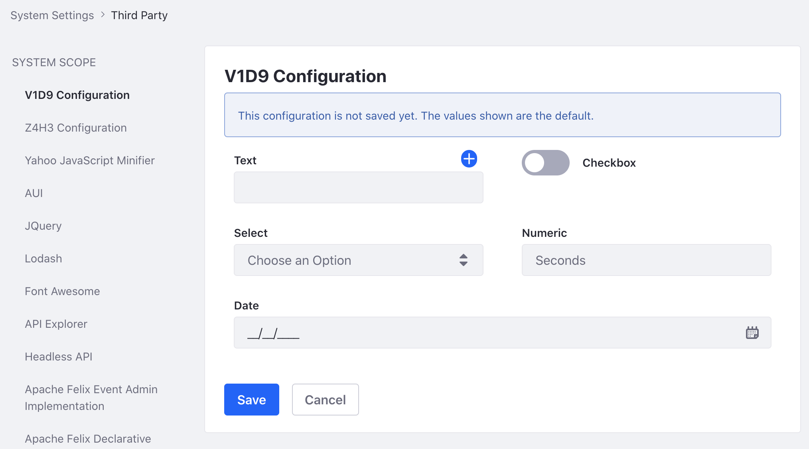

# DDM Form Annotations

The auto-generated [configuration interface](./setting-and-accessing-configurations.html#creating-the-configuration-interface) UI may be too simplistic for some configurations. You can use the Dynamic Data Mapping (DDM) form annotations to customize your layout's UI.

## See a Sample Configuration UI

1. Start Liferay DXP. If you don't already have a docker container, use

    ```bash
    docker run -it -m 8g -p 8080:8080 [$LIFERAY_LEARN_DXP_DOCKER_IMAGE$]
    ```

1. Download and unzip [DDM Form Annotations](./liferay-v1d9.zip)

    ```bash
    curl https://learn.liferay.com/dxp/latest/en/developing-applications/core-frameworks/configurable-applications/liferay-v3d9.zip -O
    ```

    ```bash
    unzip liferay-v1d9.zip
    ```

1. From the module root, build and deploy.

    ```bash
    ./gradlew deploy -Ddeploy.docker.container.id=$(docker ps -lq)
    ```

    ```{note}
    This command is the same as copying the deployed jars to /opt/liferay/osgi/modules on the Docker container.
    ```

1. Confirm the deployment in the Liferay Docker container console.

    ```
    STARTED com.acme.v1d9.impl_1.0.0 [1650]
    ```

1. Open your browser to `https://localhost:8080` and navigate to *Control Panel* &rarr; *Configuration* &rarr; *System Settings*. Under Platform click *Third Party*. Click *V1D9 Configuration* on the left.

    

Here's how the DDM form annotations work.

## Write the Configuration Form

Create a configuration form interface that includes all the form fields in your settings UI. For each field use a `@DDMFormField` annotation. Define attributes such as `label`, `properties`, and `type` for each field.

```{literalinclude} ./ddm-form-annotations/resources/liferay-v1d9.zip/v1d9-impl/src/main/java/com/acme/v1d9/internal/configuration/admin/definition/V1D9ConfigurationForm.java
:dedent: 1
:language: java
:lines: 37-58
```

Visit [Form Field Types Reference](../../../process-automation/forms/creating-and-managing-forms/forms-field-types-reference.md) to learn more about all the available field types. See [Field Type Constants](https://github.com/liferay/liferay-portal/blob/master/modules/apps/dynamic-data-mapping/dynamic-data-mapping-form-field-type-api/src/main/java/com/liferay/dynamic/data/mapping/form/field/type/constants/DDMFormFieldTypeConstants.java) for the `type` variable names of each field type.

After annotating each form field, define the layout of the form right above the class declaration with the `DDMFormLayout` annotation.

```{literalinclude} ./ddm-form-annotations/resources/liferay-v1d9.zip/v1d9-impl/src/main/java/com/acme/v1d9/internal/configuration/admin/definition/V1D9ConfigurationForm.java
:language: java
:lines: 10-34
```

Use the `DDMFormLayoutRow` annotation and the `DDMFormLayoutColumn` to arrange your form fields in the rows and columns you need for your UI.

## Write the Form Declaration

Create a new implementation of `ConfigurationDDMFormDeclaration` to register your new configuration form class. 

```{literalinclude} ./ddm-form-annotations/resources/liferay-v1d9.zip/v1d9-impl/src/main/java/com/acme/v1d9/internal/configuration/admin/definition/V1D9ConfigurationDDMFormDeclaration.java
:language: java
:lines: 7-19
```

Note that the `configurationPid` in the `Component` annotation must match the fully qualified class name of the configuration interface.
