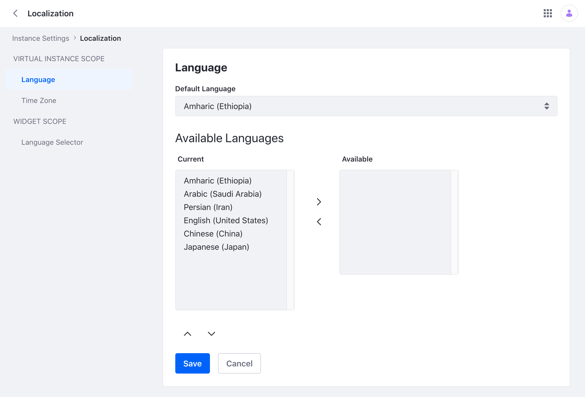
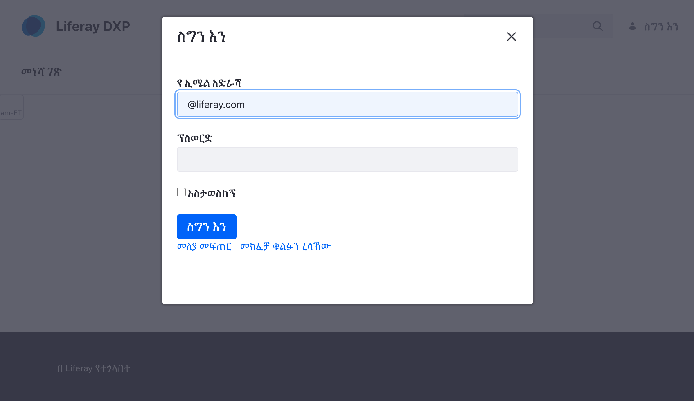

# Adding A Language

Liferay currently supports about fifty languages out-of-the-box. [Translation](https://translate.liferay.com/) has been completed for many of these languages and some are still in the translation process. Each language has its own [language properties file](https://github.com/liferay/liferay-portal/tree/master/portal-impl/src/content) that contain language keys. 

## Adding A New Language

By default, the [`portal.properties`](https://github.com/liferay/liferay-portal/blob/41ac354cd0aa3f9d851a37a6a62d8167f81a2bce/portal-impl/src/portal.properties#L2930) file specifies all the languages that are available in Liferay. To add a new language that is not specified,

1. Take note of the [ISO 639-1 standard code](http://www.loc.gov/standards/iso639-2/php/code_list.php) for your language (e.g. the ISO code for Amharic would be `am`). 

1. Take note of the [ISO 3166-1 alpha-2 two-letter country code](https://www.iso.org/iso-3166-country-codes.html) for your language. (e.g. the ISO code for Ethiopia would be `ET`).

1. Modify and replace the `web.xml` file found in your Liferay installation: `[LIFERAY_HOME]/tomcat<version>/webapps/ROOT/WEB-INF/`. Add your new language under the `<web-resource-name`> section. For example,

    ```xml
	<url-pattern>/am/c/portal/protected</url-pattern>
	<url-pattern>/am-ET/c/portal/protected</url-pattern>
	<url-pattern>/am_ET/c/portal/protected</url-pattern>
    ```

1. Modify and replace the `shielded-container-web.xml` file found in your Liferay installation: `[LIFERAY_HOME]/tomcat<version>/webapps/ROOT/WEB-INF/`. Add your new language under the `<servlet-mapping`> section. For example,

    ```xml
	<servlet-mapping>
		<servlet-name>I18n Servlet</servlet-name>
		<url-pattern>/am/*</url-pattern>
	</servlet-mapping>
	<servlet-mapping>
		<servlet-name>I18n Servlet</servlet-name>
		<url-pattern>/am-ET/*</url-pattern>
	</servlet-mapping>
	<servlet-mapping>
		<servlet-name>I18n Servlet</servlet-name>
		<url-pattern>/am_ET/*</url-pattern>
	</servlet-mapping>
    ```

1. Create your `language.properties` file for your language and use the ISO code for your filename. For example `Language_am.properties` for Amharic:

    ```properties
    create-account=መለያ መፍጠር
    email-address=የ ኢሜል አድራሻ
    forgot-password=መክፈቻ ቁልፉን ረሳኽው
    home=መነሻ ገጽ
    password=ፕስወርድ
    powered-by-x=በ {0} የተጎላበተ
    remember-me=አስታወስከኝ
    search=የፍለጋ አሞሌ
    sign-in=ስግን እን
    ```

1. Create a language module with the `language.properties` file you created and deploy the module to your Liferay installation. See [Overriding Global Language Keys](../../../../liferay-internals/extending-liferay/overriding-global-language-keys.md) to see a sample project and specific instructions on creating this module.

1. Create or modify your `portal-ext.properties` file found in your Liferay installation: `[LIFERAY_HOME]`. Note, this file overrides the enabled default locales defined in the `portal.properties` file. Therefore list all the languages you plan to use in the `portal-ext.properties` file. Define both `locales` and `locales.enabled`. For example:

    ```properties
    locales=am_ET,ar_SA,fa_IR,en_US,zh_CN,ja_JP
    locales.enabled=am_ET,ar_SA,fa_IR,en_US,zh_CN,ja_JP
    ```

1. Once the module is deployed, navigate to *Control Panel* &rarr; *Instance Settings* &rarr; *Localization*. Verify and move the new language to the current languages. Click *Save*.

    

3. Change your default language to the new language and click *Save*. The new language is now utilized by the Liferay instance.

    