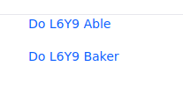

# MVC Action Command

MVC Action Commands handle actions as separate classes. With Action Commands, you can organize action logic in `MVCPortlet`s that have many actions. Action URLs in the portlet's JSPs invoke a designated MVC Action Command class.

You'll deploy an example portlet that uses MVC Action Commands and then examine it.

## Invoke a Portlet's MVC Action Commands

The example portlet's two actions log messages that indicate the MVC Action Command class and method being invoked. Here's how to deploy the portlet and trigger its actions.

1. Start a [Liferay Docker container](../../../installation-and-upgrades/installing-liferay/using-liferay-docker-images/docker-container-basics.md).

   ```bash
   docker run -it -m 8g -p 8080:8080 [$LIFERAY_LEARN_DXP_DOCKER_IMAGE$]
   ```

1. Download and unzip the example.

   ```bash
   curl https://learn.liferay.com/dxp/latest/dxp/latest/en/developing-applications/developing-a-java-web-application/using-mvc/liferay-l6y9.zip -O
   ```

   ```bash
   unzip liferay-l6y9.zip
   ```

1. Build and deploy the example.

    ```bash
    cd liferay-l6y9
    ```

    ```bash
    ./gradlew deploy -Ddeploy.docker.container.id=$(docker ps -lq)
    ```

    ```{note}
    This command is the same as copying module JARs to `/opt/liferay/osgi/modules` on the Docker container.
    ```

1. Confirm the deployment in the Docker container console.

    ```bash
    STARTED com.acme.l6y9.web_1.0.0
    ```

1. Open a browser to `http://localhost:8080`.

1. Sign in using the default credentials:

    **User Name:** `test@liferay.com`

    **Password:** `test`

1. Add the *L6Y9 Portlet* widget from the *Samples* category to a widget page. The L6Y9 Portlet appears.

   

   The links invoke methods in different `MVCActionCommand` classes. For learning purposes, the methods log messages identifying themselves. 

1. Click *Do L6Y9 Able*. `DoL6Y9AbleMVCActionCommand` logs invoking its `doProcessAction` method.

    ```bash
    [DoL6Y9AbleMVCActionCommand:26] Invoke #doProcessAction(ActionRequest, ActionResponse)
    ```

1. Click *Do L6Y9 Baker*. `DoL6Y9BakerMVCActionCommand` logs invoking its `doProcessAction` method.

    ```bash
    [DoL6Y9BakerMVCActionCommand:26] Invoke #doProcessAction(ActionRequest, ActionResponse)
    ```

You've seen MVC Action Commands in action. Now see how they work.

## Examine the Portlet

`L6Y9Portlet` is a minimal [`MVCPortlet`](https://github.com/liferay/liferay-portal/blob/[$LIFERAY_LEARN_PORTAL_GIT_TAG$]/portal-kernel/src/com/liferay/portal/kernel/portlet/bridges/mvc/MVCPortlet.java).

```{literalinclude} ./mvc-action-command/resources/liferay-l6y9.zip/l6y9-web/src/main/java/com/acme/l6y9/web/internal/portlet/L6Y9Portlet.java
:language: java
:lines: 9-19
```

The [`@Component`](https://osgi.org/javadoc/r6/residential/org/osgi/service/component/annotations/Component.html) `javax.portlet.name` property sets the portlet's name.

```{literalinclude} ./mvc-action-command/resources/liferay-l6y9.zip/l6y9-web/src/main/java/com/acme/l6y9/web/internal/portlet/L6Y9Portlet.java
:dedent: 2
:language: java
:lines: 14
```

The portlet renders `/view.jsp` by default.

```{note}
`MVCActionCommand`s bind to a portlet by the portlet's name (e.g., the portlet component `javax.portlet.name` property value).
```

The example portlet renders `view.jsp` by default. Next you'll see how the JSP invokes the MVC Action Command classes.

## Examine the Portlet Action URLs

The portlet's `view.jsp` file renders links for invoking the portlet's MVC Action Commands.

```{literalinclude} ./mvc-action-command/resources/liferay-l6y9.zip/l6y9-web/src/main/resources/META-INF/resources/view.jsp
:language: jsp
```

The first line makes the Portlet 2.0 tag library available via the `portlet` prefix. This JSP binds actions to UI components using the tag library's `portlet:actionURL` tag. Each tag maps the UI component to an MVC command by assigning the MVC Action Command's `mvc.command.name` property value to the tag's `name` attribute.

| `view.jsp` Portlet Action URL | `DoL6Y9AbleMVCActionCommand` Component Property |
| ----------------------------- | ----------------------------------------------- |
| `<portlet:actionURL name="/do_l6y9_able" />` | `mvc.command.name=/l6y9/do_l6y9_able` |

| `view.jsp` Portlet Action URL | `DoL6Y9BakerMVCActionCommand` Component Property |
| ----------------------------- | ----------------------------------------------- |
| `<portlet:actionURL name="/do_l6y9_baker" />` | `mvc.command.name=/l6y9/do_l6y9_baker` |

Clicking on the *Do L6Y9 Able* link, for example, invokes `DoL6Y9AbleMVCActionCommand`'s `doProcessAction` method.

## Examine the MVCActionCommand Classes

MVC Action Command classes can implement [`MVCActionCommand`](https://github.com/liferay/liferay-portal/blob/[$LIFERAY_LEARN_PORTAL_GIT_TAG$]/portal-kernel/src/com/liferay/portal/kernel/portlet/bridges/mvc/MVCActionCommand.java) directly or by extending [`BaseMVCActionCommand`](https://github.com/liferay/liferay-portal/blob/[$LIFERAY_LEARN_PORTAL_GIT_TAG$]/portal-kernel/src/com/liferay/portal/kernel/portlet/bridges/mvc/BaseMVCActionCommand.java). `DoL6Y9AbleMVCActionCommand` extends `BaseMVCActionCommand`.

```{literalinclude} ./mvc-action-command/resources/liferay-l6y9.zip/l6y9-web/src/main/java/com/acme/l6y9/web/internal/portlet/action/DoL6Y9AbleMVCActionCommand.java
:language: java
:lines: 13-34
```

`DoL6Y9AbleMVCActionCommand` is a [`Component`](https://docs.osgi.org/javadoc/osgi.cmpn/7.0.0/org/osgi/service/component/annotations/Component.html) that provides an `MVCActionCommand` service. `DoL6Y9AbleMVCActionCommand`'s component properties apply the component to the portlet that has the property `javax.portlet.name=com_acme_l6y9_web_internal_portlet_L6Y9Portlet` and map the component to an MVC command named `/do_l6y9_able`. When a user triggers an action bound to that command name, `DoL6Y9AbleMVCActionCommand`'s `doProcessAction` method executes. For demonstration purposes, the `doProcessAction` method above logs a message that identifies itself.

```{note}
You can associate an `MVCActionCommand` component with multiple portlets by declaring a `javax.portlet.name` property for each portlet.
```

`DoL6Y9BakerMVCActionCommand` is similar to `DoL6Y9AbleMVCActionCommand` except its names contain `Baker` or `baker` instead `Able` or `able`.

Next see how the portlet's JSP maps UI component actions to the commands.

## What's Next

Now that you know how to use MVC Action Commands, you may want to check out [MVC Render Commands](./mvc-render-command.md) and [MVC Resource Commands](./mvc-resource-command.md). If you want to start localizing your app's content, see [Using Localized Messages](./using-localized-messages-in-an-mvc-portlet.md). If you're ready to start developing model, persistence, and service layers, visit [Service Builder](../../data-frameworks/service-builder.md).

## Additional Information

* [MVC Render Command](./mvc-render-command.md)
* [MVC Resource Command](./mvc-resource-command.md)
* [Overriding MVC Commands](../../../liferay-internals/extending-liferay/overriding-mvc-commands.md)
