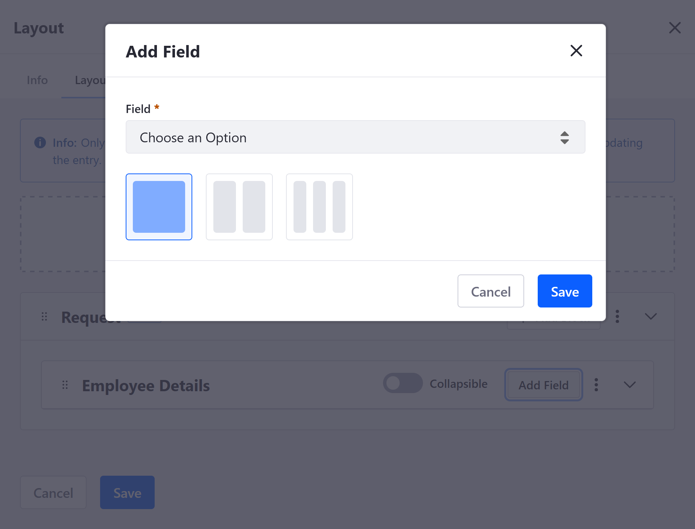
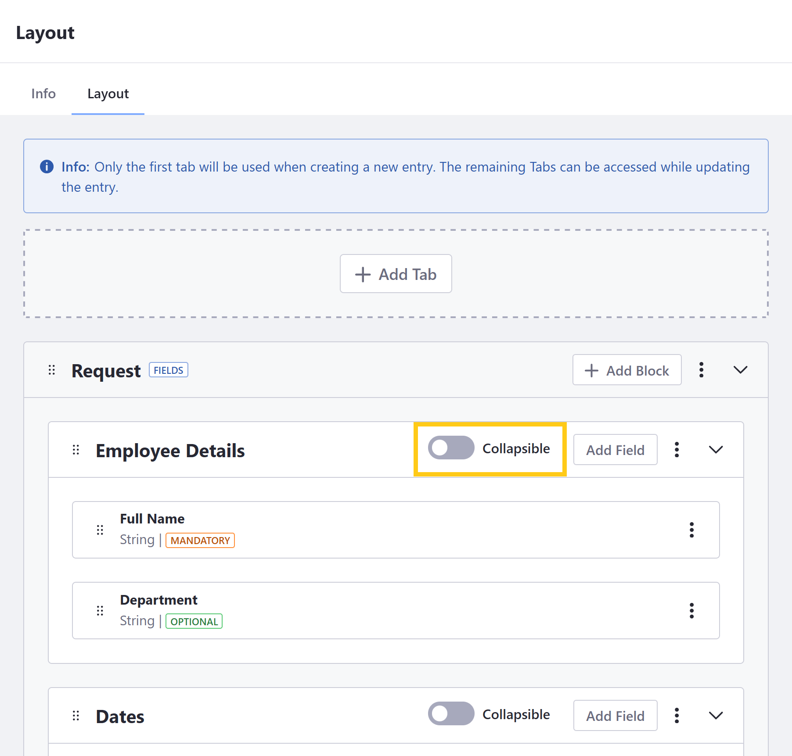
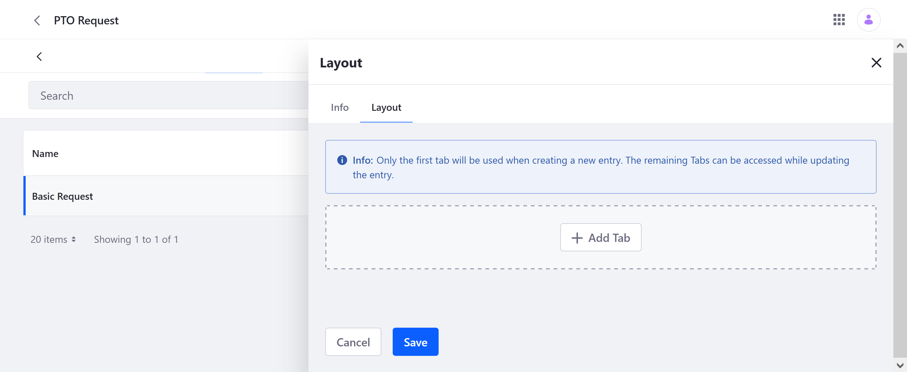
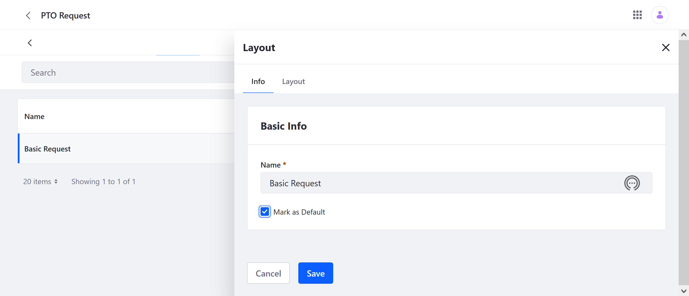

# Designing Object Layouts

An Object layout defines how its fields and relationships are organized and displayed when creating or editing an entry. By default, applications created with the Objects portlet use an automatically generated layout for their entries. This layout has a single tab that displays all Object fields in alphabetical order. However, you can design custom layouts to determine how and where elements are displayed.

```{important}
The automatically generated layout does not display Object relationships. To display relationships, you must create a custom layout with a dedicated relationships tab.
```

## Adding Object Entry Layouts

1. Open the *Objects* portlet and click on the desired *Object*.

1. Click the *Layouts* tab and select the *Add* button ().

   

1. Enter a *Name* and click on *Save*.

Once saved, a new blank layout is created. You can now [add tabs](#adding-layout-tabs) to your custom layout and determine how the Object's fields and relationships are organized for entry creation and editing.

## Adding Layout Tabs
<!--TASK: Add drag and drop details once implemented.-->
Object elements can be organized into two types of tabs:

[**Fields**](#fields-tabs): Displays Object entry fields. This includes fields created directly in the Object or those inherited from a *One to Many* relationship. <!--TASK: Add in One to One after implemented-->

[**Relationships**](#relationships-tabs): Displays relationship tables and must be used for showing the parent side of *One to Many* relationships and both sides of *Many to Many* relationships.

To design your layout, repeat the following steps until you've added all the desired [fields](#adding-fields-tabs) and [relationships](#adding-relationships-tabs).

```{important}
Only the first tab appears during Object entry creation. Other tabs appear only when editing the Object entry.

Also, the first tab in a layout cannot contain relationships, and a Relationships tab can only be added to a layout after it has a Fields tab.
```

### Fields Tabs

1. Click on the desired layout and go to the *Layout* tab.

   

1. Click on *Add Tab*, enter a *Label*, select the *Fields* type, and click on *Save*.

   The Label value determines the tab's display name in the Liferay UI.

   

1. Click on *Add Block*, enter a *Label*, and click on *Save*.

   This creates a tab subsection that you can add fields to. The Label value determines the block's display name in the Liferay UI.

   ```{note}
   Fields cannot be added directly to a tab; they must be organized into blocks.
   ```

   

1. Click on *Add Field*, select the desired field, determine whether the field is displayed in one, two, or three columns, and click on *Save*.

   ```{note}
   A field can only be used once in a layout.
   ```

   

1. Click *Add Field* to add more fields to the block, or click *Add Block* to add a new block to the tab for additional fields.

1. Use the toggle switch to determine whether the block is *collapsible*.

   

1. Click *Save*.

### Relationships Tabs

1. Select the desired layout and go to the *Layout* tab.

   

1. Click on *Add Tab*, enter a *Label*. This value determines the tab's display name in the Liferay UI.

1. For tab type, click on *Relationships* and then select from available *One to Many* or *Many to Many* relationships. This determines the relationship table displayed in the tab.

   ```{note}
   You can only select the Relationships type if the layout has at least one Fields tab. A Relationships tab cannot be the first tab in an Object layout, because relationships cannot be set at entry creation. An entry must first exist before it can be related to another Object entity.
   ```

   

1. Click *Save*.

## Selecting a Default Layout

Once you've added the desired fields and relationships to your custom layout, you can set it as the Object's default layout. This ensures it is used for creating and editing the Object's entries. If no custom layout is selected as default, the Object uses its automatically generated layout.

```{important}
In order to select a custom layout as default, all required Object fields must be added to the layout's first tab.
```

Follow these steps to select a default layout for an Object:

1. Click on the desired layout.

1. In the Basic Details tab, check the *Default* box.

   

1. Click on *Save*.

The layout is now used when creating and editing the Object's entries.

## Additional Information

* [Creating Objects](./creating-objects.md)
* [Adding Fields to Objects](./adding-fields-to-objects.md)
* [Defining Object Relationships](./defining-object-relationships.md)
* [Managing Objects](./managing-objects.md)
