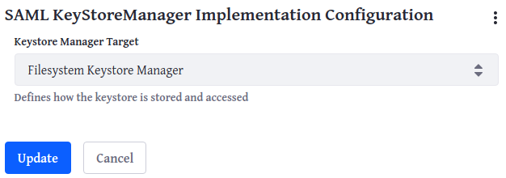

# Configuring SAML at the System Level

Before allowing any portal instances to enable SAML authentication, you should configure it at the system level so those instances have a foundation from which to work. For example, you wouldn't want to have portal instances configuring SAML and then find you must move the key store from the file system into the document library. This creates a configuration headache for everybody. It's better to configure your system level options first. 

## Choose Your Key Store Manager Target

1. Log into Liferay DXP with administrator credentials and go to _Control Panel_ &rarr; _System Settings_ &rarr; _Security_ &rarr; _SSO_ &rarr; _SAML KeyStoreManager Implementation Configuration_. 

1. Choose either _File System_ (the default) or _Document Library_. 

1. Click _Update_. 

Be sure to have backups configured for either location. 

## Configure SAML

Verify the default configuration is appropriate for your system: 

1. Go to _Control Panel_ &rarr; _System Settings_ &rarr; _Security_ &rarr; _SSO_ &rarr; _SAML Configuration_. 

1. Set your key store path. By default, it's in your [Liferay Home](../../../reference/liferay-home.md) directory. 

1. Set the password for accessing the key store. 

1. Review the other options (see below), modify them accordingly, and click _Save_. 

There are various options you can set: 

**Key Store Type:** Set the key store type. The default is _jks_, or Java Key Store. Other valid options are ssh and pgp. 

**SSO Session Check Interval:** The IdP should check for expired sessions for every minute you enter here. 

**Runtime Metadata Refresh Interval:** Refresh peer SAML entities for every second you enter here. 

**Replay Cache Duration:** Expire IdP message cache entries when the number of milliseconds entered here expires. Caching messages protects against message replay attacks. 

**Authentication Request Check Interval:** The SP removes expired Authn requests when they reach this age in minutes. 

**Authn Request Maximum Age:** Enter the time in milliseconds that Authn requests should be valid. 

**Message Check Interval:** The SP should remove expired entries from the IdP messages cache when they're older than this number of minutes. 

**Enable Identity Provider Role To Be Configured:** If you check this box, you allow portal instances on this Liferay DXP installation have the IdP role. 
