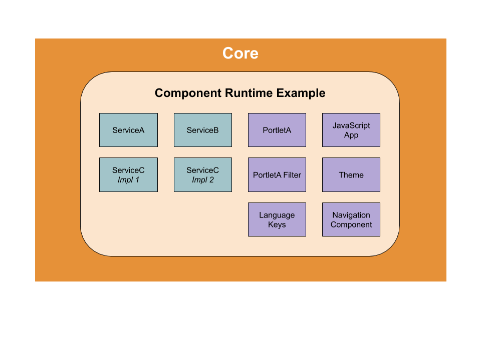
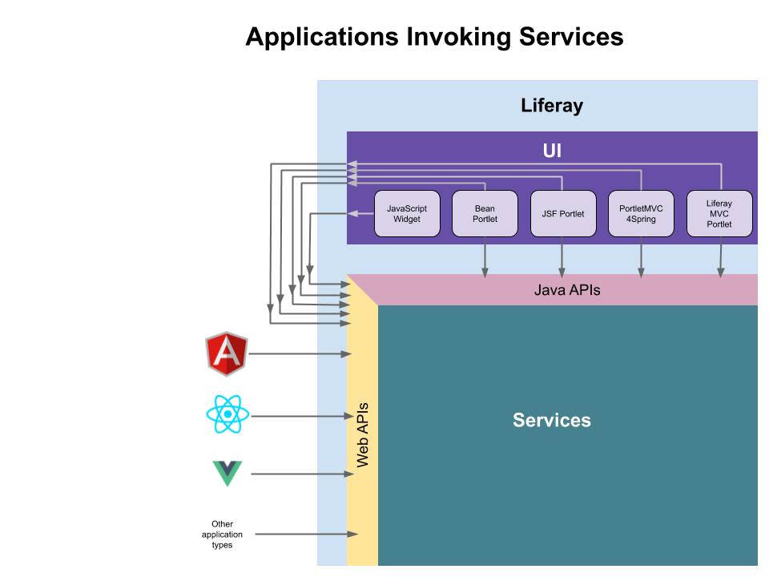

# Architecture

Liferay DXP and Portal's architecture has three parts: 

1. **Core:** Bootstraps DXP/Portal and its [frameworks](../../developing-applications/core_frameworks.html). The Core provides a runtime environment for managing services, UI components, and customizations.

1. **Services:** Expose DXP/Portal functionality and custom functionality via Java APIs and web APIs.

1. **UI:** The optional web application UI for adding portals, sites, pages, widgets, and content.

You can use the UI and services together or focus solely on using services via [REST web APIs](../../headless-delivery/consuming-apis/consuming-rest-services.md).

The architecture satisfies these requirements:

* Supports using common development technologies
* Leverages development standards
* Facilitates swapping components
* Starts fast and performs well
* Its runtime is easy to configure and inspect

The Core supports UI and service deployments and orchestrates wiring them together.

## Core

DXP/Portal is a web application that runs on your application server. The Core bootstraps the application and its [frameworks](../../developing-applications/core_frameworks.html).

There are frameworks for these things and more:

* Adaptive Media
* Application Configuration
* Application Security
* Assets
* Cache
* Data Scopes
* Dependency Injection
* Expando/Custom Attributes
* File Management
* Localization
* Logging
* Message Bus
* Scheduler
* Search
* Segmentation and Personalization
* Service Builder
* Testing
* Upgrade Processes
* Virus Protection
* Workflow

The Core provides the component runtime environment for the frameworks, services, and UI. Here are some component examples:

* [Services](../../liferay-internals/fundamentals/apis-as-osgi-services.md)
* [Service customizations](../../liferay-internals/extending-liferay/overriding-osgi-services.md)
* [Language Keys \(localized messages\)](../../developing-applications/developing-a-java-web-application/using-mvc/sharing-localized-messages.md)
* [JavaScript applications \(templates, routers, and resources\)](../../developing-applications/developing_a_javascript_application.html)
* [JSP customizations](../../liferay-internals/extending-liferay/customizing-jsps.md)
* [Portlets \(templates, controllers, and resources\)](../../developing-applications/developing-a-java-web-application/reference/portlets.md)
* [Portlet filters](../../liferay-internals/extending-liferay/portlet-filters/auditing-portlet-activity-with-a-portlet-filter.md)
* [Themes](../../site-building/site-appearance/themes/introduction-to-themes.md)

The following figure shows these component types in the runtime environment.

The runtime environment supports adding, replacing, and customizing components on-the-fly. This makes the following scenarios possible:

**Replacement:** If the `ServiceC Impl 2` component has a higher ranking than existing component `ServiceC Impl 1`, `ServiceC Impl 2` is used in its place.

**Customization:** The `PortletA Filter` intercepts and modifies requests to and responses from `PortletA`, affecting the content `PortletA` displays.

Component WAR and module JAR projects install as [OSGi bundles](https://www.osgi.org/) (modules). Liferay's OSGi framework defines the module life cycle, enforces dependencies, defines the class loading structure, and provides an API and CLI ([Felix Gogo Shell](../../liferay-internals/fundamentals/using-an-osgi-service.md)) for managing modules and components. The Core is configured via [portal properties files](../../installation-and-upgrades/reference/portal-properties.md) and [System Settings](../../system-administration/configuring-liferay/system-settings.md).

The service components provide business functionality.

## Services

Business logic is implemented in services deployed to the component runtime environment. Built-in Core services and framework services operate on models such as [Users](../../users-and-permissions/users/understanding-users.md), [Roles](../../users-and-permissions/roles-and-permissions/understanding-roles-and-permissions.md), [Web Content](../../content-authoring-and-management/web-content/web-content-articles/adding-a-basic-web-content-article.md), [Documents and Media](../../content-authoring-and-management/documents-and-media/sharing-documents-and-media.md), and more. You can introduce new models and functionality through custom services. Service components can access each other via dependency injection.

Front-end applications invoke the services to do work. You can deploy Java-based applications that call services directly using the Java APIs, and any web-based (Java and non-Java) application, whether deployed on DXP/Portal or not, can use the web APIs, which include [headless REST APIs](../../headless-delivery/consuming-apis/consuming-rest-services.md) that conform to the [OpenAPI](https://swagger.io/docs/specification/about/) standard and include plain web/REST services. The following figure shows applications and external clients invoking Liferay services.

Liferay services are built using [Service Builder](../../developing-applications/data-frameworks/service-builder.md) and made REST-ful using [REST Builder](../../headless-delivery/producing-apis-with-rest-builder/producing-apis-with-rest-builder.md). The services are easy to [override and extend](../../liferay-internals/extending-liferay/overriding-osgi-services.md) too.

The web-based UI makes content and service functionality available in browsers.

## UI

The UI helps people do work, [collaborate](../../collaboration-and-social/collaboration-and-social-overview.md), and [enjoy content](../../content_authoring_and_management.html). The UI consists of

* [DXP/Portal application](../../site-building/introduction-to-site-building.md): The web application for managing Portals, Sites, Users, Pages, Widgets, and more. 

* [Applications](../../developing_applications.html): Widgets that provide a user interface for services already deployed. 

* [Themes](../../site-building/site-appearance/themes/introduction-to-themes.md): Plugins for styling Sites with a unique look and feel.

The [UI architecture](./ui_architecture.html) articles dig deeper into developing and customizing UI components.

As you can see, the architecture supports developing services, UI components, and customizations. The architecture section covers Core, service, and UI topics. Next, we dive into the Core to describe class loading, modularity, and more. But you can jump ahead to any service or [UI architecture](ui-architecture/ui-architecture.md) topics, if you like. Enjoy exploring the architecture!
