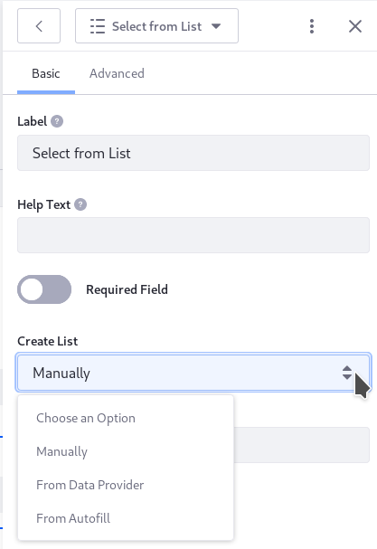
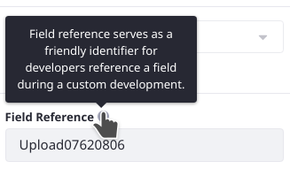
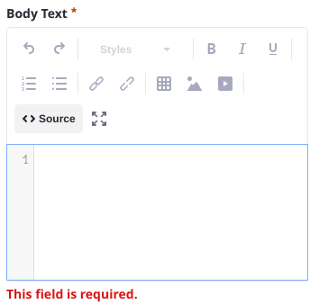
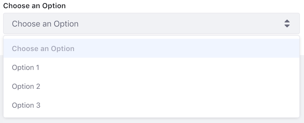
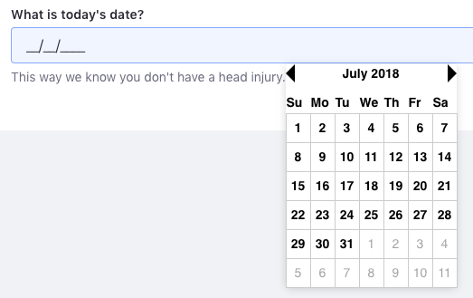
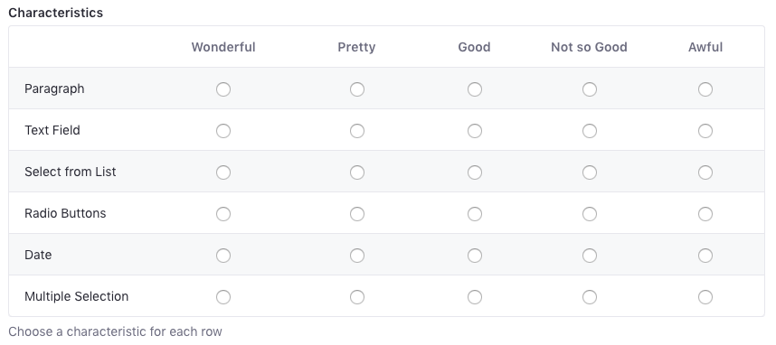
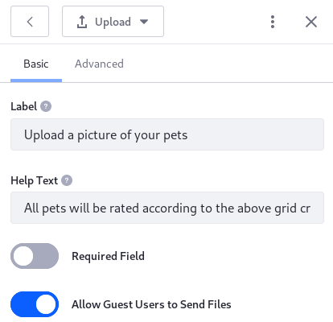
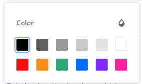
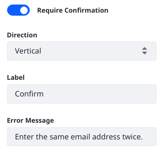

# Forms Field Types Reference

The Liferay Forms application contains lots of field types and elements to add to your forms. To discover the available elements,

1. Open the _Product Menu_ () and click the compass icon () on the Site Administration menu. Select the Site where the form will be created.
1. Click _Content & Data_  &rarr; _Forms_.
1. Click the _Add_ button (). The form builder view appears.
1. Click the _Add_ button () one more time to display the _Add Elements_ sidebar (if it is not already opened).


## Field Configuration Overview

The field configuration editor sidebar appears whenever you add a new field or click an existing one in the form builder. The available configuration options differ by field type.

All Form Fields have at least two configuration types: basic and advanced. Many forms can be [created](../creating-and-managing-forms/creating-forms.md) with just the basic configurations, which include things like its label, [placeholder text, help text](../creating-and-managing-forms/providing-help-text-and-predefined-values.md), and whether the field is required. There are additional field-specific configurations as well.



Advanced configurations include [predefined values](../creating-and-managing-forms/providing-help-text-and-predefined-values.md), search configurations, whether the field is repeatable, and the read-only field ID. There are additional-field-specific configurations as well.


### Field Name, Field ID, and Field Reference

In the first release of Liferay 7.3, the editable configuration Field Name was removed, and a read-only Field ID was included in each field's Advanced tab. However, an editable replacement, Field Reference, is now available in Liferay 7.3+. Use the Field Name value in 7.2, and the Field Reference in 7.3+, when referencing the field programmatically.



## Form Fields and Elements

### Paragraph

The paragraph field displays static text on the form, as entered by the form creator. Users do not enter data into paragraph fields. This is useful for longer instructions.


Paragraph fields can be much more than plain text. Create rich content using the embedded content editor.



### Text Field

Users enter free-form text into these fields. For example, a Full Name field is a text field. By default, a text field keeps all input on a single line of text. To accommodate longer responses, choose the multi-line setting when configuring the text field [as in this example](./creating-forms.md). You can put limits on the text users can enter (e.g., numbers from 1-10, email addresses, etc.) by using the text field's [validation options](./validating-text-and-numeric-field-entries.md).


### Select from List

Users select one option (or more, if configured to allow it) from a list of choices. Choices are entered manually or automatically populated by a [data provider](../data-providers/data-providers-overview.md). For example, a Country of Residence field can be selected from list field populated by a Countries of the World data provider.



### Single Selection

Using a radio button, users select one option from a list of options displayed on the form.


### Boolean

Users enable or disable a radio button or switch, logging a `true` or `false` response to the displayed text.


### Date

Users select a date using a date picker.



### Multiple Selection

Users select one or more options from check boxes (or toggles, if configured).


### Grid

Using radio buttons, users select from options laid out in rows and columns. One selection can be made per row. This is useful when the same response metric is needed for multiple questions.



### Numeric

Users enter numeric data (integers or decimals) into numeric fields. Non-numeric input is not accepted.


### Upload

Upload fields let users upload a file from the local file system. Logged in Users can choose from files they have previously uploaded or upload a new one.

```note::
   In 7.2 and 7.3 logged in Users can select an existing file from the Documents and Media library or choose to upload a file from their local file systems.
   ```


Beginning with Liferay 7.3 (DXP FP1+ and CE GA7+), you can allow unauthenticated Guest Users to upload files. Enable Guest uploads within the Form Field's configuration:



Uploaded documents are stored in a hidden folder in the [Documents and Media repository]( ./../../../system-administration/file-storage/configuring-file-storage.md). To display them in the Documents and Media application, set the following [portal property](../../../installation-and-upgrades/reference/portal-properties.md ) in a `portal-ext.properties` file:

```properties
dl.show.hidden.mount.folders=true
```

Configure the Guest upload behavior in the Control Panel: System Settings &rarr; Forms (Content and Data) &rarr; Forms, or by creating a [configuration file](../../../system-administration/configuring-liferay/configuration-files-and-factories/using-configuration-files.md) named `com.liferay.dynamic.data.mapping.form.web.internal.configuration.DDMFormWebConfiguration.config`.

```tip::
   To configure the Forms application at the `instance scope <../../../system-administration/configuring-liferay/understanding-configuration-scope.md#scope-definitions>`__, use the Forms entry in Instance Settings.
```

**Guest Upload File Extensions (`guestUploadFileExtensions`):** Enter the comma-separated list of accepted file extensions. By default the following list is supported: `doc`, `docx`, `jpeg`, `jpg`, `pdf`, `png`, `ppt`, `pptx`, `tiff`, `txt`, `xls`, and `xlsx`.

**Guest Upload Maximum file Size (`guestUploadMaximumFileSize`):** Set the maximum file size Guest User can upload via the Upload field. This is configured for authenticated Users in the Documents and Media application's configuration, and system-wide limits are defined in the Upload Servlet Request System Settings entry, in the field named Overall Maximum Upload Request Size. By default the limit is 25 MB.

**Maximum Repetitions for Upload Fields (`maximumRepetitionsForUploadFields`):** If the field is configured as repeatable, set maximum number of times the field can be added to the form by the User (applies equally to Guest Users and logged in Users). By default the limit is 5.

**Maximum Submissions for Guest Upload Fields (`maximumSubmissionsForGuestUploadFields`):** Set the maximum number of times a Guest User can submit a form that includes a Guest-enabled Upload field. The Guest User's IP address is used to keep track of submissions. By default the limit is 5.

### Image

Users can select an image file (`.gif`, `.jpeg`, `.jpg`, or `.png`) from Web Content Images, the Documents and Media library, or upload an image file from their local file systems.


```important::
   Guest Users cannot access or upload images. Avoid using this field unless only authenticated Users can access the form.
```

### Color

Users can enter the hex code of a color by selecting it from the color picker or entering the code directly.



### Rich Text

Users can enter Rich Text content (including formatted text, embedded images, attachments, etc.) into a form field.


### Field Confirmation

Rather than a field in the Form Builder that you add directly to the form body, the confirmation field only appears when you configure a single-line Text or Numeric field to _Require Confirmation_ (using the field's Advanced configuration section). This field ensures that fields with important data are entered correctly (for example, email address fields).


New configuration options appear when you enable the confirmation field:

**Direction:** Choose Vertical (the default) or Horizontal to determine whether the confirmation field appears below or alongside the original field.

**Label:** Choose the prefix for the original field label. The default value is Confirm, so a field named Email Address has a confirmation field label of _Confirm Email Address_.

**Error Message:** Depending on the field you're asking confirmation of, you can provide a more specific error message.



See [Validating Text and Numeric Field Entries](validating-text-and-numeric-field-entries.md) for information on ensuring the user enters information in a valid format.

## Additional Information

* [Creating Forms](./creating-forms.md)
