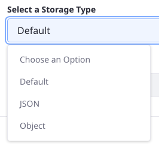

# Using Storage Adapters

When a User adds a form record, Liferay routes the processing of the request through a [storage adapter](../developer-guide/understanding-form-storage-adapters.md) API. The same is true for the other *CRUD* operations performed on form entries (read, update, and delete). The default implementation of the storage service translates the forms into JSON for storage in the Liferay database.



The default _JSON_ storage adapter was renamed in Liferay 7.4 to _Default_. In addition to the default adapter, there's an _Object_ storage adapter, beginning in Liferay 7.4. If your system contains any [custom storage adapters](../developer-guide/writing-a-form-storage-adapter.md) there may be even more.

```{note}
An [upgrade process](../../../building-applications/data-frameworks/upgrade-processes.md) is in place that moves existing forms to the Liferay 7.4 Default storage adapter.
```

To see the storage adapters in your system,

1. Add a new form.
1. Click the  icon in the upper right.
1. In the General tab, expand the list options in the Select a Storage Type setting.

The Dynamic Data Mapping (DDM) back-end can *adapt* to other storage formats for form records. This makes it easy to serialize form data as XML or YAML (or whatever format you like) instead of the default JSON, and you can choose to store form data anywhere, including the Liferay database.

```{important}
You cannot change the storage adapter after a form has been saved. All existing forms continue to use the adapter configured at the time of their creation, and a different storage adapter cannot be selected.
```

| Storage Type | Description | Liferay Version |
| :--- | :--- | :--- |
| Default      | Use the default adapter to store the form's records in the Liferay Forms database tables. | 7.4+ |
| Object       | Use the Object adapter to map the form's records to a Liferay Object. After choosing this option you must select an existing Liferay Object and map the form's fields to the Object's fields. The form record data is stored in JSON in the Object's dedicated database table. | 7.4+ |
| JSON | Use the JSON adapter in Liferay 7.2 and 7.3 to store the form's records in JSON in the Liferay Forms database tables. | 7.2 and 7.3 |
