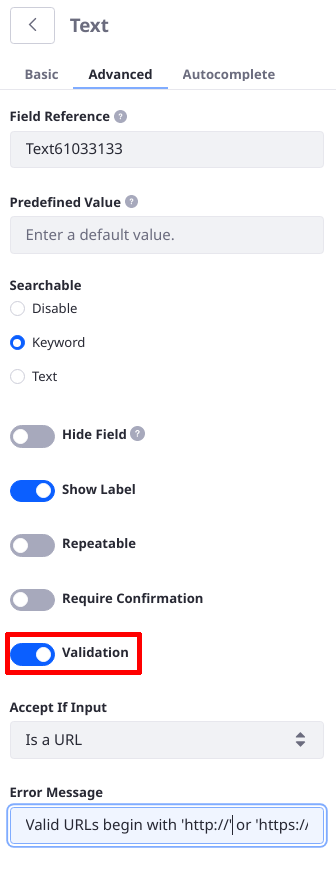
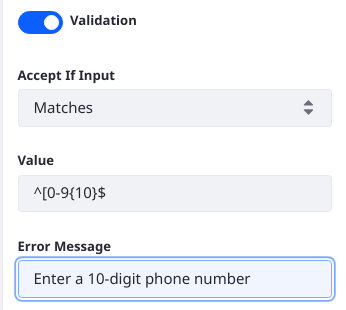
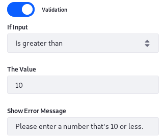
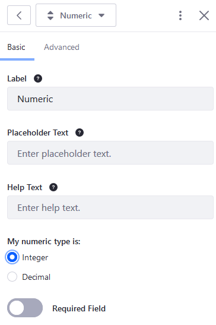
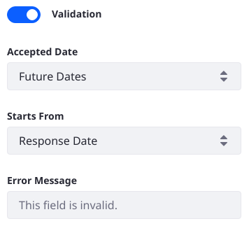
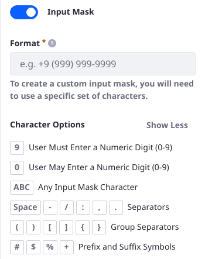
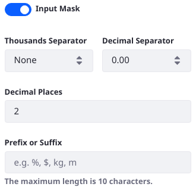

# Validation and Masking

Certain Forms fields can be validated (Text, Date, and Numeric fields) and masked (Numeric fields) to ensure User input is valid.

```{note}
Date Fields can be validated beginning in Liferay 7.4.
```

Enable input validation to ensure that only certain values are accepted in a Text or Numeric field.

## Enabling Field Validation

To enable validation:

1. While viewing a form, click on a Text, Numeric, or Date field to open the field configuration menu.
1. Click the _Advanced_ tab.
1. Switch the _Validation_ toggle to the right to enable validation.

    

Once validation has been enabled, configure the settings. For example, the Text field can specify the _If Input_ condition and the _Show Error Message_ to indicate how validation failed.

The Field validation rule is triggered as soon as a User navigates away from a validated form field (by clicking into another field, for example). 


## Validating Text Fields

See the [Validation Conditions Reference](./validation-conditions-reference.md) for more information about the other validation conditions.

### Validating Email Addresses

Forms can be configured to validate email addresses. To ensure that the user has entered a valid email address:

1. Select the _Is not email_ condition from the _If Input_ dropdown.
1. Enter the error message in the _Show Error Message_ field: Please enter a valid email address.
1. Click _Save Form_ when finished.

    

### Validating URLs

Similar to emails, Forms can be configured to validate URLs.

To validate URLs:

1. Select the _Is not URL_ condition from the _If Input_ dropdown.
1. Enter an error message.
1. Click _Save Form_ when finished.

### Using Regular Expressions

Forms can be configured to use [regular expressions](https://en.wikipedia.org/wiki/Regular_expression) to create custom validation criteria. For example, use this regular expression to ensure that ten consecutive numeric digits are entered in a phone number field:

    ^[0-9]{10}$

To validate a text field using a regular expression:

1. Select the _Does Not Match_ condition from the _If Input_ dropdown menu.
1. Enter the regular expression.
1. Enter an error message in the _Show Error Message_ field.

    

1. Click _Save Form_ when finished.

## Validating Numeric Fields

Numeric field validation is similar to text field validation, but the conditions compare the value of the number entered to some other value.

To validate numeric fields:

1. Select the desired condition from the _If Input_ dropdown menu (for example, _Is greater than_).
1. Enter numeric value (_10_) that serves as the limit.
1. Enter an error message in the _Show Error Message_ field.

    

1. Click _Save Form_ when finished.

### Requiring Only Integers

Forms can be configured to require numeric values to be integers. By default, the _My numeric type is_ value is set to Decimal.

To configure the Numeric field to accept only integers:

1. While viewing a form, click on a Numeric field to open the field configuration menu.
1. On the _Basic_ tab, click on the _Integer_ radio button.

    

1. Click _Save Form_ to apply the changes.

## Validating Date Fields

As of Liferay 7.4, the Advanced configuration of the Date Field includes Validation.



Validation options include

**Accepted Date:** Require that the selected date be a future date, a past date, or a specified range.

**Starts From/Ends On:** In the case of future dates, define the date picker Start From date. For past dates, define the Ends On date. Configure whether the date picker should use the Response Date (the date that the user is filling out the form) or a custom date for this value. Both Starts From and Ends On must be configured for a date range validation.

**Error Message:** The error message can be customized to better suit the specific validation rule.

## Masking Numeric Fields

The Input Mask configuration lets you you display the correct number format as the user enters numeric data. The configuration behavior differs between integer fields and decimal fields:

   - Integer field masks: configure the Format. A second entry, Character Options, is a read-only field setting that provides additional guidance on the character behavior used to define the format.

     

   - Decimal field masks: Configure the Thousands Separator, the Decimal Separator, the Decimal Places, and the Prefix or Suffix settings. The thousands separator style can be `None`, `1,000`, `1.000`, or `1 000`. The decimal separator style can be `0.00` or `0,00`. Prefix or Suffix. Use the Decimal Places setting to specify a limit to the number of decimal digits. The prefix or suffix is usually used to define the units of the decimal number. For example, use `$` as a prefix for a field that expects the user to enter a dollar amount.

     


## Additional Information

* [Validation Conditions Reference](./validation-conditions-reference.md)
* [Creating Forms](./creating-forms.md)
