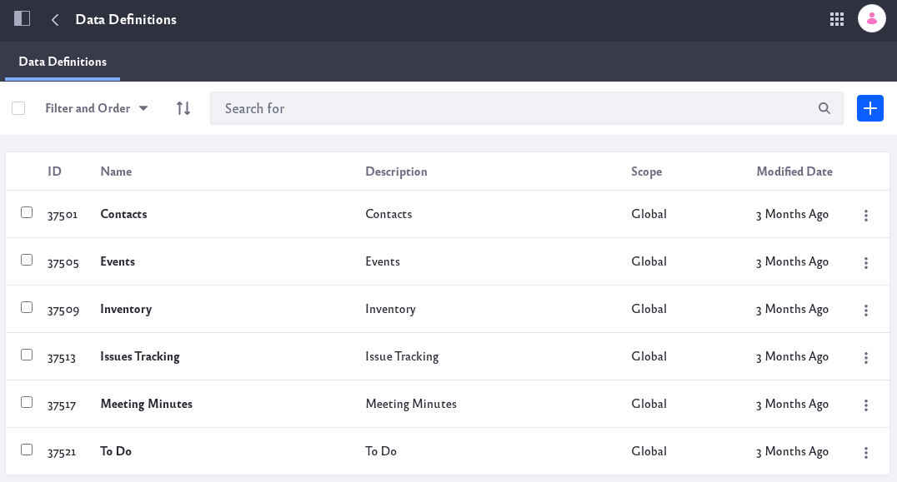
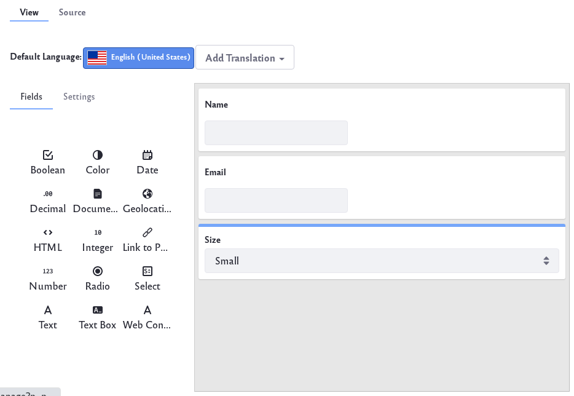
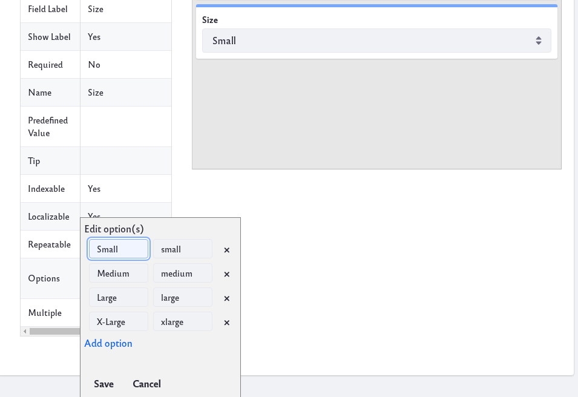

# Creating Data Definitions

To create a data definition:

1. Navigate to *Content & Data* &rarr; *Dynamic Data Lists*. 

1. Click the Options icon () at the top-right and click *Manage Data Definitions*.

    

    The Data Definitions screen appears. A table lists any existing data definitions. Several definitions are embedded for common use cases like contacts, events, inventory, and more.

1. Click the *Add* icon () to begin creating a new data definition. This opens the New Data Definition form. 

1. Give your data definition a name. Note that the definition’s name appears for any users filling out a dynamic data list that uses the definition. Expand the Details section of the form and give it a description.

    

    The Details section of the form also contains the field Parent Data Definition. This optional field lets you select an existing data definition (the parent) to form the basis of the new one (the child). The child definition inherits the parent’s fields and settings, which you can then customize. When you create a dynamic data list from a child definition, it includes the fields of the parent and child definitions. This lets you use a common definition (the parent) as the basis of a specialized definition (the child). 

    To choose a parent definition, click the *Select* button below the Parent Data Definition field and then select an existing definition in the dialog that appears.

1. Add the data definition’s fields in the data definition designer below the form’s Details section. The designer’s default View tab lets you create the definition in a WYSIWYG editor. You can click the Source tab to work with the definition’s underlying JSON, but it’s much easier to stick with the WYSIWYG editor.

    

    In the View tab click the *Fields* tab. Icons representing the field types are listed on one side and the data definition’s canvas is on the other side. To add a field type to the definition, select its icon, drag and drop it onto the canvas. By dragging a field onto a field that’s already on the canvas, you can nest the new field in the existing field. When you mouse over a field on the canvas, the field action icons appear. Clicking the *duplicate* icon (
    ) creates a duplicate of the current field and adds it below the current field. Clicking the *trash* icon (
    ) deletes the field. See the [Field Types Reference](#field-types-reference) to learn more about available fields.

1. Edit field properties to reflect their intended use. For example, a text field’s default label is Text. This can be changed to a custom value such as Email. First select the field on the canvas. This automatically selects the Settings tab on the left. Alternatively, you can access the Settings tab by clicking the field’s cog icon (). 

    

    To edit a field property, double-click its value in the Settings table and enter a new value. See the [Field Properties Reference](#field-properties-reference) to learn more.

    You can translate a data definition’s field values to any supported locales. To specify a field value for a translation, select the flag that represents the locale and enter the field value for the locale.

1. Click *Save* when you’re done. Your new data definition then appears in the table.

## Field Types Reference

The following field types are available when creating a Data Definition:

| Field Type | Description |
| :--- | :--- |
| Boolean | A check box |
| Color | Specifies a color |
| Date | Enter a date. A valid date format is required for the date field, but you don't have to enter a date manually. When you select the date field a mini-calendar pops up which you can use to select a date. |
| Decimal | Enter a decimal number. The value is persisted as a `double` |
| Documents and Media | Select a file from a Documents and Media library |
| Geolocation | Associate a location with the User's form entry. |
| HTML | An area that uses a WYSIWYG editor to write and display HTML content |
| Integer | Enter an integer. The value is persisted as an `int`. |
| Link to Page | Link to another page in the same site. |
| Number | Enter a decimal number or an integer. The value is persisted either as a `double` or an `int`, depending on the input's type |
| Radio | Displays several clickable options. The default number of options is three but this is customizable. Only one option can be selected at a time |
| Select | This is just like the radio field except that the options are hidden and must be accessed from a drop-down menu |
| Text | Enter a single line of text |
| Text Box | This is just like the text field except you can enter multiple lines of text or separate paragraphs |
| Web Content | Select web content |

## Field Properties Reference

 The following properties are available to modify. Note that some of these properties are only available for specific field types:

| Property | Description |
| :--- | :--- |
| Type | The field’s type (e.g., text, radio, etc.). This setting can’t be edited, but a display template can reference it |
| Field Label | The field’s display name |
| Show Label | Whether the field label is shown |
| Required | Whether users must fill out the field (not available for Boolean fields) |
| Name | The field’s internal identifier. You can use this value in a display template to read the field’s data. This value is automatically generated, but you can change it if you wish |
| Predefined Value | The field’s default value |
| Tip | Text to display in a tooltip |
| Indexable | Whether the field is indexed for search |
| Localizable | Whether the field can be translated |
| Repeatable | Whether users can make copies of the field |
| Multiple | Whether the user can select more than one option. This is only available for Select fields |
| Options | The options available for selection in Radio and Select fields. You can add and remove options, and edit each option’s display name and value |
