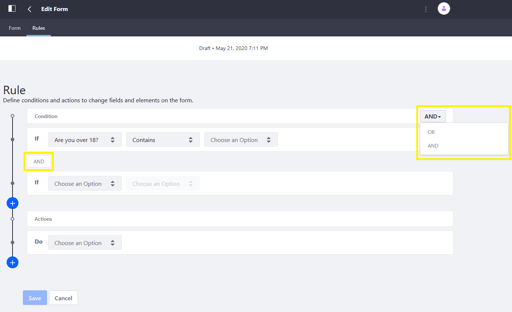
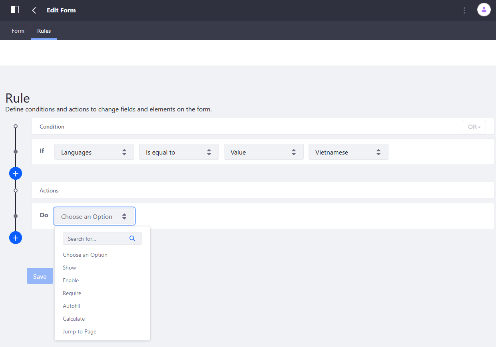

# Form Rules Overview

Forms can be dynamic, where the answer to one question changes the rest of the form. One answer may allow skipping the next three questions, while another requires answering additional questions. Fields like these are called _conditional fields_. Once you have decided which fields are conditional, use a Form Rule to determine what happens based on the answer to that question (for example, skips page 3 and goes to page 4 on a multi-page form).

As of Liferay 7.4, [form fields](./forms-field-types-reference.md) can even be hidden. This mean that a data provider can populate a hidden field, and the hidden field can be used in a rule to dynamically alter the form.

<!-- Is this complicated enough that it warrants an example? -->

## Form Rule Conditions and Actions

Rules have two components:

* **Conditions** determine whether any actions are executed.
* **Actions** determine what happens if the condition is met.

```note::
   Rules are stored in the database in JSON format by default.
```

Users can choose _OR_ or _AND_ to define the relationship between multiple conditions:

* **OR**: The action is triggered if _any_ of the conditions you specify evaluates to _true_.
* **AND**: The action is triggered only if *all* the conditions you specify evaluate to *true*.



## Accessing the Rule Builder

1. Navigate to the Form where the Form Rule is to be applied.
1. Click on the _Rules_ tab.

    

1. Click the _Add_ button () to get started.

## Specifying Conditions

When building a rule, you must specify a field (for example, _Are you over 18?_), a condition (_Is equal to_), and the Value (_Yes/ No_) to be compared against. If the condition's _if statement_ is _true_, the action is triggered. If it is _false_, nothing happens.

| Condition | Description |
| --- | --- |
| Is equal to | Checks whether the inputted value is equal to the condition. Example: if a language matches Spanish, then trigger the action.  |
| Is not equal to | Checks whether the inputted value is not equal to the condition. |
| Contains | Checks whether the inputted value contains the value. |
| Does not contain | Checks whether the inputted value does not contain the value. |
| Is empty | Checks whether a field *is* empty. |
| Is not empty | Takes an action as long as a field is *not* empty. |
| User | Checks whether the user belongs to a certain Role. If yes, the action is triggered. |

## Form Rule Actions

The following Actions are available:



| Action | Description |
| --- | --- |
| [Show](./using-the-show-hide-rule.md) | Sets the visibility of a form field based on a predefined condition. |
| **Enable** | Use a predefined condition to enable or disable a field. |
| **Require** | Use a predefined condition to make a field required. |
| [Jump to Page](./using-the-jump-to-page-rule.md) | Based on user input, skip over some form pages directly to a relevant page. _This rule doesn't appear in the rule builder until a second page is added to the form_. |
| **Autofill with Data Provider** | Use a [data provider](../using-the-rest-data-provider-to-populate-form-options.md) to populate fields when a condition is met in another field. |
| **Calculate** | Populate a field with a calculated value using data entered in other fields. |

## Additional Information

* [Creating Forms](../creating-and-managing-forms/creating-forms.md)
* [Forms Field Types Reference](../creating-and-managing-forms/forms-field-types-reference.md)
* [Data Providers Overview](../data-providers/data-providers-overview.md)
