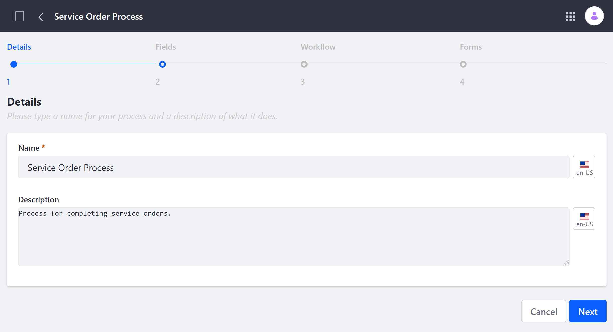
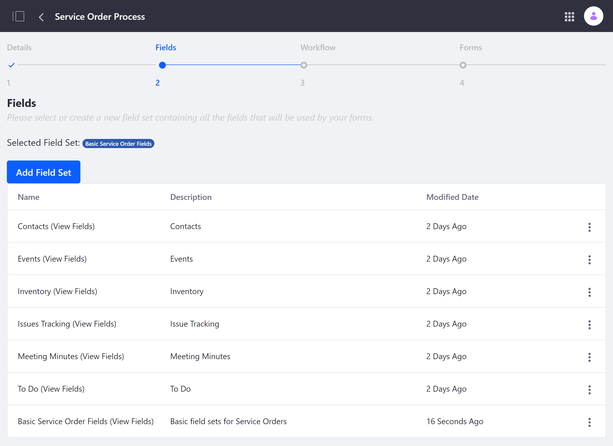
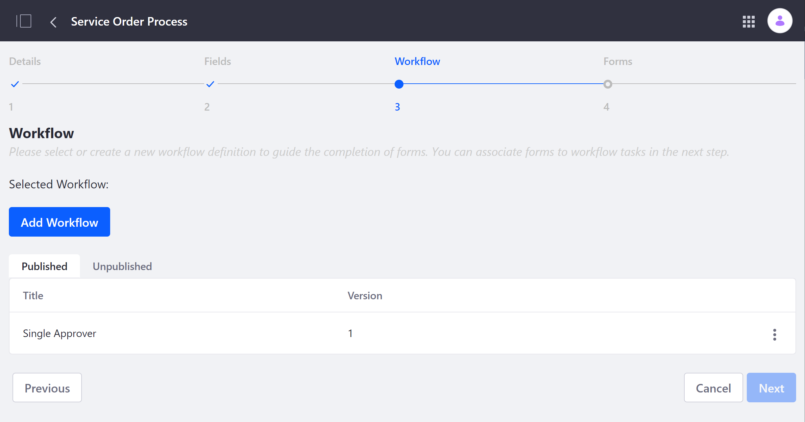
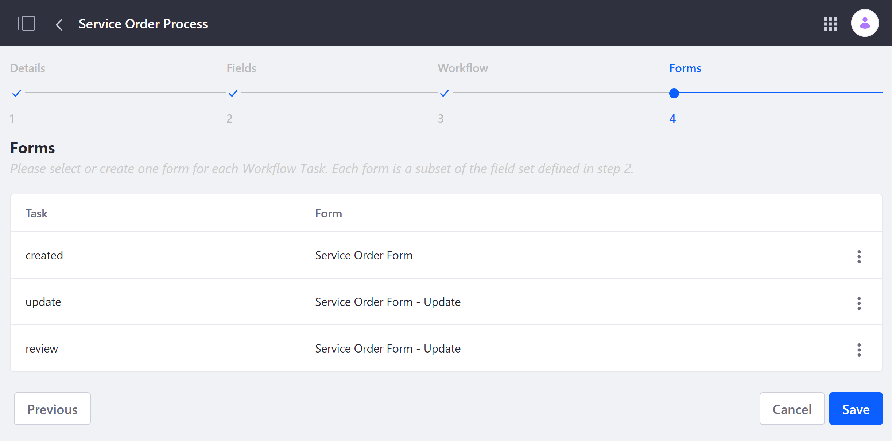

# Kaleo Forms

Liferay's *Kaleo Forms* solution combines the features of *Workflow Designer* and *Dynamic Data Lists* to create form-based business processes. With it, you can integrate forms with workflow tasks to create conference room checkout forms, support ticket processes, and more.

* [Kaleo Forms](#kaleo-forms)
  * [Creating a Kaleo Forms Process](#creating-a-kaleo-forms-process)
  * [Using a Kaleo Forms Process](#using-a-kaleo-forms-process)
  * [Additional Information](#additional-information)

## Creating a Kaleo Forms Process

Follow these steps to create a new Kaleo Forms process:

1. Open the *Site Menu*, and go to *Content & Data* &rarr; *Kaleo Forms Admin*.

1. Click on the *Add* button  to open the New Process Wizard.

1. Enter a *name* and *description* for your new process, and click *Next*.

    

1. Select a *Field Set* to define the fields that can appear in your process's forms.

   You can choose from existing field sets, or create a new one. Click on *View Fields* to preview all elements contained in an existing field set.

   * To choose an existing field set, click on its *Actions* button , and select *Choose*. Alternatively, you can select *Edit* to modify the field set before choosing it.

   * To create a new field set, click on *Add Field Set*, and incorporate the desired elements. When finished, click on *Save* and close the dialogue window to update the list of available field sets to choose from. See [Creating Data Definitions](../dynamic-data-lists/creating-data-definitions.md) for more information.

   Once you've chosen a field set, click *Next*.

   

1. Select a *Workflow* to use for your new process's forms.

   You can choose from existing published workflows or create a new one.

   * To choose an existing, published workflow, click on its *Actions* button , and select *Choose*. You can also select *Edit* to modify the workflow before choosing it.

   * To create a new workflow, click on *Add Workflow*, and incorporate the desired elements. See [Workflow Designer Overview](../../workflow/designing-and-managing-workflows/workflow-designer/workflow-designer-overview.md) for more information. When finished, click on *Publish* and close the dialogue window to update the list of available workflows to choose from.

   Once you've chosen a workflow, click *Next*.

   

1. Select *forms* to use for each workflow task.

   You can choose from existing forms, or create new ones.

   * To choose from existing forms, click on a task's *Actions* button , and select *Assign Form*. Then, click on the desired form. Once assigned, you can edit or unassign the selected form at any time via the task's *Actions* button.

   * To create a new form, click on each task's *Actions* button , and select *Assign Form*. Then, click on the *Add* button , and design a custom form. When finished, click on *Save*. You can then assign the new form to the selected workflow task.

   

1. Click *Save*.

## Using a Kaleo Forms Process

Follow these steps to initiate a Kaleo Forms process:

1. Open the *Site Menu*, and go to *Content & Data* &rarr; *Kaleo Forms Admin*.

1. Click on the *Kaleo Forms process* you want to use, and then click on the *Add* button . This redirects you to the initial form for the selected process.

1. Fill out the initial form, and click *Save* to complete the first workflow task.

Once saved, the workflow engine implements the prescribed process, and users assigned to subsequent workflow tasks are notified. These tasks can be viewed under *My Workflow Tasks* in the *Personal Menu*.

From here, you can click on the process to complete your assigned task, editing, rejecting, or approving the designated task form to move the process forward to resolution. Available options and conditions are defined by the selected Kaleo Forms process.

## Tracking a Kaleo Forms Entry in the Workflow

In Liferay 7.4 Update 1, a new feature was added to the Kaleo Form Admin application's UI: you can track each submitted form's progress through the workflow in a diagram view:

To access the diagram view, click the Track Workflow configuration option in the entry's Actions menu ().

## Additional Information

* [Introduction to Forms](../introduction-to-forms.md)
* [Introduction to Workflow](../../workflow/introduction-to-workflow.md)
* [Creating Data Definitions](../dynamic-data-lists/creating-data-definitions.md)
