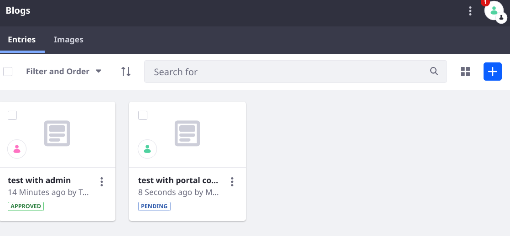

# Creating a Condition Evaluator

Workflow [condition nodes](../designing-and-managing-workflows/workflow-designer/using-condition-nodes.md) use a Groovy script to determine the proper transition a workflow item traverses. Instead of writing logic in Groovy directly in a workflow definition `<script>` element, you can execute Java logic by implementing the `ConditionEvaluator` interface. 

1. Write the Java implementation.
2. Call the Java class from the workflow definition XML file.

First deploy and observe a working `ConditionEvaluator`.

## Deploy a Condition Evaluator

1. Start Liferay.

   ```bash
   docker run -it -m 8g -p 8080:8080 [$LIFERAY_LEARN_DXP_DOCKER_IMAGE$]
   ```

1. Download and unzip the Acme R6J9 Implementation project.

   ```bash
   curl https://learn.liferay.com/dxp/latest/en/process-automation/workflow/developer-guide/liferay-r6j9.zip -O
   ```

   ```bash
   unzip liferay-r6j9.zip
   ```

1. From the module root, build and deploy.

   ```bash
   ./gradlew deploy -Ddeploy.docker.container.id=$(docker ps -lq)
   ```

   ```tip::
   This command is the same as copying the deployed jars to /opt/liferay/osgi/modules on the Docker container.
   ```

1. Confirm the deployment in the Liferay Docker container console.

   ```bash
   STARTED com.acme.r6j9.impl_1.0.0
   ```

```note::
   For convenience, the `activate` method of the `ConditionEvaluator` autoloaded a R6J9 Conditional Approver workflow definition. This code achieved the same thing as navigating to the Workflow Process Builder and uploading a workflow definition. See `Uploading a New Workflow Definition <../designing-and-managing-workflows/managing-workflows.md#uploading-a-new-workflow-definition>`__.
```

## Test the Condition Evaluator

To use the Acme R6J9 Condition Evaluator, set it for use with Blogs Entries, and add a new Blogs Entry with the administrative User.

1. In the Applications tab of the Global Menu, go to Workflow &rarr; Process Builder.

2. In the Configuration tab, assign the R6J9 Conditional Approver definition to the Blogs Entry Asset Type.

3. Click _Save_.

4. Using the default administrative User Test Test, open the Site menu &rarr; Content & Data &rarr; Blogs.

5. Click the Add button ().

6. Enter something into the Title and Content fields, then click _Submit for Publication_.

7. Back in the main Blogs view, confirm that the entry is visible and that the status is marked as _Approved_.

   ```tip::
      If the status initially shows `Pending`, refresh the page.
   ```

   

If you test with the Single Approver definition or with another, non-administrative User, you can see that the Blogs Entry is added with the status _Pending_.

## Understanding the R6J9 Condition Evaluator

The Acme R6J9 Implementation project contains a condition evaluator for triggering the `approve` transition if the workflow user has the Administrator Role. It contains a single class: `R6J9ConditionEvaluator`.

In addition to the condition evaluator the project includes and autoloads a workflow definition called the R6J9 Conditional Approver, which uses the condition evaluator.

A condition evaluator does not change the status of the asset being sent to the workflow. It merely provides a convenient way to execute a transition. If changing the workflow status is required, call the `WorkflowStatusManagerUtil` class's `updateStatus` method. The `approved` state node of the definition sets the status to approved:

```{literalinclude} ./creating-a-condition-evaluator/resources/liferay-r6j9.zip/r6j9-impl/src/main/resources/com/acme/r6j9/internal/kaleo/runtime/condition/dependencies/r6j9-workflow-definition.xml
   :dedent: 1
   :language: xml
   :lines: 174-175, 186-201
```

### Implementing a `ConditionEvaluator`

The condition evaluator class implements the `com.liferay.portal.workflow.kaleo.runtime.condition.ConditionEvaluator` interface, overriding its single `evaluate` method. Set the `scripting.language=java` component property.

```{literalinclude} ./creating-a-condition-evaluator/resources/liferay-r6j9.zip/r6j9-impl/src/main/java/com/acme/r6j9/internal/kaleo/runtime/condition/R6J9ConditionEvaluator.java
   :dedent: 0
   :language: java
   :lines: 29-32
```

The `evaluate` method must return a valid transition name so that when called in the workflow definition, the workflow can proceed to the proper node via the transition. 

The `evaluate` method takes two parameters, a `KaleoCondition` and an `ExecutionContext`. Because the workflow engine is responsible for calling the condition evaluator in the workflow process, your code isn't responsible for instantiating and constructing these objects. However, you can obtain useful information from them. For example, the R6J9 Condition Evaluator retrieves the `workflowContext` (of the type `Map`) and the `serviceContext` (of the type `ServiceContext`) from the `ExecutionContext`:

```{literalinclude} ./creating-a-condition-evaluator/resources/liferay-r6j9.zip/r6j9-impl/src/main/java/com/acme/r6j9/internal/kaleo/runtime/condition/R6J9ConditionEvaluator.java
   :dedent: 2
   :language: java
   :lines: 39-41
```

The `workflowContext` is used to retrieve the workflow User's ID, and the `serviceContext` is used to retrieve the Virtual Instance's ID (the `companyId`). Both are needed to check whether the User has the Role _Administrator_; the asset is auto-approved (sent along the transition named _approve_) by the workflow if the User does that the Administrator role. Otherwise, it executes the _review_ transition.

```{literalinclude} ./creating-a-condition-evaluator/resources/liferay-r6j9.zip/r6j9-impl/src/main/java/com/acme/r6j9/internal/kaleo/runtime/condition/R6J9ConditionEvaluator.java
   :dedent: 2
   :language: java
   :lines: 46-53
```

### Calling the `ConditionEvaluator` in the Workflow Definition

The R6J9 Conditional Approver workflow definition that was autoloaded by the Acme R6J9 Implementation project is nearly identical to the Single Approver definition that ships with Liferay. The first difference is in the `created` state node. The Single Approver definition executes the review transition always, but the R6J9 Conditional Approver executes a `check-role` transition The main difference is an addition identically named condition node. The condition node then relies on the `R6J9ConditionEvaluator` to execute the condition logic.

```{literalinclude} ./creating-a-condition-evaluator/resources/liferay-r6j9.zip/r6j9-impl/src/main/resources/com/acme/r6j9/internal/kaleo/runtime/condition/dependencies/r6j9-workflow-definition.xml
   :dedent: 1
   :language: xml
   :lines: 11-27
```

Note that the approved and review transitions are added as valid targets of the condition node. Make sure any transitions used in the `ConditionEvaluator` are included as valid transitions from the condition node where it's called.
