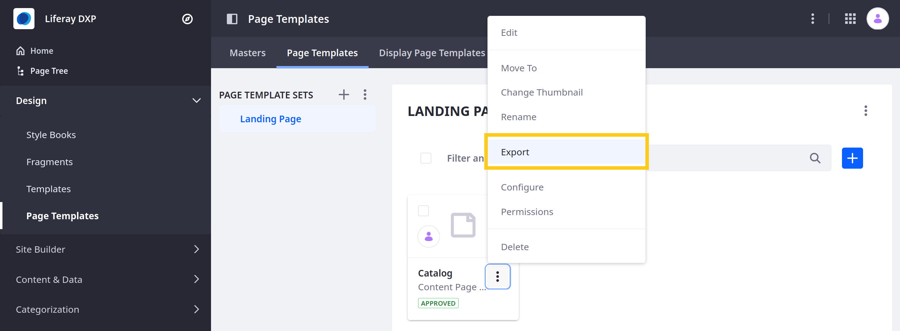
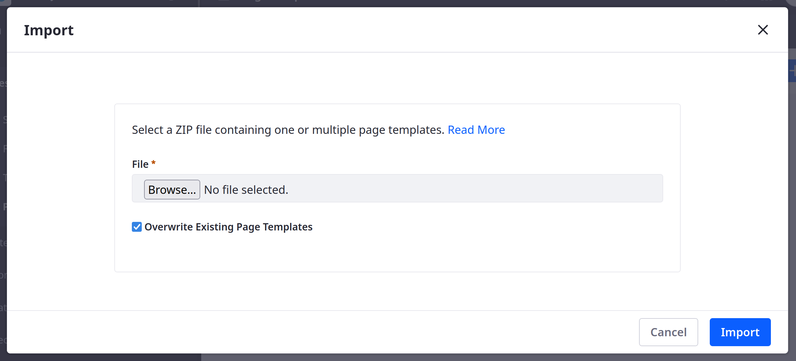

# Exporting and Importing Page Templates

Sometimes it's easier to edit templates in a code editor. Once you've [created a Page Template](./creating-a-page-template.md), you can [export](../../building-sites/importing-exporting-pages-and-content.md) it, edit it locally in the editor of your choice, and then import the template back into Liferay. You can import the template into any Site on the system. 

```tip::
   Page Templates are part of the larger Collections framework. For more information, see `About Collections and Collection Pages <../../../content-authoring-and-management/collections-and-collection-pages/about-collections-and-collection-pages.md>`_.
```

For more general information about the Export/Import Framework, see [Importing/ Exporting Sites and Content](../../building-sites/importing-exporting-pages-and-content.md).

## Exporting a Page Template

1. Navigate to the Site where the Page Template has been created.
1. Click the Product Menu (). 
1. Click _Design_ &rarr; _Page Templates_.
1. Click the _Page Templates_ tab.
1. Select the Collection where the page template resides (for example, _Collection 1_).
1. Click the Options () icon next to the desired Page Template.
1. Click _Export_.

   

1. Click _OK_ in the confirmation window.

The Page Template downloads as a ZIP file to your local machine. 

```tip::
   You can export more than one Content Template at once. However, you cannot include Widget Templates with Content Pages in the same ZIP file.
```

The last published version of the Page Template is always exported. If the Page Template has never been published, it cannot be exported.

The exported ZIP file contains these files: 

* `page-template-collection.json`: Contains the name of the Collection where the Page Template is saved and any other metadata
* An optional thumbnail file
* `page-template.json`: Contains the Page Template name and any other metadata
* `page-definition.json`: specifies the structure and content of the Page Template.

The ZIP file may contain different types of page templates as well, like `display-page-template.json`, `master-page.json`, `page-template-collection.json` and `page-template.json`.

## Importing a Page Template

1. Navigate to the Site where the _Page Template_ is to be imported.
1. Click the Product Menu (). 
1. Click _Design_ &rarr; _Page Templates_.
1. Click Options () at the top right &rarr; _Import_.

   

1. Click _Browse_ and navigate to your Page Template file. 
1. Click _Open_ in the browser window.
1. Click _Import_.

   

1. Close the _Import_ window.

The Page Template has been imported into the Site.

## Additional Information

* [Creating a Page Template](./creating-a-page-template.md)
* [Importing/ Exporting Sites and Content](../../building-sites/importing-exporting-pages-and-content.md)
* [Creating Collections](../../../content-authoring-and-management/collections-and-collection-pages/creating-collections.md)
