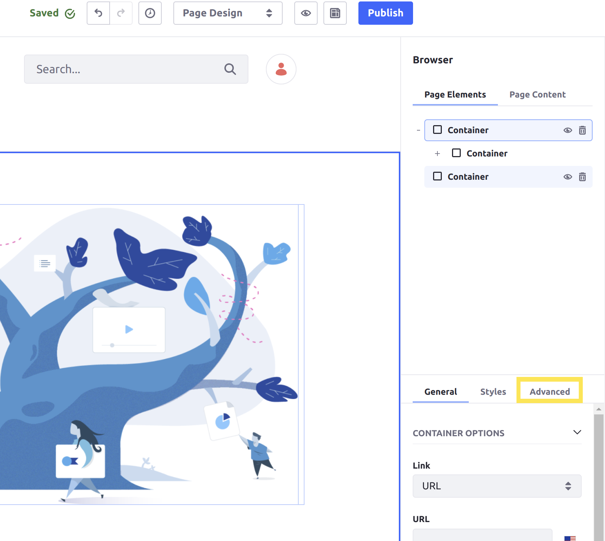
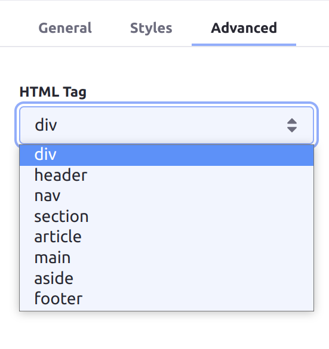
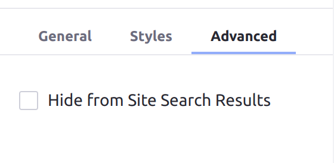

# Advanced Settings Reference

{bdg-secondary}`Available 7.4 DXP U23+ or 7.4 GA23+`

The *Advanced* Settings tab for Page Fragments provides fields for more complex or technical configurations. For example, advanced settings may alter the way web browsers handle the Fragment's HTML.

Follow these steps to access a Fragment's Advanced Settings menu:

1. Begin editing a Page or Template that supports Fragments.

1. Open the *Browser* panel () in the sidebar menu and select the desired *Fragment* under Page Elements.

   Alternatively, you can click on the desired Fragment in the Page or Template to open this menu.

1. Click the *Advanced* tab in the Page Elements side menu.



## HTML Tag

Several HTML tags exist that allow web scrapers, browsers, and site renderers to more easily find and retrieve what kind of content is on a page. *Container* Page Fragments provide the option to choose which tag is generated for the Container Fragment's HTML element on the page.

| Field | Description |
| :--- | :--- |
| HTML Tag | Choose the HTML tag generated for the Fragment (Container Fragments only). The available options are `div` (default), `header`, `nav`, `section`, `article`, `main`, `aside`, and `footer`. |

```{note}
The tag chosen only applies to the Container Fragment itself, not to any other Fragments or content nested within it.
```



## Hiding Content from Search Results

You may want to hide a Page Fragment from search results on your Site. This configuration especially helps to prevent irrelevant or repeated search results if a Fragment is commonly reused on many pages, or otherwise is not relevant for content searches.



## Additional Information

* [General Settings Reference](./general-settings-reference.md)
* [Using Fragments](../../using-fragments.md)
* [Creating a Style Book](../../../../site-appearance/style-books/using-a-style-book-to-standardize-site-appearance.md)
* [Style Book Token Definitions](../../../../site-appearance/style-books/developer-guide/style-book-token-definitions.md)
