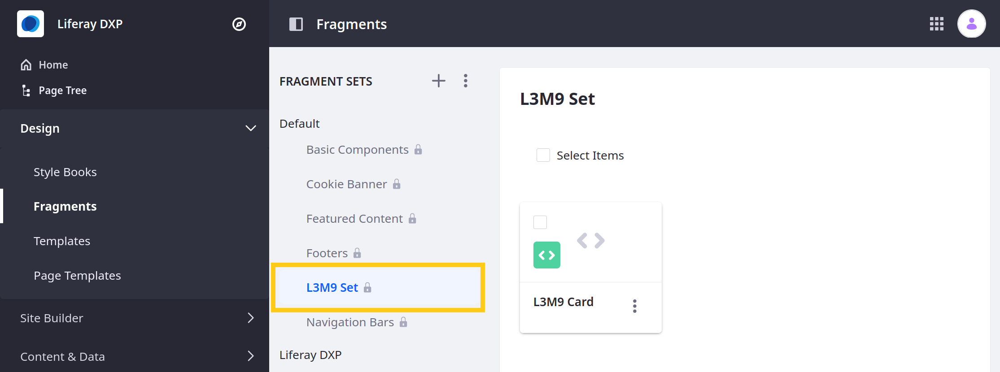
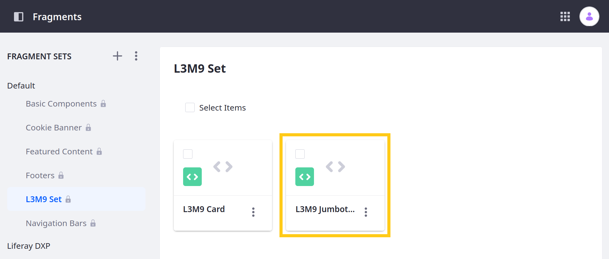

# Creating a Contributed Fragment Set

Contributed Fragment Sets are deployable modules containing Page Fragments. Fragments in a contributed Set can be used just like regular Fragments, but aren't contained in the database and can't be modified directly through the UI. If you're running Liferay 7.3+, it's better to use [Automatically deployed Fragments](./auto-deploying-fragments.md) created in compressed ZIP Sets. You can create these [with your own tools](./using-the-fragments-toolkit.md#fragment-set-structure) or the [Liferay Fragments Toolkit](./using-the-fragments-toolkit.md), and they can be modified from the UI and can include image resources.

This example runs on Liferay 7.3+.

```{note}
All Fragments added through a Contributed Fragment Set are available globally to all Sites.
```

To add a contributed Fragment Set, you extend the [`BaseFragmentCollectionContributor` Class](https://docs.liferay.com/dxp/apps/fragment/latest/javadocs/com/liferay/fragment/contributor/BaseFragmentCollectionContributor.html), which itself implements the [`FragmentCollectionContributor` interface](https://docs.liferay.com/dxp/apps/fragment/latest/javadocs/com/liferay/fragment/contributor/FragmentCollectionContributor.html).

Here, you'll learn how to contribute a Fragment Set:

- [Deploy a Contributed Fragment Set](#deploy-a-contributed-fragment-set)
- [Contributed Fragment Set Logic and metadata](#contributed-fragment-set-logic-and-metadata)
- [Add Fragment Resources](#add-fragment-resources)
- [Related Information](#related-information)

```{note}
For Liferay DXP 7.4+, Fragment Collections are called Fragment Sets in the Liferay UI.
```

## Deploy a Contributed Fragment Set

First, deploy an example to see what a contributed Fragment Set looks like:

1. Run the command below to start the Docker container:

    ```bash
    docker run -it -m 8g -p 8080:8080 [$LIFERAY_LEARN_PORTAL_DOCKER_IMAGE$]
    ```

1. Download and unzip the [example](https://learn.liferay.com/dxp/latest/en/site-building/developer-guide/developing-page-fragments/liferay-l3m9.zip):

    ```bash
    curl https://learn.liferay.com/dxp/latest/en/site-building/developer-guide/developing-page-fragments/liferay-l3m9.zip -O
    ```

    ```bash
    unzip liferay-l3m9.zip
    ```

1. From the module root, build and deploy the contributed Set's JAR.

    ```bash
    cd liferay-l3m9
    ```

    ```bash
    ./gradlew deploy -Ddeploy.docker.container.id=$(docker ps -lq)
    ```

    ```{note}
    If testing on Windows, you may need to build the module first with `./gradlew build` and then manually copy the JAR to `docker cp docker-container-name:/opt/liferay/osgi/modules` directly if deployment fails.
    ```

1. Confirm the deployment to the Liferay Docker container console. The log message below should appear in the Docker console:

    ```bash
    INFO  [fileinstall-directory-watcher][BundleStartStopLogger:46] STARTED com.acme.l3m9.impl_1.0.0 [1824]
    ```

1. Verify the contributed Fragment Set is available. Open the *Site Menu* () and go to *Design* &rarr; *Fragments*. The Set should appear in the Default Sets list.

    

Great! You successfully deployed a contributed Fragment Set.

As you can see, the contributed Fragment Set appears with the default Fragment Sets, and the Fragments can't be modified from the UI. The only way to modify the Set is to update the module they came from or [copy the Fragment to another Set](../../displaying-content/using-fragments/managing-page-fragments.md#managing-individual-page-fragments) and modify the Fragment copy.

## Contributed Fragment Set Logic and metadata

The Fragment Set contributor overrides two methods in the `*FragmentCollectionContributor` Class to provide information about the Set.

The `getFragmentCollectionKey()` method returns the key/name of the Fragment Set where these fragments are contributed:

```java
@Override
public String getFragmentCollectionKey() {
    return "l3m9";
}
```

The `getServletContext()` method returns the servlet context for the contributed Fragment Set module:

```java
@Override
public ServletContext getServletContext() {
    return _servletContext;
}
```

The `ServletContext` points to the bundle's symbolic name so it can find the Fragment resources:

```java
@Reference(
  target = "(osgi.web.symbolicname=com.liferay.learn.fragments)"
)
private ServletContext _servletContext;
```

The `bnd.bnd` file includes a few properties that must be defined for the Set:

* The `osgi.web.symbolicname` matches the `Bundle-SymbolicName` in the `bnd.bnd` file.
* The `Web-ContextPath` Header indicates the module folder that contains the Set, so the `ServletContext` is correctly generated.
* The `-dsannotations-options` enables the Declarative Service annotations found in the class hierarchy of the Component class.

See the example project's [`bnd.bnd`](https://learn.liferay.com/dxp/latest/en/site-building/developer-guide/developing-page-fragments/liferay-l3m9.zip) for a reference of these values.

Now you'll modify the project to include another Fragment in the contributed Set.

## Add Fragment Resources

Follow these steps to add a new packaged Fragment to the contributed Fragment Set:

1. Move the example's `l3m9-impl/l3m9-jumbotron` folder into the `l3m9-impl/src/main/resources/com/acme/l3m9/internal/fragment/contributor/l3m9/dependencies` folder.

    ```bash
    cp -r l3m9-impl/l3m9-jumbotron l3m9-impl/src/main/resources/com/acme/l3m9/internal/fragment/contributor/l3m9/dependencies/
    ```

    See [Developing Page Fragments with the Fragments Toolkit](./using-the-fragments-toolkit.md) for more information on creating Fragments.

    ```{note}
    Packaged Fragments go in the `dependencies` folder, and the class package name and resources package name must match (e.g. `[class.package.path].dependencies`).
    ```

    ```{note}
    Contributed Fragment Sets do not support [included resources](./including-default-resources-with-fragments.md).
    ```

1. Build the updated contributed Set's JAR.

    ```bash
    cd liferay-l3m9
    ```

    ```bash
    ./gradlew deploy -Ddeploy.docker.container.id=$(docker ps -lq)
    ```

    ```{note}
    If deployment fails on Windows, you may need to [bind mount Liferay in the container](../../../installation-and-upgrades/installing-liferay/using-liferay-docker-images/providing-files-to-the-container.md), build the module JAR with `.\gradlew jar`, and copy the JAR to the appropriate bind-mounted folder.
    ```

1. Verify that the updated Fragment is included in the contributed Set. Point your browser to `https://localhost:8080`, and under the Site Menu on the left side of the screen, go to *Design* &rarr; *Fragments*. The L3M9 Jumbotron Fragment appears in the L3M9 Set.

    

Congratulations! You now know how to create a contributed Fragment Set, and have added a new contributed Fragment Set to Liferay.

## Related Information

* [Using the Fragments Toolkit](./using-the-fragments-toolkit.md)
* [Using the Fragments Editor](./using-the-fragments-editor.md)