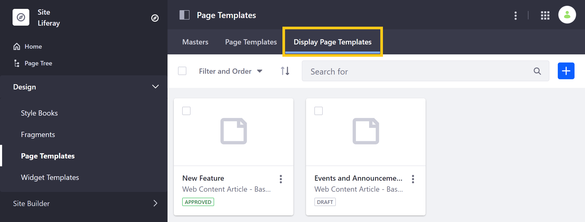
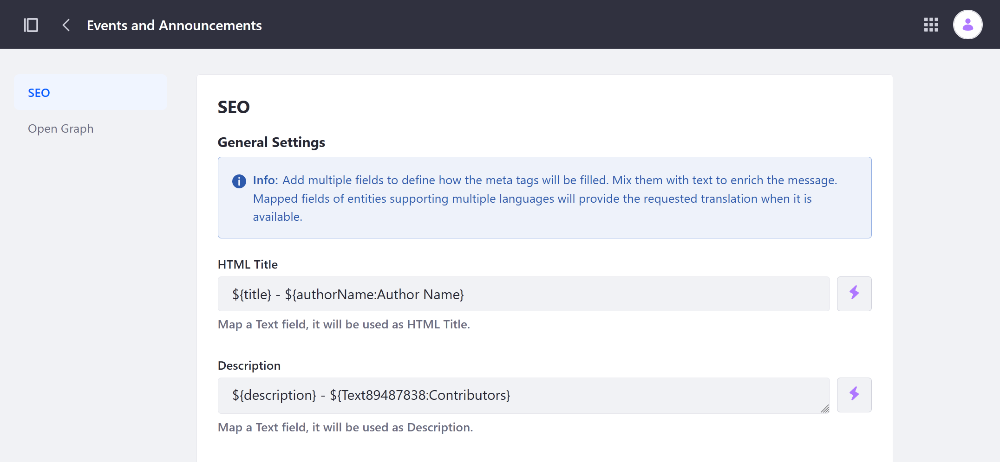

# Configuring SEO and Open Graph

> Available DXP/Portal 7.3+

With Display Page Templates, you can create standard formats for displaying different content types, such as Web Content Articles, Documents, and Blog Entries. When configuring a template, you can define SEO and Open Graph fields that are dynamically filled for your displayed content.

To create or configure these settings for an existing Display Page template, go to *Design* &rarr; *Page Templates* in the Site menu, and click on the *Display Page Templates* tab.



Create a new template using the Add button (), or edit an existing template by clicking on its *Actions* button () and selecting *Configure*. Here, configuration options are organized into two tabs: *SEO* and *Open Graph*.

* [Configuring SEO Settings](#configuring-seo-settings)
* [Configuring Open Graph Settings](#configuring-open-graph-settings)

## Configuring SEO Settings

Search engine optimization (SEO) refers to the methods used to improve your Page's ranking in a search engine results page (SERP). With Liferay DXP, you can create Display Page templates that dynamically configure your displayed content for optimal SEO.

```{note}
Liferay provides translations for mapped fields when possible. However, text provided outside of mapped fields is not translated.
```

### HTML Title

The *HTML Title* field defines a Display Page's `<title>` tag. This title is used by search engines to rank your Page and serves as the Page's heading in search engine results. By default, Display Page templates map this field to `${title}`. If desired, you you can use the field selector to combine multiple mapped fields and build your own HTML title.

The recommended length for an *HTML title* is under 60 characters.

```{tip}
It is best practice to update the SEO and Open Graph titles together.
```



### Description

The *Description* field defines a Display Page's description `<meta>` tag. This description is used by search engines to rank your Page and appears in search engine results as a preview of your Page. By default, Display Page templates map this field to `${description}`. If desired, you can build your HTML description by combining multiple mapped fields provided by the selector.

The recommended length for a Page's description is under 155 characters.

```{tip}
It is best practice to update the SEO and Open Graph descriptions together.
```


### Robots

The *Robots* field configures `robots.txt` rules for a Display Page. These rules provide instructions to search engines and other tools crawling and indexing your Site, defining what paths should or should not be crawled. Note that web crawlers may or may not obey instructions in `robots.txt`. You can also localize this field using the *Language Flag*.


### Sitemap

Determine whether to include a Display Page in your `sitemap.xml` file, as well as set its *Priority* and *Change Frequency*. These fields inform search engines whether to crawl and index the Display Page, how it should be prioritized relative to other Site Pages, and how frequently it is updated.


## Configuring Open Graph Settings

> Available: Liferay DXP/Portal 7.3+.

[Open Graph](https://ogp.me) is an Internet protocol that standardizes how a Site's metadata appears on social networks. With Liferay DXP, you can create Display Page templates that dynamically configure a Page's Open Graph `<meta>` tags.

For your displayed content, values defined here override default values defined elsewhere in your Liferay instance.

```{note}
Liferay provides translations for mapped fields when possible. However, text provided outside of mapped fields is not translated.
```

### Title

The *Title* field defines a Display Page's `og:title` property, which defines the title displayed for your content in rich previews. By default, this field is mapped to `${title}`. If desired, you can use the field selector to combine multiple mapped fields and build your own Open Graph title.

```{tip}
It is best practice to update the SEO and Open Graph titles together.
```


### Description

The *Description* field defines a Display Page's `og:description` property which determines the description displayed for your content in rich previews. By default, this field is mapped to `${description}`. If desired, you can use the field selector to combine multiple mapped fields and build your own Open Graph description.

```{tip}
It is best practice to update the SEO and Open Graph descriptions together.
```


### Image

The *Image* field defines a Display Page's `og:image` properties, which configures the image displayed for your content in rich previews. In addition to the basic image tag, DXP automatically adds a number of structured properties that determine how your selected image is displayed. The Image field defines the following `<meta>` tags.

```
<meta property="og:image" content="http://example.com/ogp.jpg" />
<meta property="og:image:secure_url" content="https://secure.example.com/ogp.jpg" />
<meta property="og:image:type" content="image/jpeg" />
<meta property="og:image:width" content="400" />
<meta property="og:image:height" content="300" />
```

By default, this field is unmapped in Display Page templates. This means the template defaults to the image set at Site level, unless you select a different Image field.


### Image Alt Description

The *Image Alt Description* field defines a Display Page's `og:image:alt` property, which determines the alt text read by screen readers for your displayed content's `og:image` property.

```
<meta property="og:image:alt" content="This is an example." />
```

By default, this field is unmapped in Display Page templates. This means the template defaults to the alt text set at the Site level, unless you select a different Text field.


## Additional Information

- [Configuring Your Page's Friendly URL](../../creating-pages/page-settings/configuring-your-pages-friendly-url.md)
- [Configuring Open Graph](./../../site-settings/configuring-open-graph.md)
