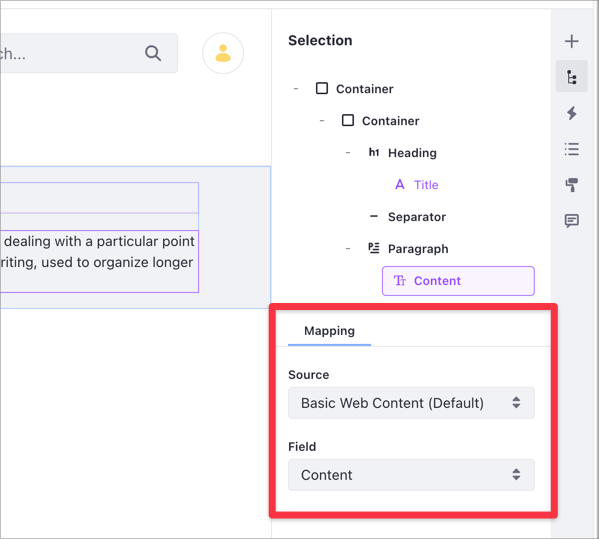
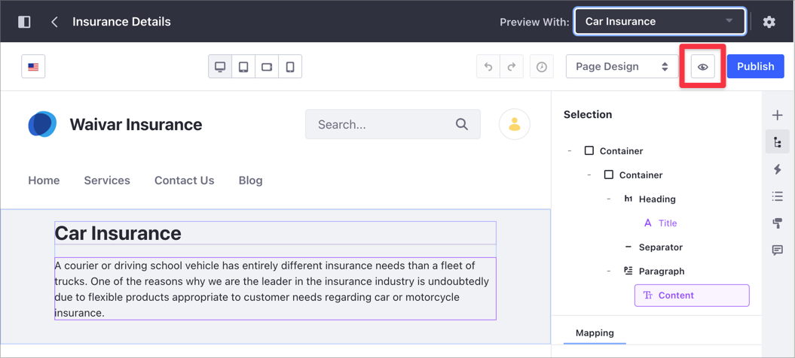
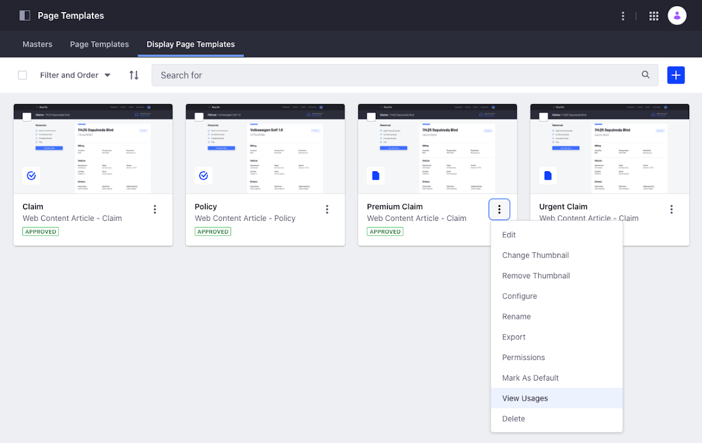

# Creating and Managing Display Page Templates

> Available: Liferay DXP/Portal 7.3+

A Display Page Template specifies the layout and formatting for your content and displays it at a unique friendly URL. To learn more about Display Page Templates and Display Pages, read [Displaying Content with Display Page Templates](./about-display-page-templates-and-display-pages.md).

```{note}
Display Page Templates are only supported for Web Content, Documents, Blog Entries, and Categories (starting with Liferay DXP 7.4.)
```

## Creating a Display Page Template

1. Open the Product Menu and click *Design* &rarr; *Page Templates*.

1. Click the *Display Page Templates* tab.

   

1. Click *Add* ().

1. Enter a *Name* for your template and select a *Content Type* and *Subtype*, if applicable. Then click *Save*.

   

1. Add element in the Display Page Template editor using the same interface and page elements as [Content Pages](../../creating-pages/building-and-managing-content-pages/content-page-editor-user-interface-reference.md).

   

1. Once you've added Page elements, you can [map](../../creating-pages/building-and-managing-content-pages/configuring-elements-on-content-pages.md#mapping-content) them to content structure fields (e.g., title, description) by double-clicking on an editable field.

   ```{tip}
   Mapped fields are outlined in purple color.
   ```

   

   See [Configuring SEO and Open Graph](./configuring-seo-and-open-graph.md) to learn about using these mapped structure fields when configuring SEO and Open Graph settings for your Display Page.

1. Before publishing, you can preview your editable fields mappings with existing content using the [preview function](#preview-the-display-page-template-content-mappings) (available in Liferay DXP 7.4+.)

1. When finished, click *Publish* to save your work.

You can now [publish your content](./publishing-content-with-display-pages.md) with the Display Page Template.

### Preview the Display Page Template Content Mappings

> Available: Liferay DXP/Portal 7.4+.

1. From the Product Menu, click the *Preview With* drop-down menu and choose *Select Other Item*.

   

1. In the Select dialog, click the content you want to use to preview the Display Page Template.
1. Alternatively, from the Display Page Template editor, click the *Preview* () button and choose the content you want to preview.

   

## Viewing Display Page Template Usage

> Available: Liferay DXP/Portal 7.4+

You can manage the different Display Page Templates using the *Actions* menu (). From here, the *View Usages* option provides a list of content that uses a specific Display Page Template.

```{note}
The *View Usages* option does not provide the usage of content assigned to the default Display Page Template.
```



Before you delete a Display Page Template in use by some of your content, you have two ways to unassign the Display Page Template from the content:

- Assign to Default: Your content is unassigned from the current Display Page Template and assigned to the default Display Page Template for the content type and subtype (if applicable.)
- Unassign: Your content is not assigned to any Display Page Template.

To view your Display Page Template usage and unassign your content,

1. Open the Product Menu and go to *Design* &rarr; *Page Templates*.
1. Click the *Display Page Templates* tab.
1. Click the Display Page Template's *Actions* menu () and select *View Usages*.
1. From the list of content using the Display Page Template, select one or more elements.
1. Click the *Actions* menu () in the top-right corner and select *Assign to Default* or *Unassigned*.
1. Click *OK*.

If you assign your content to a new Display Page Template, make sure the content appears as expected. To preview and publish your content, see [Publishing Content with Display Pages](./publishing-content-with-display-pages.md).

## Additional Information

- [Publishing Content with Display Pages](./publishing-content-with-display-pages.md)
- [Configuring SEO and Open Graph](./configuring-seo-and-open-graph.md)
- [Content Page Overview](./../../creating-pages/building-and-managing-content-pages/content-pages-overview.md)
- [Adding Elements to Content Pages](../../creating-pages/building-and-managing-content-pages/adding-elements-to-content-pages.md)
