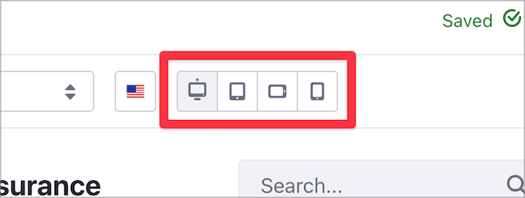
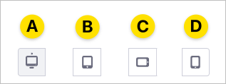

# Configuring Fragment Visibility

> Available: Liferay DXP/Portal 7.4+

[Fragments](../using-fragments/using-page-fragments.md) can be used to assemble your [Content Pages](../../creating-pages/building-and-managing-content-pages/content-pages-overview.md) with a variety of layouts and information. Starting with Liferay DXP 7.4, you can configure the Fragments' visibility based on a user's screen size. For instance, a Fragment can be hidden for a page rendered from a computer while visible from the same Page on a smartphone.

You configure the Fragment visibility for each screen size from the [Content Page editor](../contnet-page-../creating-pages/building-and-managing-content-pages/content-page-editor-user-interface-reference.md), using the viewport controls on the top of the Page editor.



## Understanding Fragment Visibility and Styles Inheritance

The Fragment's visibility and styles you apply to a viewport on the left-hand side are applied to all the viewports on the right-hand side, unless you specify different styles for one of the right-hand side viewports. For example, if you hide a Fragment on the Desktop viewport, the Fragment is also hidden on all other viewports. This table summarizes this configuration:

| Viewport | Visible? | Fragment Visibility Setting |
| :--- | :--- | :--- |
| Desktop (A) | No | Hidden |
| Tablet (B) | No | Default / Inherited |
| Landscape Phone (C) | No | Default / Inherited |
| Portrait Phone (D) | No | Default / Inherited |



From this setup, if you now make the Fragment visible on the Landscape Phone (for example), the Fragment stays visible on that viewport and the Portrait Phone viewport. This table summarizes the new configuration:

| Viewport | Visible? | Fragment Visibility Setting |
| :--- | :--- | :--- |
| Desktop (A) | No | Hidden |
| Tablet (B) | No | Default / Inherited |
| Landscape Phone (C) | Yes | Visible |
| Portrait Phone (D) | Yes | Default / Inherited |

In this example, the Fragment is hidden on a computer, but visible when using a smartphone.

## Content Page Editor Viewports Behavior

This table summarizes each viewport's behavior:

| Viewport | Description |
| --- | --- |
| Desktop | The default viewport. The Fragment styles and visibility you define here apply to all other viewports, unless you specify another style or visibility in another viewport. |
| Tablet | The viewport for tablet-size screens. The Fragment styles and visibility you define here apply to the phone viewports, unless you specify a style or visibility in the landscape or portrait phone viewports. |
| Landscape Phone | The Fragment styles and visibility you define on this viewport apply to portrait phone viewport as well, unless you specify another style or visibility in the portrait phone viewport. |
| Portrait Phone | This viewport inherits the style and visibility changes you make in any other viewports, unless you specify another style or visibility here. |

## Changing Fragment Visibility

You can change the Fragment visibility on your Content Pages in three different ways:

1. From the Content Page editor sidebar, under the *Browser* () &rarr; *Page Elements* area, click the *Hide* () or *Unhide* () control next to the Page Fragment.

   

1. From the Content Page editor sidebar, under the *Browser* () &rarr; *Styles* area, check or uncheck the *Hide Fragment* box:

   

1. From the Fragment's Actions menu (), select the *Hide Fragment* () option:

   

```{tip}
To restore a hidden Fragment, from the Browser Page Elements area, click the *Unhide* () control next to the Page Fragment.
```

## Example: Using Fragment Visibility

Consider this example. Your insurance company wants to promote a new mobile app that lets customers manage their insurance policies. You want to promote this app when users access your Page from a smartphone. In this case, you can create a promotional banner for your new smartphone app and make this banner visible only on the Smartphone viewports:

1. From the default Desktop viewport, add a new Fragment with your promotional text for the smartphone app.
1. Hide the Fragment with your promotional text. The Fragment is now hidden in all viewports.
1. Click the *Landscape Phone* viewport. Changes on this viewport affect the Portrait Phone viewport as well.
1. [Change the Fragment visibility](#changing-fragment-visibility) to unhide your promotional text in the Phone viewports.
1. Click on the different viewports to see the effect. The promotional text is now available in the Landscape Phone and Portrait Phone viewports only.

The following video illustrates this example:


```{tip}
To restore the default viewport visibility, click on the viewport and click the Restore Default () button under the Fragment Styles area:


```

## Related Information

- [Managing Page Fragments](./managing-page-fragments.md)
- [Creating Content Page Compositions Using the Container Fragment](../../creating-pages/building-and-managing-content-pages/creating-content-page-compositions-using-the-container-fragment.md)
- [Page Fragments User Interface Reference](../../creating-pages/building-and-managing-content-pages/page-fragments-user-interface-reference.md)
